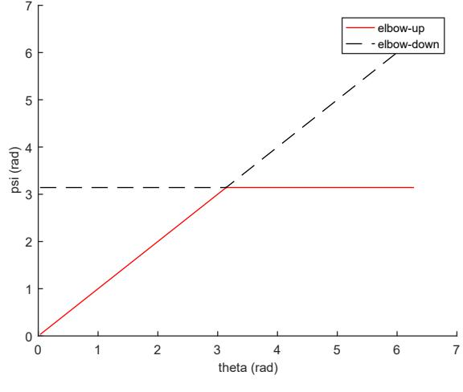
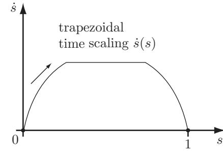
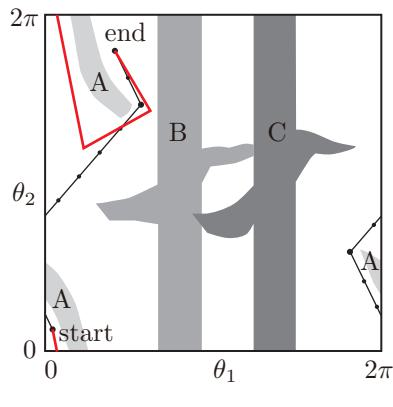
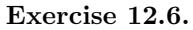
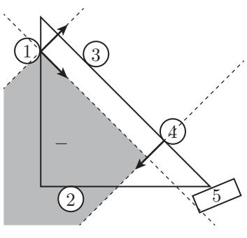

# Modern Robotics Solutions

Robotics (Soongsil University)

Scan to open on Studocu

# MODERN ROBOTICS MECHANICS, PLANNING, AND CONTROL

Exercise Solutions

September 9, 2017

Go to the table of contents.

# Contents

| Chapter 2 Solutions . | 5 |
| --- | --- |
| Chapter 3 Solutions | 27 |
| Chapter 4 Solutions . | 20 |
| Chapter 5 Solutions | 73 |
| Chapter 6 Solutions . | 99 |
| Chapter 7 Solutions . | 107 |
| Chapter 8 Solutions . | 121 |
| Chapter 9 Solutions | 129 |
| Chapter 10 Solutions | 135 |
| Chapter 11 Solutions | 139 |
| Chapter 12 Solutions . | 143 |
| Chapter 13 Solutions | 153 |

Go to the table of contents.

# Chapter 2 Solutions

#### Exercise 2.1.

The first point placed has n degrees of freedom, the next one has one constraint so n - 1 degrees of freedom, the next has two constraints, etc. So n + (n - 1) + (n - 2) + ... 1 = n(n + 1)/2. (Get this by summing the outermost pair in the sequence, n + 1 = n + 1, then the pair (n - 1) + 2 = n + 1, etc., and observe that there are n/2 such pairs.) n of these freedoms are the linear freedoms of placing the first point; the other n(n - 1)/2 are rotational freedoms. After choosing the first point, the next point is on the sphere 5™-1, the next is on S™-2, etc., so the topology of the space is R™ × S™-1 × S™-2 × ... × S1.

#### Exercise 2.2.

- (a) The shoulder is a spherical joint (four dof), the elbow has one dof, the wrist has two dof, and between the elbow and the wrist there is one more dof (rotation of the forearm about the axis of the forearm). Therefore the arm has seven dof.
- (b) Placing the palm at a fixed position and orientation in space puts six constraints on the arm (the six dof of a rigid body). Keeping the center of the shoulder joint stationary, there is only one dof left: the arc of a circle on which the tip of the elbow can lie. This is one dof, so the arm must have started with seven dof before six constraints were placed on it.

#### Exercise 2.3.

Treat the shoulder as a spherical joint (three dof) between the torso and the upper arm bone (humerus), and assume the carpal bones just beyond the wrist joint form a rigid body. Then the closed-chain linkage of the forearm between the humerus and the carpal bones, which includes only the radius and the ulna as links, must have four dof, since our solution in the previous exercise tells us that the arm has seven dof.

We know that each of the radius and the ulna must have at least one joint at the proximal (closer to the torso and distal (closer to the hand) ends of forearm, so there are at least four joints between the humerus and carpal bones. There could be as many as six: three at the elbow (humeroradial, humeroulnar, and proximal radioulnar) and three at the wrist (radiocarpal, ulnocarpal, and distal radioulnar). Without knowing more about the anatomy of the arm, we cannot say for sure.

If we assume the maximum number of joints, six, in the forearm closed chain, then the arm has J = 7 joints (the three-dof S joint at the shoulder and the six forearm joints mentioned above) and N = 5 links (the torso "ground," the humerus, the ulna, the radius, and the carpal bones). By Grübler's formula,

$ 7=6(N-1-J)+\sum_{i=1}^7f_i=-18+\text{freedomsofthesixforearmjoints}$...  

Therefore the six forearm joints must have a total of 25 freedoms. These joints, averaging more than four freedoms each, are not standard joints we have studied. They are stabilized by a complex of ligaments joining the bones.

If we assume the minimum number of joints, four, in the forearm closed chain, then the arm has J = 5 joints and N = 5 links. By Grübler's formula,

$ 7=6(N-1-J)+\sum_{i=1}^5f_i=-6+3+\text{freedomsofthefourforearmjoints}$.  

Therefore there must be a total of 10 freedoms at the four forearm joints. These could potentially be joints we have studied, such as two universal joints at the elbow (four dof) and two spherical joints at the wrist (six dof).

The problem is to show correct general reasoning, not to demonstrate a detailed understanding of arm anatomy!

#### Exercise 2.4.

Once the hands firmly grip the steering wheel, each arm has n - 6 dof if the wheel is stationary. The mobility

of the wheel adds one dof, though, so the total number of degrees of freedom is 2n – 11.

### Exercise 2.5.

$\begin{array}{ccc}N&=&6\text{(links)}+1\text{(ground)}=7\\ \\[-3mm]J&=&5\text{(R joints)}+2\text{(S joints)}=7\\ \\[-3mm]\sum f_i&=&5\times1+2\times3=11.\end{array}$

Substituting the above values into the spatial version of Grübler's formula,

$$\operatorname{dof}=6(N-1-J)+\sum f_{i}=5.$$

#### Exercise 2.6.

- (a) The wheeled mobile base can be regarded as a rolling coin with C-space R2 x T2. The C-space of a 6R robot arm can be written S¹ × S¹ × S¹ × S¹ × S¹ × S¹ = T°. The C-space of the wheeled mobile arm therefore can be written R2 × T2 × T6 = R2 × T8.
- (b) For this problem, the last link of the 6R robot can be regarded as connected to ground by a revolute joint:

$ \begin{array}{rcl}N&=&6\text{(links)}+1\text{(ground)}=7\\ J&=&7\text{(R joints)}\\ \sum f_i&=&7\times1=7.\end{array}$

Substituting the above values into the spatial version of Grübler's formula,

$$\operatorname{dof}=6(N-1-J)+\sum f_{i}=1.$$

- (c) The second identical 6R robot is grasping the last link (i.e., the refrigerator door) of the original 6R robot. In this case,
$\begin{array}{ccc}N&=&11\text{(links)}+1\text{(ground)}=12\\ \\ J&=&13\text{(R joints)}\end{array}$  
  
$\sum f_i&=&13\times1=13.$

Substituting the above values into the spatial version of Grübler's formula,

$$\operatorname{dof}=6(N-1-J)+\sum f_{i}=1.$$

Exercise 2.7.

(a)

  
$ N\quad=\quad6\text{(links)}+1\text{(object)}+1\text{(ground)}=8$  
  
$ \quad J\quad=\quad3\text{(R joints)}+6\text{(S joints)}=9$  
  
$ \sum f_i\quad=\quad3\times1+6\times3=21$.  

Substituting the above values into the spatial version of Grübler's formula,

$$\operatorname{dof}=6(N-1-J)+\sum f_{i}=9.$$

Go to the table of contents.

(b) Consider open chain arms as 7-dof joint connecting object and ground. Then,

$$N=1\ (\mathrm{object})+1\ (\mathrm{ground})=2$$
 
$$J=n\ (\mathrm{open\ chain\ arm})$$
 
$$\sum f_i=n\times7=7n.$$

Substituting the above values into the spatial version of Grübler's formula,

$$\operatorname{dof}=6(N-1-J)+\sum f_{i}=(n+6).$$

(c) Each of the n 7-dof open chains is replaced by the 6-dof open chains. So.

$$\begin{array}{r c l}{{N}}&{{=}}&{{1\ (\mathrm{object})+1\ (\mathrm{ground})=2}}\\ {{J}}&{{=}}&{{n\ (\mathrm{open\ chain\ arm})}}\\ {{\sum f_{i}}}&{{=}}&{{n\times6=6n.}}\end{array}$$

Substituting the above values into the spatial version of Grübler's formula,

$$\operatorname{dof}=6(N-1-J)+\sum f_{i}=6.$$

#### Exercise 2.8.

Set the degrees of freedom of each open chain leg to a. Then

$$N=1\ (\mathrm{object})+1\ (\mathrm{ground})=2$$
 
$$J=n\ (\mathrm{open\ chain\ arms})$$
 
$$\sum f_i=n\times\alpha=\alpha n.$$

Substituting the above values into the spatial version of Grübler's formula,

$$\operatorname{dof}=6(N-1-J)+\sum f_{i}=6+(\alpha-6)n=6.$$

Therefore, the total degrees of freedom is six regardless of the number of open chain legs.

#### Exercise 2.9.

- (a) Consider the combination of revolute (R) and prismatic (P) joint as a 2-dof cylindrical (C) joint. Then
  
$\begin{array}{rcl}N&=&7\text{(links)}+1\text{(ground)}=8\\ J&=&7\text{(R joints)}+1\text{(P joints)}+2\text{(C joints)}=10\\ \sum f_i&=&7\times1+1\times1+2\times2=12.\end{array}$

Substituting the above values into the planar version of Grübler's formula,

$$\operatorname{dof}=3(N-1-J)+\sum f_{i}=3.$$

(b) Considering all the R and P joints separately,

  
$ \begin{array}{rcl}N&=&13\text{(links)}+1\text{(ground)}=14\\ J&=&16\text{(R joints)}+2\text{(P joints)}=18\\ \sum f_i&=&16\times1+2\times1=18.\end{array}$

Substituting the above values into the planar version of Grübler's formula,

$$\operatorname{dof}=3(N-1-J)+\sum f_{i}=3.$$

the table of content

This document is available on

- (c) A fork joint is kinematically equivalent to a C joint, so that

$$N=7\ (\text{links})+1\ (\text{ground})=8$$
 
$$J=6\ (\text{R joints})+2\ (\text{P joints})+1\ (\text{C joint})=9$$
 
$$\sum f_{i}=6\times1+2\times1+1\times2=10.$$

Substituting the above values into the planar version of Grübler's formula,

$$\operatorname{dof}=3(N-1-J)+\sum f_{i}=4.$$

(d)

$ \begin{array}{rcl}N&=&5\text{(links)}+1\text{(ground)}=6\\ J&=&6\text{(R joints)}+1\text{(P joints)}=7\\ \sum f_i&=&6\times1+1\times1=7.\end{array}$

Substituting the above values into the planar version of Grübler's formula,

$$\operatorname{dof}=3(N-1-J)+\sum f_{i}=1.$$

(e)

  
$\begin{array}{rcl}N&=&\text{13(links)}+\text{1(ground)}=\text{14}\\ J&=&\text{14(R joints)}+\text{4(P joints)}=\text{18}\\ \sum f_i&=&\text{14}\times1+4\times1=18.\end{array}$

Substituting the above values into the planar version of Grübler's formula,

$$\operatorname{dof}=3(N-1-J)+\sum f_{i}=3.$$

(f.)

  
$ \begin{array}{rcl}N&=&6\text{(links)}+1\text{(ground)}=7\\ J&=&8\text{(R joints)}+1\text{(P joints)}=90\\ \sum f_i&=&8\times1+1\times1=9.\end{array}$

Substituting the above values into the planar version of Grübler's formula,

$$\operatorname{dof}=3(N-1-J)+\sum f_{i}=0.$$

# Exercise 2.10.

(a)

$\begin{array}{rcl}N&=&5\text{(links)}+1\text{(ground)}=6\\ J&=&7\text{(R joints)}\\ \sum f_i&=&7\times1=7.\end{array}$

Substituting the above values into the planar version of Grübler's formula,

$$\operatorname{dof}=3(N-1-J)+\sum f_{i}=1.$$

Go to the table of contents.

(b)

  
$ N\quad=\quad5\text{(links)}+1\text{(ground)}=6$  
  
$ \quad J\quad=\quad2\text{(R joints)}+4\text{(P joints)}=64$  
  
$ \quad\sum f_i\quad=\quad2\times1+4\times1=6$.  

Substituting the above values into the planar version of Grübler's formula,

$$\operatorname{dof}=3(N-1-J)+\sum f_{i}=3.$$

(c)

  
$\begin{array}{rcl}N&=&2\text{(sliding links)}+11\text{(rod links)}+1\text{(ground)}=14\\ J&=&2\text{(P joints)}+10\text{(R joints)}+6\text{(overlapping R joints)}=18\\ \sum f_i&=&2\times1+10\times1+6\times1=18.\end{array}$

Substituting the above values into the planar version of Grübler's formula,

$$\operatorname{dof}=3(N-1-J)+\sum f_{i}=3.$$

(d)

$\begin{array}{rcl}N&=&20\text{(links)}+1\text{(ground)}=21\\ J&=&9\text{(P joints)}+8\text{(R joints)}+10\text{(overlapping R joints)}=27\\ \sum f_i&=&9\times1+8\times1+10\times1=27.\end{array}$

Substituting the above values into the planar version of Grübler's formula,

$$\operatorname{dof}=3(N-1-J)+\sum f_{i}=6.$$

### Exercise 2.11.

(a)

$\begin{array}{rcl}N&=&5\text{(links)}+1\text{(ground)}=6\\ J&=&6\text{(U joints)}\\ \sum f_i&=&6\times2=12.\end{array}$

Substituting the above values into the spatial version of Grübler's formula,

$$\operatorname{dof}=6(N-1-J)+\sum f_{i}=6.$$

(b)

$$\begin{array}{r c l}{{N}}&{{=}}&{{6\ (\mathrm{rods})+1\ (\mathrm{plate})+1\ (\mathrm{ground})=8}}\\ {{J}}&{{=}}&{{3\ (\mathrm{P\ joints})+3\ (\mathrm{U\ joints})+3\ (\mathrm{S\ joints})=9}}\\ {{\sum f_{i}}}&{{=}}&{{3\times1+3\times2+3\times3=18.}}\end{array}$$

Substituting the above values into the spatial version of Grübler's formula,

$$\operatorname{dof}=6(N-1-J)+\sum f_{i}=6.$$

o the table of contents

This document is available on

Downloaded by Tianyi Xiang (xiang7976@gmail.com)

(c)

  
$ \begin{array}{rcl}N&=&5\text{(rods)}+1\text{(plate)}+1\text{(ground)}=7\\ J&=&2\text{(P joints)}+3\text{(U joints)}+3\text{(S joints)}=8\\ \sum f_i&=&2\times1+3\times2+3\times3=17.\end{array}$

Substituting the above values into the spatial version of Grübler's formula,

$$\operatorname{dof}=6(N-1-J)+\sum f_{i}=5.$$

(d)

$ \begin{array}{rcl}N&=&7\ \text{(links)}+1\ \text{(ground)}=8\\ J&=&3\ \text{(P joints)}+6\ \text{(U joints)}=9\\ \sum f_i&=&3\times1+6\times2=15.\end{array}$

Substituting the above values into the spatial version of Grübler's formula,

$$\operatorname{dof}=6(N-1-J)+\sum f_{i}=3.$$

(e)

$N\quad=\quad7\text{(links)}+1\text{(ground)}=8$  
  
$\quad J\quad=\quad2\text{(R joints)}+4\text{(U joints)}+2\text{(P joints)}=8$  
  
$\quad\sum f_{i}\quad=\quad2\times1+4\times2+2\times1=12$.  
  

Substituting the above values into the spatial version of Grübler's formula,

$$\operatorname{dof}=6(N-1-J)+\sum f_{i}=6.$$

(f.)

  
$ \begin{array}{rcl}N&=&3\text{(rods)}+1\text{(plate)}+1\text{(ground)}=5\\ J&=&3\text{(3dofjoints)}+3\text{(Sjoints)}=6\\ \sum f_i&=&3\times3+3\times3=18.\end{array}$

Substituting the above values into the spatial version of Grübler's formula,

$$\operatorname{dof}=6(N-1-J)+\sum f_{i}=6.$$

# Exercise 2.12.

(a)

$\begin{array}{rcl}N&=&7\ \text{(links)}+1\ \text{(ground=legs)}=8\\ J&=&3\ \text{(R joints)}+6\ \text{(U joints)}=9\\ \sum f_i&=&3\times1+6\times2=15.\end{array}$

Substituting the above values into the spatial version of Grübler's formula,

$$\operatorname{dof}=6(N-1-J)+\sum f_{i}=3.$$

Go to the table of contents.

(b)

  
$ \begin{array}{rcl}N&=&8\text{(links)}+1\text{(ground)}=9\\ J&=&4\text{(R joints)}+5\text{(P joints)}=95\\ \sum f_i&=&4\times1+5\times1=9.\end{array}$

Substituting the above values into the spatial version of Grübler's formula,

$$\operatorname{dof}=6(N-1-J)+\sum f_{i}=3.$$

(c)

$$N=12\ (\mathrm{links})+1\ (\mathrm{plate})+1\ (\mathrm{ground})=14$$
 
$$J=6\ (\mathrm{R\ joints})+6\ (\mathrm{U\ joints})+6\ (\mathrm{S\ joints})=18$$
 
$$\sum f_{i}=6\times1+6\times2+6\times3=36.$$

Substituting the above values into the spatial version of Grübler's formula.

$$\operatorname{dof}=6(N-1-J)+\sum f_{i}=6.$$

- (d) The spatial parallel mechanism consists of four RFRRPR serial subchains, where F is a four-bar parallelogram linkage. Each serial subchain with RFRRPR joints can be regarded as ground with a single 6-dof joint:
dof = 1 (four-bar parallelogram linkage) + 1 x 4 (R joints) + 1 (P joint) = 6.

Now apply Grübler's formula to the 4-RFRRPR mechanism:

$$\begin{array}{r c l}{{N}}&{{=}}&{{1\ (\mathrm{plate})+1\ (\mathrm{ground})=2}}\\ {{J}}&{{=}}&{{4\ (\mathrm{RFRPRP\ joints})}}\\ {{\sum f_{i}}}&{{=}}&{{4\times6=24.}}\end{array}$$

Substituting the above values into the spatial version of Grübler's formula,

$$\operatorname{dof}=6(N-1-J)+\sum f_{i}=6.$$

Exercise 2.13.

  
$\begin{array}{rcl}N&=&6\text{(legs)}+1\text{(upper platform)}+1\text{(ground)}=8\\ J&=&12\text{(S joints)}\\ \sum f_i&=&12\times3=36.\end{array}$

Substituting the above values into the spatial version of Grübler's formula,

$$\operatorname{dof}=6(N-1-J)+\sum f_{i}=6.$$

The upper platform can simultaneously translate and rotate about the vertical axis, and also translate horizontally.

Exercise 2.14.

Go to the table of contents.

This document is available on

$\left(\mathrm{a}\right)$ .  

12

  
$\begin{array}{rcl}N&=&6\text{(links)}+1\text{(upper platform)}+1\text{(ground)}=81\\ J&=&3\text{(P joints)}+6\text{(U joints)}=9\\ \sum f_i&=&3\times1+6\times2=15.\end{array}$

Substituting the above values into the spatial version of Grübler's formula,

$$\operatorname{dof}=6(N-1-J)+\sum f_{i}=3.$$

- (b) If the three P joints are locked, the robot loses three degrees of freedom and thus should become a structure, but clearly the robot can move.
#### Exercise 2.15.

(a)

  
$\begin{array}{rcl}N&=&5\text{(squares)}+1\text{(ground=square)}=6\\ J&=&6\text{(R joints)}\end{array}$  
  
$\sum f_i&=&6\times1=6$.  

Substituting the above values into the planar version of Grübler's formula.

$$\operatorname{dof}=3(N-1-J)+\sum f_{i}=3.$$

(b)

  
$ \begin{array}{rcl}N&=&5\text{(squares)}+1\text{(ground=square)}=6\\ J&=&6\text{(R joints)}\end{array}$  
  
$ \sum f_i&=&6\times1=6$.  

Substituting the above values into the spatial version of Grübler's formula.

$$\operatorname{dof}=6(N-1-J)+\sum f_{i}=0.$$

However, under the assumption that all the squares are of the same size, the mechanism can move with 1 dof. Grübler's formula is unable to distinguish such cases.

#### Exercise 2.16.

- (a) Since all the links are constrained to move on the surface of a sphere, the planar version (or more accurately, the two-dimensional version) of Grübler's formula must be used. In this case,

$$\begin{array}{r c l}{{N}}&{{=}}&{{3\ \mathrm{(links)}+1\ \mathrm{(ground)}=4}}\\ {{}}&{{}}&{{}}\\ {{J}}&{{=}}&{{4\ \mathrm{(R\ joints)}}}\\ {{}}&{{}}&{{}}\\ {{\sum f_{i}}}&{{=}}&{{4\times1=4.}}\\ {{}}&{{}}&{{}}\\ {{\mathrm{~dof~}}}&{{=}}&{{3(N-1-J)+\sum f_{i}=1.}}\end{array}$$

If we had used the spatial (three-dimensional) version of Grübler's formula, we would obtain the result that dof = - 2, implying the mechanism is incapable of motion.

- (b) Since the mechanism has one dof and is constructed of four revolute joints, its C-space is a curve in the four-dimensional torus T4. Depending on the relative lengths of the links, the curve may be closed, and also have self-intersections.
- (c) The workspace is a curve on the sphere as shown in Figure 2.1. At each point on the curve, the orientation of the frame is fixed.

### Go to the table of contents.

Figure 2.1

# Exercise 2.17.

- (a) The surgical tool can move freely in the base hole, so there's no joint constraint between the end-effector and the base. In this case,
	- 3 (3 links for leg A) + 8 (4 links for each leg B and C) + 2 (end-effector and base) = 13 N == 4 (3 R and 1 P joints for leg A) + 10 (4 R and 1 U joints for each leg B and C) = 14

$ \sum f_i\;\;=\;\;4\text{(leg A)}+2\times6\text{(leg B and C)}=16.$  
. 

Substituting the above values into the spatial version of Grübler's formula,

$$\operatorname{dof}=6(N-1-J)+\sum f_{i}=4.$$

- (b) The constraint that the surgical tool must pass through point A is equivalent to connecting the tool with a four-dof spherical-prismatic pair: the spherical joint determines the tool orientation, while the prismatic joint determines the displacement along the tool axial direction. Therefore
$N\quad=\quad3+8+2$ (end-effector and base) $=13$  
  
$\quad J\quad=\quad4+10+1$ (SP joint between end-effector and base) $=15$  
  
$\quad\sum f_i\quad=\quad4+2\times6+4=20$.  
  

Go to the table of contents.

This document is available on

Substituting the above values into the spatial version of Grübler's formula,

$$\operatorname{dof}=6(N-1-J)+\sum f_{i}=2.$$

- (c) Since the axes of all the revolute joints pass through point A, all the links are constrained to move on the two-dimensional sphere and the tool always passes through point A (Refer to exercise 2.16). In this case, the two-dimensional version of Grübler's formula must be used:
$\begin{array}{rcl}N&=&9\ (\text{3links for each leg})+2\ (\text{end-effector and base})=11\\ J&=&12\ (\text{4R joints for each leg})\\ \sum f_i&=&3\times4=12.\end{array}$

Substituting the above values into the planar version of Grübler's formula,

$$\operatorname{dof}=3(N-1-J)+\sum f_{i}=6.$$

Exercise 2.18.

$N\quad=\quad6$ (links) + 1 (moving platform) + 1 (ground) = 8  
  
$\quad J\quad=\quad6$ (P joints) + 3 (U joints) = 9  
  
$\quad\sum f_{i}\quad=\quad6\times1+3\times2=12$.  
  

Substituting the above values into the spatial version of Grübler's formula,

$$\operatorname{dof}=6(N-1-J)+\sum f_{i}=0.$$

However, this mechanism can move: if the three P joints on the fixed base move identically, the moving platform will move vertically. Therefore, it contradicts the fact that the mechanism has zero degrees of freedom as calculated by Grübler's formula.

#### Exercise 2.19.

There are N = 7 links (ground, torso, two upper arms, two lower arms, and one combined hand-object-hand link) and J = 8 joints (three R, four S, and a joint between the box and the table that has three sliding freedoms, two translational and one rotational). By Grübler's formula,

$$\operatorname{dof}=6(7-1-8)+\sum_{i=1}^{8}f_{i}=-12+3(1)+4(3)+3=6.$$

#### Exercise 2.20.

- (a) Referring to the Figure 2.2, when the body is fixed (ground) there are four rigid wings, four rigid legs, four linkages consisting of two links each, and the body (ground), so N = 17. There are four wing R, joints, four leg R joints, four leg S joints, four leg P joints, and four leg U joints, so J = 20. The freedoms of the joints are 1 for the R and P joints, two for the U, three for the U, so ∑¿ ½ = 12(1) + 4(2) + 4(3) = 32. Grübler's formula gives 6(17 - 1 - 20) + 32 = 8 dof.
- (b) Add six dof for the chassis to get 14 dof.
- (c) Keeping a foot at a fixed location adds 3 constraints on that foot, or 12 constraints total, so subtract 12 from 14 (the answer to part (b)) to get 2 dof. Alternatively, by Grübler, add four more S joints at the feet (with 3 dof each) and one more link (ground) compared to the answer in part (a). So 6(18 - 1 - 24) + (32 + 4(3)) = 2 dof. Note that the wings, of course, can still move with 4 dof, so that means the legs and body only (ignoring the wings) have -2 dof, assuming that none of the constraints are redundant. This means (1) the body and legs cannot move and (2) we even have two constraints on where we can position the legs on the ground.

Go to the table of contents.

Figure 2.2

#### Exercise 2.21.

(a) Each of the connections between the body links can be regarded as a three-dof RPR joint. In this case

  
$\begin{array}{rcl}N&=&7\ (\text{1head,6body links})+1\ (\text{tail=ground})=8\\ J&=&5\ (\text{RPR}\ \text{joints between body links})+2\ (\text{R joint between head-body,tail-body})=7\\ \sum f_i&=&5\times3+2\times1=17.\end{array}$

Substituting the above values into the spatial version of Grübler's formula,

$$\operatorname{dof}=6(N-1-J)+\sum f_{i}=17.$$

- (b) Each of the contacts between the body links and the ground can be modelled as a five-dof joint (sliding along two directions, and rotation about three directions). In this case
  
$\begin{array}{rcl}N&=&8\ (\text{1head,1tail,6body links})+1\ (\text{ground})=9\\ J&=&7\ (\text{joints between links})+6\ (\text{contacts between body links and ground})=13\\ \sum f_i&=&17+6\times5=47.\end{array}$

Substituting the above values into the spatial version of Grübler's formula,

$$\operatorname{dof}=6(N-1-J)+\sum f_{i}=17.$$

- (c) Only two of the body links are in contact with the ground. In this case
	- N 8 (1 head, 1 tail, 6 body links) + 1 (ground) = 9 = 7 (joints between links) + 2 (contacts between body links and ground) = 9

$ \sum f_i\quad=\quad17+2\times5=27$.  

Substituting the above values into the spatial version of Grübler's formula,

$$\operatorname{dof}=6(N-1-J)+\sum f_{i}=21.$$

Go to the table of contents

This document is available on

#### Exercise 2.22.

- (a) The palm has six dof and each of the four fingers has four dof, so the hand has 22 dof total. When one finger is in contact with the table, there is one constraint on its position (the equation describing the height of the finger above the table being equal to zero), so the hand has 21 dof. If n fingers are in contact, the hand has 22 - n dof.
- (b) 26 n dof.
- (c) Model the finger contacts as spherical joints, so N = 14 (12 finger links, the ellipsoid and the palm ground) and J = 16, which includes four U joints, eight R joints, and four S joints (at the finger contacts). By Grübler, dof = 6(14 - 1 - 16) + 4(2) + 8(1) + 4(3) = 10.
- (d) This question is to see how the student thinks about rolling constraints. A sphere rolling on a surface can achieve any configuration in contact with the surface; the rolling, no-slip nonholonomic velocity constraints do not create any configuration constraint other than that the sphere must remain in contact with the surface. Therefore each finger contact "joint" has five degrees of freedom. Building on (c) above, dof = - 18 + 4(2) + 8(1) + 4(5) = 28.

#### Exercise 2.23.

Define the joint variables as shown in Figure 2.3 and let the length of the links be L. The positions of the

Figure 2.3

centers of each link are denoted (x3, y3) (22, y2), (x1, y1), respectively (starting from the left in Figure 2.3), Define the eight-dimensional vector x = (61,02,x1,y1,W2,Y2,W3,Y3). The constraint equations g;(x) = 0 of the joints are derived as follows:

> x1 - L cos 01 + L cos 02 91 (x) - L sin 01 - L sin 02 92 (x) x2 - L cos 01 + L/2 cos 02 93 (x) - L sin 01 - L/2 sin 02 94(x) y2 x3 - L/2 cos 01 95 (x) 96 (x) y3 - L/2 sin 01

Additionally, there is one more constraint on the slider gr(x) = y1 = 0. Therefore, there are 7 constraint equations and 8 configuration variables in total. The feasible configuration space of the joint variables can now be determined as

$C=\{x=(\theta_{1},\theta_{2},x_{1},y_{1},x_{2},y_{2},x_{3},y_{3})\ |g_{i}(x)=0\ (i=1,\cdots,7)\}$.  
  

The configuration space C projected to the space of joint variables (01,02,x1) is given by

$$C_{p}=\{(\theta_{1},\theta_{2},x_{1})\ |\theta_{1}=\theta_{2},x_{1}=L(\cos\theta_{1}+\cos\theta_{2})\}.$$

Go to the table of contents.

#### Exercise 2.24.

- (a) The four-bar linkage is floating in space, so the number of links is 4 since the ground and linkage are not connected. 4 joints connect the adjacent links of the floating linkage. Finally, m in Grübler's formula is set to 6 since it is a spatial mechanism. We therefore have
$\begin{array}{rcl}N&=&4\ (4\ \text{links})+1\ (\text{ground})=5\\ J&=&4\ (\text{R joints between links})\\ \sum f_i&=&4.\end{array}$

Substituting the above values into the spatial version of Grübler's formula,

$$\operatorname{dof}=6(N-1-J)+\sum f_{i}=4.$$

However, the actual dof of the floating system differs from that predicted by Grübler's formula: any single floating system has at least 6 dof. This mismatch will be discussed further in (b).

- (b) The degrees of freedom can be calculated by subtracting the number of constraints from the number of variables. First of all, we already know that there are three coordinates for each point and three points on each link. Thus, the total number of variables is 36. The planar four-bar linkage has three types of constraints: rigid body, revolute joint, and planar motion. For rigid body constraints, twelve constraints should be considered. For link 1,

$$\|p_{A}-p_{B}\|=\mbox{const.}\Leftrightarrow\sqrt{(x_{A}-x_{B})^{2}+(y_{A}-y_{B})^{2}+(z_{A}-z_{B})^{2}}=\mbox{const.}$$
 
$$\|p_{B}-p_{C}\|=\mbox{const.}\Leftrightarrow\sqrt{(x_{B}-x_{C})^{2}+(y_{B}-y_{C})^{2}+(z_{B}-z_{C})^{2}}=\mbox{const.}$$
 
$$\|p_{C}-p_{A}\|=\mbox{const.}\Leftrightarrow\sqrt{(x_{C}-x_{A})^{2}+(y_{C}-y_{A})^{2}+(z_{C}-z_{A})^{2}}=\mbox{const.}$$

Similarly, constraints on links 2, 3, and 4 can be expressed as above. The four pairs of points are connected by a revolute joint: C with D. F with G. I with J. and L with A. These constraints can be written as follows:

$$p_{C}=p_{D}\Leftrightarrow(x_{C},y_{C},z_{C})=(x_{D},y_{D},z_{D})\Leftrightarrow x_{C}=x_{D},y_{C}=y_{D},z_{C}=z_{D}$$
 
$$p_{F}=p_{G}\Leftrightarrow(x_{F},y_{F},z_{F})=(x_{G},y_{G},z_{G})\Leftrightarrow x_{F}=x_{G},y_{F}=y_{G},z_{F}=z_{G}$$
 
$$p_{I}=p_{J}\Leftrightarrow(x_{I},y_{I},z_{I})=(x_{J},y_{J},z_{J})\Leftrightarrow x_{I}=x_{J},y_{I}=y_{J},z_{I}=z_{J}$$
 
$$p_{L}=p_{A}\Leftrightarrow(x_{L},y_{L},z_{L})=(x_{A},y_{A},z_{A})\Leftrightarrow x_{L}=x_{A},y_{L}=y_{A},z_{L}=z_{A}.$$

Finally, only planar motions are admissible: all of the points on the linkage lie on a plane with normal AC×AJ vector ||AC.AJ|

$$\begin{array}{r c l}{{\overrightarrow{A F}\cdot\vec{n}}}&{{=}}&{{0}}\\ {{\overrightarrow{A B}\cdot\vec{n}}}&{{=}}&{{0}}\\ {{\overrightarrow{A E}\cdot\vec{n}}}&{{=}}&{{0}}\\ {{\overrightarrow{A H}\cdot\vec{n}}}&{{=}}&{{0}}\\ {{\overrightarrow{A K}\cdot\vec{n}}}&{{=}}&{{0}}\end{array}$$

The first constraint AF . n = 0 is to prevent folding between planes DFI and ACJ. The total number of constraints is 29. Therefore, the degrees of freedom of the system is equal to 36 - 29 = 7 dof. The reason why this differs from the result obtained from Grübler's formula is that the planar four-bar linkage floating in 3-D space undergoes 2-D motion. The spatial version of Grübler's formula should not be applied to planar motion in 3D space.

Exercise 2.25.

Go to the table of contents.

This document is available on

Figure 2.4

- (a) Draw a line between joint A and joint D, and set the length of this line as c. In addition, set the angle between BD and AD as n (see Figure 2.4). The following equation can then be derived:
$\begin{array}{ccc}a^2+g^2-2ag\cos\theta&=&c^2\\ \\[-3mm]b^2+c^2-2bc\cos\eta&=&h^2.\end{array}$  
  
. 

From the above, y2 and x2 + B2 can be calculated as follows:

  

$$\begin{array}{rcrl}\gamma^2&=&\left(h^2-g^2-b^2-a^2+2ag\cos\theta\right)^2=\left(h^2-b^2-c^2\right)^2=\left(-2bc\cos\eta\right)^2\\ \therefore\,\gamma^2&=&4b^2c^2\cos^2\eta\\ \alpha^2+\beta^2&=&\left(2gb-2ab\cos\theta\right)^2+\left(-2ab\sin\theta\right)^2=4b^2\left(g^2+a^2-2ag\cos\theta\right)\\ \therefore\,\alpha^2+\beta^2&=&4b^2c^2\end{array}$$

$\gamma^2=4b^2c^2\cos^2\eta\leq4b^2c^2=\alpha^2+\beta^2$...  

If the constraint y2 ≤ a2 + B2 is not satisfied, then cosη > 1, which implies that the four-bar linkage is unable to reach a desired output angle φ. The maximum value ψηασ is determined by the structure, and Figure 2.5 illustrates such a scenario.

Figure 2.5

- (b) Expressing ¢ in terms of a, b, g and 0,

$$\phi=\tan^{-1}\left(\frac{\beta}{\alpha}\right)=\tan^{-1}\left(\frac{-2ab\sin\theta}{2gb-2ab\cos\theta}\right)$$
 
$$\phi=\tan^{-1}\left(-\frac{a\sin\theta}{g-a\cos\theta}\right).$$

Go to the table of contents.

Therefore, ø represents the angle between CD and AD (see Figure 2.4). The relation between ø, y and η can be obtained from

$$\begin{array}{rcl}\cos(\psi-\phi)&=&\frac{\gamma}{\sqrt{\alpha^{2}+\beta^{2}}}=\frac{-2bc\cos\eta}{\sqrt{4b^{2}c^{2}}}=-\cos\eta\\ \psi-\phi&=&\pm\eta\end{array}$$
  
  

$$\begin{array}{rcl}\cdot,\psi=\phi\pm\eta.\end{array}$$

The two possible values of the output angle y represent the elbow-up and elbow-down configurations with respect to AD (Figure 2.6).

Figure 2.6

- (c) By substituting the expressions for a, b, g, h into the equations for a, B, Y, the relation between 0 and y can be derived as shown in Figure 2.7 (obtained via MATLAB).

Figure 2.7

- (d) Same as 2.25(c) (Figure 2.8).
Go to the table of contents. This document is available on Downloaded by Tianyi Xiang (xiang7976@gmail.com)

(e) Same as 2.25(c) (Figure 2.9).

#### Exercise 2.26.

- (a) The configuration space is the space of the variables x1, 91, 01, 02, 02, 02, where (x, y; ) denotes the center of mass of the i-th link and θ; denotes the orientation of the link. The constraint equations and corresponding feasible configuration space are given by

$$\begin{array}{r l}{C}&{{}=\{q=(x_{1},y_{1},\theta_{1},x_{2},y_{2},\theta_{2})\mid\quad g_{i}(q)=0\ (i=1,\cdots,4),}\end{array}$$

where

$$g_{1}(x)=x_{1}-\cos\theta_{1}$$
 
$$g_{2}(x)=y_{1}-\sin\theta_{1}$$
 
$$g_{3}(x)=x_{2}-(2\cos\theta_{1}+\frac{1}{2}\cos(\theta_{1}+\theta_{2}))$$
 
$$g_{4}(x)=y_{2}-(2\sin\theta_{1}+\frac{1}{2}\sin(\theta_{1}+\theta_{2})).$$

Go to the table of contents.

- (b) The workspace W is the set of all points reachable by the tip as shown in Figure 2.10 (left):
Figure 2.10

$W=\{(x,y)\ |x=2\cos\theta_{1}+\cos(\theta_{1}+\theta_{2}),y=2\sin\theta_{1}+\sin(\theta_{1}+\theta_{2}),\theta_{i}\leq2\pi\}$.  
  

Corresponding to the given constraint equations, let a = 2, b = 1 in Figure 2.10.

- (c) Vertical barrier at x = ±1: exclude the space such that |x > 1 from the original free C-space, whose area is (a + b)2n - (a - b)2n. Substituting a = 2, b = 1, the area to be excluded is

$$4\int_{a-b}^{a+b}{\sqrt{(a+b)^{2}-x^{2}}}\ d x.$$

Thus, the left area is now ((a + b)2n – (a – b)2n) – 4 Jg_g √(a + b)² – x2 dx = 8.6323. The area indicated as "Not Reachable" in Figure 2.10 can be calculated as follows:

$$({\mathrm{triangle~-~fan~shapes}})={\frac{\sqrt{3}}{2}}-{\frac{\pi}{4}}.$$

As a result we have

$$r={\frac{\mathrm{restricted~area}}{\mathrm{original~area}}}={\frac{8.6323-4({\frac{\sqrt{3}}{2}}-{\frac{\pi}{4}})}{8\pi}}=0.3306.$$

#### Exercise 2.27.

- (a) Let the revolute joint variables be 01,02,03. Similar to Figure 2.10, the donut-shaped workspace is now moving along the circle of radius a = 5. We can derive an analytic expression for the coordinates of the tip (x,y):

$$x=5\cos\theta_{1}+2\cos(\theta_{1}+\theta_{2})+\cos(\theta_{1}+\theta_{2}+\theta_{3})$$
 
$$y=5\sin\theta_{1}+2\sin(\theta_{1}+\theta_{2})+\sin(\theta_{1}+\theta_{2}+\theta_{3}).\tag{2.1}$$

The admissible region of (x, y) is given in Figure 2.11; it is donut-shaped with radii 2 and 8, with total area 64π - 4π = 60π.

- (b) Setting a = 1, b = 2, c = 5 in Figure 2.11, it can be seen that the lengths are the reverse of (a). Thus, intuitively one can conjecture that answer is 60m, the same as obtained for (a). To prove this, express
Go to the table of contents

Figure 2.11

the tip coordinates (x, y) as

$$\begin{array}{r c l}{{x}}&{{=}}&{{\cos\theta_{1}+2\cos(\theta_{1}+\theta_{2})+5\cos(\theta_{1}+\theta_{2}+\theta_{3})}}\\ {{y}}&{{=}}&{{\sin\theta_{1}+2\sin(\theta_{1}+\theta_{2})+5\sin(\theta_{1}+\theta_{2}+\theta_{3}).}}\end{array}$$

These equations for the tip coordinates can be transformed into the same form as (a):

$$x=5\cos\alpha_{1}+2\cos(\alpha_{1}+\alpha_{2})+\cos(\alpha_{1}+\alpha_{2}+\alpha_{3})$$
 
$$y=5\sin\alpha_{1}+2\sin(\alpha_{1}+\alpha_{2})+\sin(\alpha_{1}+\alpha_{2}+\alpha_{3}),\tag{2.2}$$

where a1 = 01 + 02 + 03, 02 = 01 + 02, 0:3 = 01. These 0; range from 0 to 27, as do the 0%. Since the equations of the tip coordinates of Equations (2.1) and (2.2) are the same, the area of (b) is also 60m as conjectured.

- (c) For problems like this, it is useful to begin with the simplest case (i.e., the two-link planar open chain) and to work your wav up to higher degrees of freedom. For the 2R planar chain, based on the above we know that the Cartesian positioning workspace will be an annulus: if the links have length L and L2 and L1 > L2, then this annulus will have inner radius L1 - L2 and outer radius L1 + L2, and its area is given by 4TL1L2. Clearly increasing the link lengths does enlarge the Cartesian positioning workspace area, so the designer's claim is not entirely incorrect (although one could easily argue that the shape of the workspace-possessing a large hole close to the base-would not be generally useful). Now consider the 3R planar open chain. Assume that the length of the last link is L, which is longer than 5, and the first two links are of lengths 1 and 2 as before. Note that the workspace is independent of the order of the lengths as previously proven. Thus, the equations for the tip coordinates can be derived as follows:

$$\begin{array}{r c l}{{x}}&{{=}}&{{L\cos\alpha_{1}+2\cos(\alpha_{1}+\alpha_{2})+\cos(\alpha_{1}+\alpha_{2}+\alpha_{3})}}\\ {{y}}&{{=}}&{{L\sin\alpha_{1}+2\sin(\alpha_{1}+\alpha_{2})+\sin(\alpha_{1}+\alpha_{2}+\alpha_{3}),}}\end{array}$$

where α1 = θ1+θ2+θ3, α2 = −θ3,α3 = −θ2. The workspace is again annular with radii (レ−2−1) and (L+2+1). Further calculation reveals that the area of the workspace is 7((L+3)2 -(L-3)2) = 12Lm. This linearity can be preserved for arbitrary lengths a, b, c as indicated in Figure 2.11. Here again the Cartesian positioning workspace can be enlarged with increased L, so the designer's claim does not appear to be incorrect. For planar open chains with increasing degrees of freedom, we can expect the situation to be more or less the same.

#### Go to the table of contents.

However, the notion of workspace volume above is based only on the Cartesian positioning workspace. If one were to take into account the orientation workspace-that is, at any given point in the Cartesian positioning workspace, what is the range of possible orientations achievable by the tip ?- then the situation becomes different. The analysis is quite involved and we won't get into it here-some relevant references are "The workspace of a mechanical manipulator," A. Kumar and K. Waldron, ASME J. Mechanical Design, vol. 103, 1981, and "Optimal kinematic design of 6R manipulators," B. Paden and S. Sastry, Int. J. Robotics Research, vol. 7, 1988-but if both the position and orientation workspace are simultaneously considered in the notion of a robot's workspace, then it can be shown that varying the length of the last link does not change this more general notion of a robot's workspace volume. As an analogy, for the 3R planar open chain, at each point in the Cartesian positioning workspace there will be a range of orientations achievable by the tip (some interval on [0, 2π]); imagine integrating this orientation range over the entire positioning workspace, and using this integral as the total workspace volume.

#### Exercise 2.28.

The task space and workspace are not the same concept. The task space is the space of configurations as specified by the task itself and independent of the robot. On the other hand, the workspace is the configuration space of the end-effector that the robot can reach, which is primarily determined by the robot's structure and independent of the task.

- (a) Writing on a blackboard:
Focusing on what is actually written on the board, the task of drawing is determined by the position of the chalk but not the orientation. Keeping contact with the blackboard, the dimension of the chalk is two (i.e., (x,y) E R2). The task space is therefore R2.

- (b) Twirling a baton:
A rigid body has 6 degrees of freedom. Note however that rotation about the central axis of the baton does not change its appearance, so that the task space can be considered to be Se x R3. Observe that flipping the baton also does not change the baton's appearance, so that the orientation could actually be a half-sphere, or the real projective space RP2.

#### Exercise 2.29.

- (a) R2 × S1.
- (b) S2 × S1 (the chassis position on the sphere and the chassis heading direction).
- (c) R² × S¹ × T³ × [a, b] = R² × T4 × [a, b]
(d) R³ × S² × S¹ × Tº = R³ × S² × T¹.
- 

#### Exercise 2.30.

To achieve the desired (x, y) position, change the heading ¢ to point at the goal location. Then roll there. Then change the rolling angle 0 by driving the coin around a circle so that the contact point with the plane traces a circle of radius R back to the starting (x, y) position. To change the rolling angle by an amount △0, R should satisfy R = Δθr /(2π), where r is the radius of the coin. Once the proper (x, y, 0) is achieved, the coin can be rotated to the desired heading angle 4.

#### Exercise 2.31.

- (a) Let ¢1 be the rotation angle of the left wheel and ¢2 be the rotation angle of the right wheel. Let R1 = r and R2 = r be the steering radii of the left and right wheel respectively. Furthermore, assume that the distance between the wheels is 2d. Based on this we have the following equations:

$$\begin{array}{l}{{\dot{\phi}_{1}=\omega_{1}}}\\ {{\dot{\phi}_{2}=\omega_{2}}}\end{array}$$

Go to the table of contents

$$\begin{array}{l}{{\dot{x}=(1/2)(\omega_{1}+\omega_{2})r\cos\theta}}\\ {{\dot{y}=(1/2)(\omega_{1}+\omega_{2})r\sin\theta}}\\ {{\dot{\theta}=(r/2d)(\omega_{2}-\omega_{1})}}\end{array}$$

In vector form we have the equality:

$${\dot{q}}={\begin{bmatrix}(1/2)r\cos\theta\\ (1/2)r\sin\theta\\ -(r/2d)\\ 1\\ 0\end{bmatrix}}\,\omega_{1}+{\begin{bmatrix}(1/2)r\cos\theta\\ (1/2)r\sin\theta\\ (r/2d)\\ 0\\ 1\end{bmatrix}}\,\omega_{2}$$

(b) The Pfaffian constraints are dependent on the following differential equations:

$$\dot{x}-(1/2)\dot{\phi}_{1}r\cos\theta-(1/2)\dot{\phi}_{2}r\cos\theta=0$$
 
$$\dot{y}-(1/2)\dot{\phi}_{1}r\sin\theta-(1/2)\dot{\phi}_{2}r\sin\theta=0$$
 
$$\dot{\theta}+(r/2d)\dot{\phi}_{1}-(r/2d)\dot{\phi}_{2}=0$$
 
$$\implies A(q)\dot{q}=\begin{bmatrix}1&0&0&-(1/2)r\cos\theta&-(1/2)r\cos\theta\\ 0&1&0&-(1/2)r\sin\theta&-(1/2)r\sin\theta\\ 0&0&1&(r/2d)&-(r/2d)\end{bmatrix}\begin{bmatrix}\dot{x}\\ \dot{y}\\ \dot{\theta}\\ \dot{\phi}_{1}\\ \dot{\phi}_{2}\end{bmatrix}=0$$

- (c) The constraint 0 + (r/2d)ø1 (r/2d)ø2 = 0 is holonomic (integrable) and the other two constraints are nonholonomic.
#### Exercise 2.32.

- (a) Transform the constraint into Pfaffian form:

$$\begin{array}{r l}{A(q)\dot{q}}&{{}=0}\\ {\mathrm{where}}&{A(q)}&{{}=\left[1+\cos q_{1}\quad1+\cos q_{2}\quad\cos q_{1}+\cos q_{2}+4\quad0\right].}\end{array}$$

To check whether A(q) is integrable, assume A(q)

$$\frac{\partial g(q)}{\partial q_{1}}=\qquad1+\cos q_{1}\qquad\quad\to g(q)=q_{1}+\sin q_{1}+h(q_{2},q_{3},q_{4})\tag{2.3}$$

$$\frac{\partial g(q)}{\partial q_{2}}=\qquad1+\cos q_{2}\qquad\to g(q)=q_{1}+\sin q_{1}+q_{2}+\sin q_{2}+h(q_{3},q_{4})\tag{2.4}$$

$$\frac{\partial g(q)}{\partial q_{3}}=\quad\cos q_{1}+\cos q_{2}+4\quad\to\frac{\partial h(q_{3},q_{4})}{\partial q_{3}}=\cos q_{1}+\cos q_{2}+4\tag{2.5}$$

$$\frac{\partial g(q)}{\partial q_{4}}=\qquad\qquad0.\tag{2.6}$$

A contradiction occurs in Equation (2.5) since h(q3, q4) does not incorporate any q1 or q2 term. Therefore, A(q) is not integrable and the velocity constraint is nonholonomic.

(b) Transform the constraint into Pfaffian form:

$$\begin{array}{r l r l}{A(q)\dot{q}}&{{}=0}&{}&{{}}\\ {\mathrm{where}}&{A(q)}&{{}=\left[\begin{array}{c c c c}{{-\cos q_{2}}}&{{0}}&{{\sin(q_{1}+q_{2})}}&{{-\cos(q_{1}+q_{2})}}\\ {{0}}&{{0}}&{{\sin q_{1}}}&{{-\cos q_{1}}}\end{array}\right].}\end{array}$$

Go to the table of contents.

To check whether A(q) is integrable, assume A(q) = 0g(g) :

$$\frac{\partial g_{1}(q)}{\partial q_{1}}=\qquad-\cos q_{2}\qquad\to g_{1}(q)=-q_{1}\cos q_{2}+h(q_{2},q_{3},q_{4})\tag{2.7}$$

$$\frac{\partial g_{1}(q)}{\partial q_{2}}=\qquad\qquad0\qquad\qquad\to\frac{h(q_{2},q_{3},q_{4})}{\partial q_{2}}=-q_{1}\sin q_{2}\tag{2.8}$$

$$\frac{\partial g_{1}(q)}{\partial q_{3}}=\quad\sin(q_{1}+q_{2})\tag{2.9}$$

$$\frac{\partial g_{1}(q)}{\partial q_{4}}=\quad-\cos(q_{1}+q_{2})\tag{2.10}$$

A contradiction occurs in Equation (2.8) since h(q2, 93, 44) does not incorporate any q1 terms. Thus, there exists no admissible g1(q). To check g2(q),

$$\frac{\partial g_{2}(q)}{\partial q_{1}}=\qquad0\qquad\to g_{2}(q)=h(q_{2},q_{3},q_{4})\tag{2.11}$$

$$\frac{\partial g_{2}(q)}{\partial q_{2}}=\qquad0\qquad\to g_{2}(q)=h(q_{3},q_{4})\tag{2.12}$$

$$\frac{\partial g_{2}(q)}{\partial q_{3}}=\quad\sin q_{1}\quad\to\frac{\partial h(q_{3},q_{4})}{\partial q_{3}}=\sin q_{1}\tag{2.13}$$

$$\frac{\partial g_{2}(q)}{\partial q_{4}}=\quad-\cos q_{1}\tag{2.14}$$

A contradiction occurs in Equation (2.13) since h(q3, q4) does not incorporate any q1 terms. In conclusion, there exists no g(q) satisfying A(q) = 2990) and thus the given constraint is nonholonomic.

Go to the table of contents.

This document is available on

Go to the table of contents.

# Chapter 3 Solutions

# Exercise 3.1.

- (a) The three frames are:

Figure 3.1

(b) The rotation matrices are:

$$R_{s a}=\begin{bmatrix}0&-1&0\\ 0&0&-1\\ 1&0&0\end{bmatrix}\qquad R_{s b}=\begin{bmatrix}1&0&0\\ 0&0&1\\ 0&-1&0\end{bmatrix}$$

(c)

$$R_{s b}^{-1}=R_{b s}=R_{s b}^{\mathrm{T}}=\begin{bmatrix}1&0&0\\ 0&0&-1\\ 0&1&0\end{bmatrix}$$

(d)

$$R_{a b}=R_{a s}R_{s b}=R_{s a}^{\mathrm{T}}R_{s b}=\begin{bmatrix}0&0&1\\ -1&0&0\\ 0&-1&0\end{bmatrix}\begin{bmatrix}1&0&0\\ 0&0&1\\ 0&-1&0\end{bmatrix}=\begin{bmatrix}0&-1&0\\ -1&0&0\\ 0&0&-1\end{bmatrix}$$

(e)

$$R_{1}=R_{s a}R=R_{s a}R_{s b}=\begin{bmatrix}0&-1&0\\ 0&0&-1\\ 1&0&0\end{bmatrix}\begin{bmatrix}1&0&0\\ 0&0&1\\ 0&-1&0\end{bmatrix}=\begin{bmatrix}0&0&-1\\ 0&1&0\\ 1&0&0\end{bmatrix}$$

R1 corresponds to rotating Rsa by -90° about the body-fixed xa axis.

$R_{2}=RR_{sa}=R_{sb}R_{sa}=\begin{bmatrix}1&0&0\\ 0&0&-1\\ 0&-1&0\end{bmatrix}\begin{bmatrix}0&-1&0\\ 0&0&-1\\ 1&0&0\end{bmatrix}=\begin{bmatrix}0&-1&0\\ 1&0&0\\ 0&0&1\end{bmatrix}$.  
  

(f) ps = Rsbpb = (1,3, 2)T.

(g)

$$p^{\prime}=R_{sb}p_{s}=\begin{bmatrix}1&0&0\\ 0&0&1\\ 0&-1&0\end{bmatrix}\begin{bmatrix}1\\ 2\\ 3\end{bmatrix}=\begin{bmatrix}1\\ 3\\ -2\end{bmatrix}\implies\text{location transformation}$$
 
$$p^{\prime\prime}=R_{sb}^{\text{T}}p_{s}=\begin{bmatrix}1&0&0\\ 0&0&-1\\ 0&1&0\end{bmatrix}\begin{bmatrix}1\\ 2\\ 3\end{bmatrix}=\begin{bmatrix}1\\ -3\\ 2\end{bmatrix}\implies\text{coordinate change}$$

(h)

$$R_{a s}\omega_{s}=\omega_{a}\begin{bmatrix}0&0&1\\ -1&0&0\\ 0&-1&0\end{bmatrix}\begin{bmatrix}3\\ 2\\ 1\end{bmatrix}=\begin{bmatrix}1\\ -3\\ -2\end{bmatrix}$$

(i)

$$R_{sa}=\begin{bmatrix}0&-1&0\\ 0&0&-1\\ 1&0&0\end{bmatrix}$$

Trace Rsa is equal to 0, so we are in the third condition of the algorithm. Therefore 0 = cos 을 . By definition

  
$\begin{array}{c}\left[\dot{\omega}\right]=\dfrac{1}{2\sin\theta}(\bar{R}-\bar{R}^{\rm T})=\dfrac{\sqrt{3}}{3}(R_{sa}-R_{as})\\ \implies\left[\dot{\omega}\right]=\dfrac{\sqrt{3}}{2}\begin{bmatrix}0&-1&-1\\ 1&0&-1\\ 1&1&0\end{bmatrix}\\ \implies\dot{\omega}=\dfrac{\sqrt{3}}{3}\begin{bmatrix}1\\ -1\\ 1\end{bmatrix}\text{(to make it a unit vector we have to divide the vector by its norm)}\\ \end{array}$

(j)

$$\hat{\omega}\theta={\sqrt{5}}\begin{bmatrix}{\frac{1}{\sqrt{5}}}\\{\frac{2}{\sqrt{5}}}\\0\end{bmatrix}$$
  

$$\implies[\hat{\omega}]=\begin{bmatrix}0&0&{\frac{2}{\sqrt{5}}}\\0&0&-{\frac{1}{\sqrt{5}}}\\-{\frac{2}{\sqrt{5}}}&{\frac{1}{\sqrt{5}}}&0\end{bmatrix},{\mathrm{~with~}}\theta={\sqrt{5}}$$

By definition R = e[0]0 = I + sin θ[ώ] + (1 - cos θ)[ω]2,

$$R=\begin{bmatrix}1&0&0\\ 0&1&0\\ 0&0&1\end{bmatrix}+\begin{bmatrix}0&0&0.704\\ 0&0&-0.352\\ -0.704&0.352&0\end{bmatrix}+\begin{bmatrix}-1.294&0.647&0\\ 0.647&-0.324&0\\ 0&0&-1.6173\end{bmatrix}$$
 
$$=\begin{bmatrix}-0.2938&0.6469&0.7037\\ 0.6469&0.6765&-0.3518\\ -0.7037&0.3518&-0.6173\end{bmatrix}$$

# Exercise 3.2.

Let point p' be the new position after rotation, and denote the corresponding rotation matrix as R.

Go to the table of contents.

- (a) Since the rotation is with respect to the fixed frame,
$p^{\prime}=\text{Rot}(\hat{\text{z}},-120^{\circ})\text{Rot}(\hat{\text{y}},135^{\circ})\text{Rot}(\hat{\text{x}},30^{\circ})p)$  
  

$$=\left[\begin{array}{ccc}\cos(-120^{\circ})&-\sin(-120^{\circ})&0\\ \sin(-120^{\circ})&\cos(-120^{\circ})&0\\ 0&1\end{array}\right]\left[\begin{array}{ccc}\cos135^{\circ}&0&\sin135^{\circ}\\ 0&1&0\\ -\sin135^{\circ}&0&\cos135^{\circ}\end{array}\right]\left[\begin{array}{ccc}1&0&0\\ 0&\cos30^{\circ}&-\sin30^{\circ}\\ 0&\sin30^{\circ}&\cos30^{\circ}\end{array}\right]p^{\prime}$$
 
$$=\left[\begin{array}{ccc}-0.526\\ 0.4571\\ -0.6969\end{array}\right].$$

(b) From (a),

$$R=\mathrm{Rot}(\hat{\mathrm{z}},-120^{\circ})\mathrm{Rot}(\hat{\mathrm{y}},135^{\circ})\mathrm{Rot}(\hat{\mathrm{x}},30^{\circ})=\left[\begin{array}{c c c}{{0.3536}}&{{0.5732}}&{{-0.7392}}\\ {{0.6124}}&{{-0.7392}}&{{-0.2803}}\\ {{-0.7071}}&{{-0.3536}}&{{-0.6124}}\end{array}\right].$$

# Exercise 3.3.

From Rp = q,

0 V2 V2 0 1 R 2 V2 0 1 2 / 2 2 _1 0 12 —2 V2 SNS 0 V2 0 1 NINH NI טוחוק V2 < > R = 2 0 1 2√2 5 12 0 —2 2 -1 0

# Exercise 3.4.

Let Rab and Rbc be

$$R_{a b}=\left[\begin{array}{c c c}{{r_{11}}}&{{r_{12}}}&{{r_{13}}}\\ {{r_{21}}}&{{r_{22}}}&{{r_{23}}}\\ {{r_{31}}}&{{r_{32}}}&{{r_{33}}}\end{array}\right],R_{b c}=\left[\begin{array}{c c c}{{s_{11}}}&{{s_{12}}}&{{s_{13}}}\\ {{s_{21}}}&{{s_{22}}}&{{s_{23}}}\\ {{s_{31}}}&{{s_{32}}}&{{s_{33}}}\end{array}\right]$$

We then have

て11 パ12 r13 Ќь Ýa ટે > 2h 1°21 122 123 て31 1°32 r33 2a | Rab Xa Ûa S11 S12 S13 Î c x b Уб 26 yc S21 S22 S23 S31 S32 S33 хь 2ь | Rbc ўь ] RabRbc Xa 2a Ýa

Since

$${\left[\begin{array}{l l l}{{\hat{x}}_{c}}&{{\hat{y}}_{c}}&{{\hat{z}}_{c}}\end{array}\right]}={\left[\begin{array}{l l l}{{\hat{x}}_{a}}&{{\hat{y}}_{a}}&{{\hat{z}}_{a}}\end{array}\right]}\,R_{a c},$$

we can conclude that

$$R_{a c}=R_{a b}R_{b c}.$$

Go to the table of contents.

This document is available on

Downloaded by Tianyi Xiang (xiang7976@gmail.com)

Exercise 3.5. 3 V 3 ωθ = 3√3 3.13

Exercise 3.6.

R = Rot( x, n/2)Rot( 2, T) which gives us the matrix:

$$R=\begin{bmatrix}-1&0&0\\ 0&0&-1\\ 0&-1&0\end{bmatrix}$$

In order to find R = e[0]0 we have to perform matrix logarithm. The trace of the above matrix is –1, and thus we are in the first condition. Either the first or the second equation can be used to calculate the unit vector @ and angle of rotation by definition is 0 = n.

$${\hat{\omega}}={\frac{1}{\sqrt{2}}}\left[\begin{array}{c}{{0}}\\ {{-1}}\\ {{1}}\end{array}\right]$$

#### Exercise 3.7.

(a) From tr(R) = -1 = 1 + 2 cos 0 it follows that 0 = T.

$$R=I+2[\hat{\omega}]^{2}$$
 
$$=\left[\begin{array}{c c c}{{1-2(\omega_{2}^{2}+\omega_{3}^{2})}}&{{2\omega_{1}\omega_{2}}}&{{2\omega_{1}\omega_{3}}}\\ {{2\omega_{1}\omega_{2}}}&{{1-2(\omega_{1}^{2}+\omega_{3}^{2})}}&{{2\omega_{2}\omega_{3}}}\\ {{2\omega_{1}\omega_{3}}}&{{2\omega_{2}\omega_{3}}}&{{1-2(\omega_{1}^{2}+\omega_{2}^{2})}}\end{array}\right]$$
 
$$=\left[\begin{array}{c c c}{{0}}&{{0}}&{{1}}\\ {{0}}&{{-1}}&{{0}}\\ {{1}}&{{0}}&{{0}}\end{array}\right].$$

  
$\qquad\hat{\omega}=(\frac{1}{\sqrt{2}},0,\frac{1}{\sqrt{2}})^T\text{or}(-\frac{1}{\sqrt{2}},0,-\frac{1}{\sqrt{2}})^T$  
  
(b) From the exponential formula ...  

$$e^{[\omega]\theta}=I+{\frac{\sin\theta}{3}}\left[\begin{array}{c c c}{{0}}&{{-1}}&{{2}}\\ {{1}}&{{0}}&{{-2}}\\ {{-2}}&{{2}}&{{0}}\end{array}\right]+{\frac{1-\cos\theta}{9}}\left[\begin{array}{c c c}{{-5}}&{{4}}&{{2}}\\ {{4}}&{{-5}}&{{2}}\\ {{2}}&{{2}}&{{-8}}\end{array}\right]$$

Substituting the above equation into v2 = Rv1 yields

$${\left[\begin{array}{l}{-1}\\ {1}\\ {0}\end{array}\right]}={\frac{1}{3}}\left[\begin{array}{l}{2\sin\theta-(1-c o s\theta)}\\ {-\sin\theta+2(1-\cos\theta)}\\ {-2\sin\theta-2(1-\cos\theta)}\end{array}\right]\ \Leftrightarrow\ \theta=-{\frac{\pi}{2}}.$$

#### Exercise 3.8.

(a) Using the fact that w2 + w2 + ws,

+ w3) = 1 - 2(1 - w2) = 2wf = 1 - 2(ws r22 = 1 - 2(w2 + w3) = 1 - 2(1 - w2) ​​​ = 1 − 2(1 − ພຣຼີ) = 2ω걸
= 1 − 2(1 − ພຊີ) = 2ωરૂ r33 = 1 - 2(@2 + w2)

"11, @2 = ± "33 ±1 . Depending on the sign of the off-diagonal 2+1, and ŵ3 = ± Hence @1 = ± terms in the [@]2 matrix, we can get two combinations of signs of the @ elements. However, the given solution shows only the magnitude of the elements and is incorrect.

### Go to the table of contents.

(b)

$$[\hat{\omega}](R+I)=\left[\begin{array}{c c c}{{0}}&{{-\hat{\omega}_{3}}}&{{\hat{\omega}_{2}}}\\ {{\hat{\omega}_{3}}}&{{0}}&{{-\hat{\omega}_{1}}}\\ {{-\hat{\omega}_{2}}}&{{\hat{\omega}_{1}}}&{{0}}\end{array}\right]\left[\begin{array}{c c c}{{r_{11}+1}}&{{r_{12}}}&{{r_{13}}}\\ {{r_{21}}}&{{r_{22}+1}}&{{r_{23}}}\\ {{r_{31}}}&{{r_{32}}}&{{r_{33}+1}}\end{array}\right]=0$$

$$\frac{\omega_{3}}{\hat{\omega}_{2}}=\frac{r_{31}}{r_{21}}=\frac{r_{32}}{r_{22}+1}=\frac{r_{33}+1}{r_{23}}\tag{3.1}$$
 
$$\hat{\omega}_{3}=\frac{r_{31}}{r_{31}}=\frac{r_{32}}{r_{33}+1}\tag{3.2}$$

$$\frac{\omega_{3}}{\tilde{\omega}_{1}}=\frac{r_{31}}{r_{11}+1}=\frac{r_{32}}{r_{12}}=\frac{r_{33}+1}{r_{13}}\tag{3.2}$$

Using Equations (3.1) and (3.2) and the fact that w2 + w2 + a2

$$\left(\frac{r_{13}}{r_{33}+1}\cdot\hat{\omega}_{3}\right)^{2}+\left(\frac{r_{23}}{r_{33}+1}\cdot\hat{\omega}_{3}\right)^{2}+\hat{\omega}_{3}^{2}=1,$$
 
$$\hat{\omega}_{3}^{2}\cdot\left\{\frac{r_{13}^{2}+r_{23}^{2}+r_{33}^{2}+2r_{33}+1}{(r_{33}+1)^{2}}\right\}=1$$
 
$$\hat{\omega}_{3}^{2}=\frac{r_{33}+1}{2}$$

+ r33 = 1. In the same way we have since r

$$\hat{\omega}_{1}^{2}=\frac{r_{11}+1}{2},$$
  

$$\hat{\omega}_{2}^{2}=\frac{r_{22}+1}{2}.$$

It can be verified that the result is the same as (a).

#### Exercise 3.9.

To multiply two arbitrary 3 × 3 matrices, 27 multiplication and 18 addition operations are required. However for rotation matrices, once the first and second columns of R1 x R2 - let's call them u and v - are obtained, the third column can be obtained simply by taking the cross-product u x v (which requires only 6 multiplications and 3 additions). It is possible to save 3 multiplications and 3 additions with this procedure.

#### Exercise 3.10.

Since A, R E SO(3) and tr(XY) = tr(Y X) for any X, Y ∈ R383, the objective function can be equivalently written as

$$\min_{R\in SO(3)}\operatorname{tr}((A-R)(A-R)^{\intercal})\Rightarrow\min_{R\in SO(3)}\operatorname{tr}(AA^{\intercal}+RR^{\intercal}-2R^{\intercal}A)$$
 
$$\Rightarrow\max_{R\in SO(3)}\operatorname{tr}(R^{\intercal}A).$$

Note that the constant terms in the objective function can be ignored. The optimization can therefore be formulated as follows:

$$\begin{array}{r l}{\operatorname*{max}_{R\in S O(3)}}&{{}\sum\limits_{i=1}^{3}r_{i}^{\intercal}a_{i}}\\ {\mathrm{subject~to}}&{{}\quad r_{i}^{\intercal}r_{j}}&{{}={\left\{\begin{array}{l l}{1}&{{\mathrm{if~}}i=j}\\ {0}&{{\mathrm{otherwise}}}\end{array}\right.}}\\ {r_{3}-[r_{1}]r_{2}}&{{}=0,}\end{array}$$

where a; is the i-th column of A and r; is the i-th column of R. An alternative solution is also possible based on the singular value decomposition (SVD) of a matrix (consult

Go to the table of contents

any linear algebra textbook for a discussion of SVD). Letting A = UΣV be the SVD of A (and in practice A may not necessarily be a rotation matrix due to measurement errors) the equivalent problem is

$$\operatorname*{max}_{R\in S O(3)}\operatorname{tr}(R^{\mathsf{T}}U\Sigma V^{\mathsf{T}})=\operatorname{tr}(S\Sigma V^{\mathsf{T}}),$$

where U,V as obtained from the SVD are orthonormal (i.e., UTU = VIV = I) and S = RU is also orthonormal. Let si, v; respectively denote the i-th column of U, V, and σ; be the (i, i) component of Σ (where σ i > 0). Then

$$\operatorname{tr}(S\Sigma V^{\mathsf{T}})=\sum_{i=1}^{3}\sigma_{i}s_{i}^{\mathsf{T}}v_{i}.$$

Note that s! vi ≤ 1 and equality is achieved when s; = v;. Consequently S = V is the optimal solution, leading to

$$\begin{array}{r c l}{{S}}&{{=}}&{{R^{\mathsf{T}}U=V}}\\ {{R}}&{{=}}&{{U V^{\mathsf{T}}.}}\end{array}$$

Exercise 3.11.

- (a) Expanding eAeB and eA+B

$$e^{A}e^{B}=(I+A+\frac{1}{2!}A^{2}+\frac{1}{3!}A^{3}+\cdots)(I+B+\frac{1}{2!}B^{2}+\frac{1}{3!}B^{3}+\cdots)$$
 
$$=I+(A+B)+(\frac{1}{2!}A^{2}+AB+\frac{1}{2!}B^{2})+(\frac{1}{3!}A^{3}+\frac{1}{2!}A^{2}B+\frac{1}{2!}AB^{2}+\frac{1}{3!}B^{3})+\cdots$$
 
$$=I+(A+B)+\frac{1}{2!}(A^{2}+2AB+B^{2})+\frac{1}{3!}(A^{3}+3A^{2}B+3AB^{2}+B^{3})+\cdots$$
 
$$e^{A+B}=I+(A+B)+\frac{1}{2!}(A+B)^{2}+\frac{1}{3!}(A+B)^{3}+\cdots\,.$$

We can see that eAeB = eA+B holds if

  
$ (A+B)^2=A^2+AB+BA+B^2=A^2+2AB+B^2$  
  
$ (A+B)^3=A^3+A^2B+ABA+AB^2+BA^2+BAB+B^2A+B^3=A^3+3A^2B+3AB^2+B^3$.  

- and so forth. Thus, the necessary condition is AB = BA
(b) From (a), the necessary condition is [Va][V6] = [V6][Va]. Under this condition.

$$[{\cal V}_{a}][{\cal V}_{b}]=\left[\begin{array}{cc}[\omega_{a}]&v_{a}\\ 0&0\end{array}\right]\left[\begin{array}{cc}[\omega_{b}]&v_{b}\\ 0&0\end{array}\right]=\left[\begin{array}{cc}[\omega_{b}]&v_{b}\\ 0&0\end{array}\right]\left[\begin{array}{cc}[\omega_{a}]&v_{a}\\ 0&0\end{array}\right]=[{\cal V}_{b}][{\cal V}_{a}]$$
 
$$\qquad\qquad\left[\begin{array}{cc}[\omega_{a}][\omega_{b}]&[\omega_{a}]v_{b}\\ 0&0\end{array}\right]=\left[\begin{array}{cc}[\omega_{b}][\omega_{a}]&[\omega_{b}]v_{a}\\ 0&0\end{array}\right].$$

That is, the following two equations hold:

$$[\omega_{a}][\omega_{b}]-[\omega_{b}][\omega_{a}]=0\tag{3.3}$$

$$[\omega_{a}]v_{b}-[\omega_{b}]v_{a}=0\tag{3.4}$$

Equation (3.3) implies that cross product of wa and we is zero, and so two screw rotation axes are parallel. Let we be car where c E R is constant. Then, substituting vi = -w; x q; + h;w; (i = a, b) and Wb = cwa into Equation (3.4),

$$[\omega_{a}]v_{b}-[\omega_{b}]v_{a}=\omega_{a}\times v_{b}-\omega_{b}\times v_{a}$$
 
$$=\omega_{a}\times v_{b}-c\omega_{a}\times v_{a}$$
 
$$=\omega_{a}\times(-c\omega_{a}\times q_{b}+ch_{b}\omega_{a})-c\omega_{a}\times(-\omega_{a}\times q_{a}+h_{a}\omega_{a})$$
 
$$=\omega_{a}\times(-c\omega_{a}\times q_{b})-c\omega_{a}\times(-\omega_{a}\times q_{a})$$
 
$$=0$$

Go to the table of contents.

Therefore, ως × (ωω × qb) = ωώ × (ωω × qω), and so we can conclude that the two screws are collinear.

#### Exercise 3.12.

Let A, B E SO(3) have rotation axes and angles such that

  
$A=\text{Rot}(\hat{\omega}_a,\alpha)$  
  
$B=\text{Rot}(\hat{\omega}_b,\beta)$.  

If there exists R E SO(3) satisfying AR = RB, then A = RBR". We get then

$$e^{[\hat{\omega}_a]\alpha}=Re^{[\hat{\omega}_b]\beta}R^T$$
 
$$=e^{[R\hat{\omega}_b]\beta}$$

R therefore satisfies Wa = RwbB.

- (a) If ûa = ûn = 2 and α = β, then î = R2. The matrix R is therefore any 2-axis rotation.
- (b) If wa = wb = 2 and a + B, then two cases arise: Case 1. |a | / 3 : No solutions. Case 2. |a = | 3|: From a = - ß, we get 2 = - R2.

$$R=\operatorname{Rot}({\hat{\omega}}_{t},\theta),$$

where wt is a unit vector lying on the x-y plane and 0 = ±7.

(c) If wa = wb, then the problem can be solved in the same way as (a) and (b). If wa + @b, then we separate this problem into three cases: Case 1. |a| / / 3 | No solutions. Case 2. a = B: From Wa = Rwb,

$$R=\operatorname{Rot}(\hat{\omega}_{t},\theta),$$

where @ is a unit vector with direction ±(@a + @b), and 0 = ±7. Case 3. a = - B: The direction of wt in R should be ±(@n - wb).

#### Exercise 3.13.

- (a) There exists two different ways to find the eigenvalues of R.
	- Method 1. For R = el@b E SO(3), Rw = û. This implies that one of its eigenvectors is û and its corresponding eigenvalue is 1. Since the equation det(R- X/) = 0 is a third-order real polynomial, two roots should be a complex conjugate pair. Observe also that

$$\operatorname*{det}(R)=\lambda_{1}\lambda_{2}\lambda_{3}=\lambda_{2}\lambda_{3}=1,$$

from which it follows that

$$\begin{array}{l}{{\lambda_{2}=\cos\theta+i\sin\theta=e^{i\theta}}}\\ {{\lambda_{3}=\cos\theta-i\sin\theta=e^{-i\theta}.}}\end{array}$$

Method 2. For R E SO(3), the relation between the eigenvector and eigenvalue of R can be written as

$Rx=\lambda x$,

where x E R3 is the eigenvector and x is its corresponding eigenvalue. Multiplying the complex conjugate transpose of each term in Equation (3.5) to both sides of Equation (3.5),

$$\begin{array}{r l}{(R x)^{*}R x=(\lambda x)^{*}\lambda x}\\ {\Leftrightarrow}&{{}x^{*}R^{*}R x=x^{*}\lambda^{*}\lambda x}\\ {\Leftrightarrow}&{{}x^{*}x=\lambda^{*}\lambda x^{*}x.}\end{array}$$

We can thus conclude that À is a complex number with magnitude 1. Hence, the eigenvalues of R can be written as 1, e20, and e-i0

Go to the table of contents

- (b) Denote the eigenvector associated with the eigenvalue µ+iv by x + iy for x, y ∈ R3 . The relation can be written as
$R(x+iy)=(\mu+i\nu)(x+iy)$, (3.6)

and its complex conjugate can also be written as

$$\overline{R(x+iy)}=\overline{(\mu+i\nu)(x+iy)}$$
 
$$\Leftrightarrow\ R(x-iy)=(\mu-i\nu)(x-iy).\tag{3.7}$$

From Equations (3.6) and (3.7),

$$\begin{array}{l}{R x=\mu x-\nu y}\\ {R y=\nu x+\mu y,}\end{array}$$

and Rz = z from the eigenvalue whose value is 1. We can thus write

$$R=A\left[\begin{array}{c c c}{{\ \ \ \mu\ }}&{{\nu\ }}&{{0}}\\ {{-\nu\ }}&{{\mu\ }}&{{0}}\\ {{0\ }}&{{0\ }}&{{1}}\end{array}\right]A^{-1},$$

where A = | x y z |. From Equation (3.6),

$$\begin{array}{r l}{{}}&{{(x^{T}+i y^{T})R^{T}R(x+i y)=(\mu+i\nu)^{2}(x^{T}+i y^{T})(x+i y)}}\\ {{\Leftrightarrow}}&{{(x^{T}+i y^{T})(x+i y)=(\mu^{2}-\nu^{2}+2i\mu\nu)(x^{T}+i y^{T})(x+i y)}}\\ {{\Leftrightarrow}}&{{(x^{T}x-y^{T}y+2i(x^{T}y))=(\mu^{2}-\nu^{2}+2i\mu\nu)(x^{T}x-y^{T}y+2i(x^{T}y))}}\end{array}$$

Since (u2 - v2 + 2iuv) cannot be 1,

$$\begin{array}{r}{x^{T}x-y^{T}y=0}\\ {\Rightarrow\qquad\qquad x^{T}y=0.}\end{array}$$

which means x and y are orthogonal. From the relation Rz = x, the following holds:

$$\begin{array}{r l}{z^{T}R^{T}R(x+i y)=(\mu+i\nu)z^{T}(x+i y)}\\ {\Leftrightarrow}&{{}(z^{T}x+i z^{T}y)=(\mu+i\nu)(z^{T}x+i z^{T}y),}\end{array}$$

from which it follows that z" x = 0 and z" y = 0 (since µ+iv ≠ 1). x, y, and z are therefore orthogonal. Taking x, y, and z as unit vectors satisfying det(A) = 1 yields A E SO(3).

#### Exercise 3.14.

Express the inverse as a quadratic matrix polynomial in [v], and multiply it with the original polynomial:

$$(I\theta+(1-\cos\theta)[\omega]+(\theta-\sin\theta)[\omega]^{2})(\alpha I+\beta[\omega]+\gamma[\omega]^{2})=I I$$

Using the identity [w]3 = -[w], the above leads to the following set of simultaneous equations:

$$\left\{\begin{array}{l l}{\theta\alpha=1}\\ {(1-\cos\theta)\alpha+(\sin\theta)\beta-(1-\cos\theta)\gamma=0}\\ {(\theta-\sin\theta)\alpha+(1-\cos\theta)\beta+(\sin\theta)\gamma=0.}\end{array}\right.$$

Solving the equations,

$$\alpha={\frac{1}{\theta}},\;\beta=-{\frac{1}{2}},\;\gamma={\frac{1}{\theta}}-{\frac{1}{2}}\cot{\frac{\theta}{2}},$$

Exercise 3.15.

Go to the table of contents.

- (a) As a sequence of rotations about the axes of the fixed frame, rotation matrices should be multiplied on the left. Beginning with Ro1 = I,
	- Step 1. Ro2 = Rot(xo, a)Ro1 = Rot(xo, a).
	- Step 2. Ro3 = Rot(fo, B)Ro2 = Rot(fo, Ø)Rot(xo, a).
	Step 3. Ro4 = Rot(2o, 7)Ro3 = Rot(2o, 7)Rot(fo, 7)Rot(xo, a)
	-

$$R_{04}=\left[\begin{array}{c c c}{{\cos\gamma}}&{{-\sin\gamma}}&{{0}}\\ {{\sin\gamma}}&{{\cos\gamma}}&{{0}}\\ {{0}}&{{0}}&{{1}}\end{array}\right]\left[\begin{array}{c c c}{{\cos\beta}}&{{0}}&{{\sin\beta}}\\ {{0}}&{{1}}&{{0}}\\ {{-\sin\beta}}&{{0}}&{{\cos\beta}}\end{array}\right]\left[\begin{array}{c c c}{{1}}&{{0}}&{{0}}\\ {{0}}&{{\cos\alpha}}&{{-\sin\alpha}}\\ {{0}}&{{\sin\alpha}}&{{\cos\alpha}}\end{array}\right].$$

- (b) As this rotation is about the axes of the moving frame, the rotation matrix should be multiplied on the right:

$$R_{04}=R_{03}\mathrm{Rot}(\hat{z}_{3},\gamma)$$
 
$$=\mathrm{Rot}(\hat{y}_{0},\beta)\mathrm{Rot}(\hat{x}_{0},\alpha)\mathrm{Rot}(\hat{z}_{3},\gamma)$$
 
$$=\left[\begin{array}{ccc}\cos\beta&0&\sin\beta\\ 0&1&0\\ -\sin\beta&0&\cos\beta\end{array}\right]\left[\begin{array}{ccc}1&0&0\\ 0&\cos\alpha&-\sin\alpha\\ 0&\sin\alpha&\cos\alpha\end{array}\right]\left[\begin{array}{ccc}\cos\gamma&-\sin\gamma&0\\ \sin\gamma&\cos\gamma&0\\ 0&0&1\end{array}\right].$$

(c)

RT - RabPab Tca = TcbTba = Tcbl 0 1 0 0 J ప్రాపు V2 V2 1 1 0 0 V2 11 0 0 -1 1 0 0 V2 0 1 0 0 1 0 O -------0 V2 V2 0 O 1

#### Exercise 3.16.

- (a) The three frames are shown in Figure 3.2.

Figure 3.2

Go to the table of contents.

Downloaded by Tianyi Xiang (xiang7976@gmail.com)

(b)

  

$$R_{sa}=\begin{bmatrix}0&-1&0\\ 0&0&-1\\ 1&0&0\end{bmatrix}R_{sb}=\begin{bmatrix}1&0&0\\ 0&0&1\\ 0&-1&0\end{bmatrix}$$
  
  

$$T_{sa}=\begin{bmatrix}0&-1&0&3\\ 0&0&-1&0\\ 1&0&0&0\\ 0&0&0&1\end{bmatrix}T_{sb}=\begin{bmatrix}1&0&0&0\\ 0&0&1&2\\ 0&-1&0&0\\ 0&0&0&1\end{bmatrix}$$
  
  
(c)  
  

$$T_{sb}^{-1}=\begin{bmatrix}R_{sb}&p_{b}\\ 0&1\end{bmatrix}^{-1}=\begin{bmatrix}R_{sb}^{T}&-R_{sb}^{T}p_{b}\\ 0&1\end{bmatrix}=\begin{bmatrix}1&0&0&0\\ 0&0&-1&0\\ 0&1&0&-2\end{bmatrix}$$

$$T_{s b}^{-1}=\begin{bmatrix}R_{s b}&p_{b}\\ 0&1\end{bmatrix}^{-1}=\begin{bmatrix}R_{s b}^{\mathrm{T}}&-R_{s b}^{\mathrm{T}}p_{b}\\ 0&1\end{bmatrix}=\begin{bmatrix}0&0&-1&0\\ 0&1&0&-2\\ 0&0&0&1\end{bmatrix}$$

(d)

  

$$T_{ab}=T_{sa}^{-1}T_{sb}$$
  

$$T_{sa}^{-1}=\begin{bmatrix}R_{sa}^{\rm T}&-R_{sa}^{\rm T}p_a\\ 0&1\end{bmatrix}=\begin{bmatrix}0&0&1&0\\ -1&0&0&3\\ 0&-1&0&0\\ 0&0&0&1\end{bmatrix}$$
  
  

$$T_{ab}=\begin{bmatrix}0&0&1&0\\ -1&0&0&3\\ 0&-1&0&0\\ 0&0&0&1\end{bmatrix}\begin{bmatrix}1&0&0&0\\ 0&0&1&2\\ 0&-1&0&0\\ 0&0&0&1\end{bmatrix}=\begin{bmatrix}0&-1&0&0\\ -1&0&0&3\\ 0&0&-1&-2\\ 0&0&0&1\end{bmatrix}$$

(e)

$$T_{1}=T_{sa}T=\begin{bmatrix}0&-1&0&3\\ 0&0&-1&0\\ 1&0&0&0\\ 0&0&0&1\end{bmatrix}\begin{bmatrix}1&0&0&0\\ 0&0&1&2\\ 0&-1&0&0\\ 0&0&0&1\end{bmatrix}=\begin{bmatrix}0&0&-1&1\\ 0&1&0&0\\ 1&0&0&0\\ 0&0&0&1\end{bmatrix}$$

this corresponds to a transformation in a body frame

$$T_{2}=TT_{sa}=\begin{bmatrix}1&0&0&0\\ 0&0&1&2\\ 0&-1&0&0\\ 0&0&0&1\end{bmatrix}\begin{bmatrix}0&-1&0&3\\ 0&0&-1&0\\ 1&0&0&0\\ 0&0&0&1\end{bmatrix}=\begin{bmatrix}0&-1&0&3\\ 1&0&0&2\\ 0&0&1&0\\ 0&0&0&1\end{bmatrix}$$

this corresponds to a transformation in s world frame

(f)

$$p_{s}=T_{s b}p_{b}=\begin{bmatrix}1&0&0&0\\ 0&0&1&2\\ 0&-1&0&0\\ 0&0&0&1\end{bmatrix}\begin{bmatrix}1\\ 2\\ 3\\ 1\end{bmatrix}=\begin{bmatrix}1\\ 5\\ -1\\ 1\end{bmatrix}\implies p_{s}=\begin{bmatrix}1\\ 5\\ -2\end{bmatrix}.$$

Go to the table of contents.

(g)

$$p'=T_{sb}p_s=\begin{bmatrix}1&0&0&0\\ 0&0&1&2\\ 0&-1&0&0\\ 0&0&0&1\end{bmatrix}\begin{bmatrix}1\\ 2\\ 3\\ 1\end{bmatrix}=\begin{bmatrix}1\\ 5\\ -1\\ 1\end{bmatrix}\implies\begin{bmatrix}1\\ 5\\ -2\end{bmatrix}$$
  

$$p'=T_{sb}^{-1}p_s=\begin{bmatrix}1&0&0&0\\ 0&0&-1&0\\ 0&1&0&-2\\ 0&0&0&1\end{bmatrix}\begin{bmatrix}1\\ 2\\ 3\\ 1\end{bmatrix}=\begin{bmatrix}1\\ -3\\ 0\\ 1\end{bmatrix}\implies\begin{bmatrix}1\\ -3\\ 0\end{bmatrix}$$

Therefore p' is a change in location and p" is change in reference frame. (h)

$$\mathcal{V}_{a}=[\text{Ad}_{T_{as}}]\mathcal{V}_{s}$$
 
$$T_{as}=\begin{bmatrix}0&0&1&0\\ -1&0&0&3\\ 0&-1&0&0\\ 0&0&0&1\end{bmatrix}$$
 
$$\Rightarrow\ [\text{Ad}_{T_{as}}]=\begin{bmatrix}0&0&1&0&0&0\\ -1&0&0&0&0&0\\ 0&-1&0&0&0&0\\ 0&-3&0&0&0&1\\ 0&0&-1&0&0\\ 0&0&-3&0&-1&0\end{bmatrix}$$
 
$$\mathbb{V}_{a}=\begin{bmatrix}0&0&1&0&0&0\\ -1&0&0&0&0&0\\ 0&-1&0&0&0&0\\ 0&-3&0&0&0&1\\ 0&0&0&-1&0&0\\ 0&0&-3&0&-1&0\end{bmatrix}\begin{bmatrix}3\\ 2\\ 1\\ -1\\ -2\\ -3\end{bmatrix}=\begin{bmatrix}1\\ -3\\ -2\\ -9\\ 1\\ -1\end{bmatrix}$$

(i)

$$R_{s a}=\begin{bmatrix}0&-1&0\\ 0&0&-1\\ 1&0&0\end{bmatrix}$$

Therefore the trace of tr(Rga) = 0 which means we are condition (iii) and when we solve for θ we get

0 = cos-1((0-1)/2) = 2.094

Go to the table of contents.

This document is available on

Then we have

1/3 [w] = 1/(2 sin 0) 1 0 (1/0)I - (1 (2)[w] + ((1/0) - (1/2)(cot(0/2))[w]2 +(0) = 0.352 0.226 0.352 -0.352 0.352 0.2257 -0.2257 -0.352 0.352 1(0)p= [1.0548 - 1.0548 — 0.6772]T 11 = 0 -0.5774 -0.5774 1.0548 0.5774 -1.0548 -0.5774 0.5774 -0.6772 0.5774 0 0 0 0 1 0.5774 — 0.5774 0.5774 1.0548 — 1.0548 — 0.6772]T = ω//ω/ A = 1 0 = 0.827

(j)

$$\mathcal{S}\theta=[0\ 1\ 2\ 3\ 0\ 0]^{\mathrm{T}}=[\omega\theta,v\theta]^{\mathrm{T}}$$
  

$$\implies\omega\theta=[0\ 1\ 2]^{\mathrm{T}}\implies\theta=\sqrt{5}$$

We can find the matrix exponential by:

elw]� e[s]0 0 0 -0.8944 0.4472 0.8944 [ws] = 0 0 -0.4472 0 0 —0.6173 0.3518 -0.7037 e[ω]θ 0.7037 -0.2938 0.6469 -0.3518 0.6469 0.6765 -0.6173 -0.7037 0.3518 1.0555 1.0555 0.7037 1.9407 -0.2938 0.6469 G(0)v = 1.9407 e[s]0 -0.3518 -0.9704 0.6469 0.6765 -0.9704 0 0 0 1.0000

# Exercise 3.17.

(a)

$$T_{a d}=\left[\begin{array}{l l l l}{{1}}&{{0}}&{{0}}&{{-1}}\\ {{0}}&{{1}}&{{0}}&{{1}}\\ {{0}}&{{0}}&{{1}}&{{0}}\\ {{0}}&{{0}}&{{0}}&{{1}}\end{array}\right],\ T_{c d}=\left[\begin{array}{l l l l}{{0}}&{{1}}&{{0}}&{{0}}\\ {{1}}&{{0}}&{{0}}&{{0}}\\ {{0}}&{{0}}&{{-1}}&{{2}}\\ {{0}}&{{0}}&{{0}}&{{1}}\end{array}\right].$$

Go to the table of contents.

(b) TabTbcTcd = Tad. Thus Tab = Tad(TocTcd)-1.

$$T_{b c}T_{c d}=\left[\begin{array}{cccc}1&0&0&4\\ 0&1&0&0\\ 0&0&1&0\\ 0&0&0&1\end{array}\right]\left[\begin{array}{cccc}0&1&0&0\\ 1&0&0&0\\ 0&0&-1&2\\ 0&0&0&1\end{array}\right]=\left[\begin{array}{cccc}0&1&0&4\\ 1&0&0&0\\ 0&0&-1&2\\ 0&0&0&1\end{array}\right]$$

$$T_{a b}=\left[{\begin{array}{l l l l}{1}&{0}&{0}&{-1}\\ {0}&{1}&{0}&{1}\\ {0}&{0}&{1}&{0}\\ {0}&{0}&{0}&{1}\end{array}}\right]\left[{\begin{array}{l l l l}{0}&{1}&{0}&{0}\\ {1}&{0}&{0}&{-4}\\ {0}&{0}&{-1}&{2}\\ {0}&{0}&{0}&{1}\end{array}}\right]=\left[{\begin{array}{l l l l}{0}&{1}&{0}&{-1}\\ {1}&{0}&{0}&{-3}\\ {0}&{0}&{-1}&{2}\\ {0}&{0}&{0}&{1}\end{array}}\right].$$

# Exercise 3.18.

- (a) TeaTar = TesTor or Tsr = (Tes) -¹TeaTar. Therefore Trs = (Tar)-¹(Tea)-¹Tes.
(b) Prs = TrePes and

$$P_{e s}={\left[\begin{array}{l}{1}\\ {1}\\ {1}\\ {1}\\ {1}\end{array}\right]}$$

$$T_{r e}=T_{e r}^{-1}=\left[\begin{array}{l l l}{{R_{e r}^{T}}}&{{-R_{e r}^{T}p_{e r}}}\\ {{0}}&{{1}}\end{array}\right]=\left[\begin{array}{l l l}{{-1}}&{{0}}&{{0}}&{{1}}\\ {{0}}&{{1}}&{{0}}&{{-1}}\\ {{0}}&{{0}}&{{-1}}&{{1}}\\ {{0}}&{{0}}&{{0}}&{{1}}\end{array}\right].$$

Therefore

$${\left[\begin{array}{l}{p_{r s}}\\ {1}\end{array}\right]}={\left[\begin{array}{l l l l}{-1}&{0}&{0}&{1}\\ {0}&{1}&{0}&{-1}\\ {0}&{0}&{-1}&{1}\\ {0}&{0}&{0}&{1}\end{array}\right]}{\left[\begin{array}{l}{1}\\ {1}\\ {1}\\ {1}\end{array}\right]}={\left[\begin{array}{l}{0}\\ {0}\\ {0}\\ {1}\end{array}\right]}.$$

#### Exercise 3.19.

- (a) The transformation from the fixed frame to the satellite can be described as follows: Rotate about the {0} frame x-axis to align the y-axis with the satellite's y-axis. Then, rotate about the body frame ŷ-axis to align the î-axis with the satellite's x-axis. Finally, translate about the body frame x-axis by
Go to the table of contents.

This document is available on

# R. Defining 01 = %, 02 = ½

To1 = Rot(x, 120°)Rot(y, - 90° + 01)Trans(x, - R1) 0 1 0 cos(-90° +01) sin(-90° +01) -R1 0 0 0 1 0 0 0 0 cos 120° sin 120° 0 0 0 1 0 0 1 0 = 0 sin 120° cos 120° 0 - sin(-0 cos( 0 0 0 1 0 -90° + 01 ) 90€ A-0 0 0 1 0 0 0 0 0 1 0 1 1 0 0 0 sin 01 - cos 01 1 0 0 -R1 0 0 0 NHN 0 0 0 0 1 0 1 0 0 0 = V3 cos 01 0 sin 01 0 0 0 0 1 0 0 0 0 0 0 0 0 1 1 1 0 sin θι 0 -R1 sin 01 cos 01 -13 sin 01
-1 sin 01 V3 cos 01 13 R1 cos 01 ผ่าน T B1 cos Al 2 cos 01 == 0 0 1 0

To2 = Rot(x, 90°)Rot(ŷ, -90° + θ2)Trans(Â, -R2) 0 1 0 0 cos( -90° + 02) 0 sin(-90° + 02 0 1 0 0 - R2 0 0 0 0 0 cos 90° 0 0 1 0 — sin 90° cos 90° 0 sin 90° 0 90° + 02) 0 cos(-90° + 02) 0 0 0 0 - sin( 1 0 0 0 0 0 0 1 0 0 0 1 1 0 0 7 sin θշ 1 0 0 - cos θ-0 0 0 -R2 1 0 0 0 0 1 0 0 0 1 0 0 -= 0 cos θշ sin θշ 0 0 0 0 0 0 0 1 1 0 0 0 0 0 0 0 0 0 1 1 1 sin 02 0 cos As R2 sin 02 - cos 02 0 sin 02 R2 cos 02 0 0 0 1 0 0 0 1

(b)

T21 = To2 To1 Ro2 Ro1 P01 0 1 0 sin 01 -R1 sin 01 0 cos 01 sin 02 R2 0 cos A-ల్లిప్ల sin 0-R1 cos 0 0 cos A 0 0 1 = 0 0 = cos 01 sin 02 - cos U2 = sin 01 = R1 cos 01 0 0 0 1 0 0 1 cos A2 a13 a 1 4 a11 V3 = cos 01 sin A = R1 cos 01 == 2 sin 02 a31 a33 a34 0 0 0 ﺴﺮ

# Go to the table of contents.

where

$$a_{11}=\sin\theta_{1}\sin\theta_{2}+\frac{\sqrt{3}}{2}\cos\theta_{1}\cos\theta_{2}$$
 
$$a_{13}=-\cos\theta_{1}\sin\theta_{2}+\frac{\sqrt{3}}{2}\sin\theta_{1}\cos\theta_{2}$$
 
$$a_{14}=-R_{1}\sin\theta_{1}\sin\theta_{2}-\frac{\sqrt{3}}{2}R_{1}\cos\theta_{1}\cos\theta_{2}+R_{2}$$
 
$$a_{31}=-\sin\theta_{1}\cos\theta_{2}+\frac{\sqrt{3}}{2}\cos\theta_{1}\sin\theta_{2}$$
 
$$a_{33}=\cos\theta_{1}\cos\theta_{2}+\frac{\sqrt{3}}{2}\sin\theta_{1}\sin\theta_{2}$$
 
$$a_{34}=R_{1}\sin\theta_{1}\cos\theta_{2}-\frac{\sqrt{3}}{2}R_{1}\cos\theta_{1}\sin\theta_{2}.$$

#### Exercise 3.20.

Since the two wheels roll the same distance, we can represent the rotation angle of the two wheels with one variable 0:

$${T}_{{{a}{b}}}={\left[\begin{array}{cc}{0}\\{I}&{L\sin\theta}\\{L\cos\theta}\\{0}&{1}\end{array}\right]}$$
  

$${T}_{{{b}{c}}}={\left[\begin{array}{cc}{0}\\{I}&{2}{r}\\{0}\\{0}&{1}\end{array}\right]}$$
  

$${T}_{{{a}{c}}}={T}_{{{a}{b}}}{T}_{{{b}{c}}}$$
  

$$={\left[\begin{array}{cc}{0}\\{I}&{L\sin\theta}+{2}{r}\\{L\cos\theta}\\{0}&{1}\end{array}\right]}$$

# Exercise 3.21.

(a) From the given Tab, qab = (−100,300,500)™ and

$$R_{a b}=\left[\begin{array}{l l l}{{0}}&{{-1}}&{{0}}\\ {{1}}&{{0}}&{{0}}\\ {{0}}&{{0}}&{{1}}\end{array}\right].$$

Therefore ra = Pa - qab, which leads to

$$r_{b}=R_{a b}^{T}r_{a}=R_{a b}^{T}(p_{a}-q_{a b})=(500,-100,-500)^{T}.$$

- (b) From the given Pac = Pa and Rac = Rot(x, 30°), Tac can be derived as follows:

$$T_{a c}={\left[\begin{array}{l l l l}{1}&{0}&{0}&{0}\\ {0}&{\cos{\frac{\pi}{6}}}&{-\sin{\frac{\pi}{6}}}&{800}\\ {0}&{\sin{\frac{\pi}{6}}}&{\cos{\frac{\pi}{6}}}&{0}\\ {0}&{0}&{0}&{1}\end{array}\right]}$$

Go to the table of contents.

Tbc can then be computed as follows:

$$T_{b c}=T_{a b}^{-1}T_{a c}=\left[\begin{array}{c c c c}{{0}}&{{\frac{\sqrt{3}}{2}}}&{{-\frac{1}{2}}}&{{500}}\\ {{-1}}&{{0}}&{{0}}&{{-100}}\\ {{0}}&{{\frac{1}{2}}}&{{\frac{\sqrt{3}}{2}}}&{{-500}}\\ {{0}}&{{0}}&{{0}}&{{1}}\end{array}\right]$$

#### Exercise 3.22.

- (a) Since the platform is rising vertically, po1 = (0,0, vt) , with the f2-axis of the laser frame pointing at the target. Thus R12 = Rot(2, -a)Rot(x, -y), where a and y satisfy

$$\tan\alpha={\frac{1-\cos\theta}{1-\sin\theta}},\ \ \tan\gamma={\frac{L t}{\sqrt{(1-\cos\theta)^{2}+(1-\sin\theta)^{2}}}}$$

The target is rotating about its 2-axis, or Ro3 = Rot(2, 2 + wt). T11, T12, T03 can be therefore be as follows:

$$T_{01}=\left[\begin{array}{c c}{{}}&{{0}}\\ {{I}}&{{0}}\\ {{}}&{{v t}}\\ {{0}}&{{1}}\end{array}\right]$$
  

$$T_{12}=\left[\begin{array}{c c}{{\mathrm{Rot}(\hat{\mathbf{z}},-\alpha)\mathrm{Rot}(\hat{\mathbf{x}},-\gamma)}}&{{0}}\\ {{}}&{{0}}\\ {{}}&{{0}}\\ {{}}&{{1-\cos\omega t}}\\ {{\mathrm{Rot}(\hat{\mathbf{z}},\frac{\pi}{2}+\omega t)}}&{{1-\sin\omega t}}\\ {{}}&{{0}}\\ {{}}&{{0}}\\ {{}}&{{0}}\end{array}\right].$$

(b)

T23 = (To2)-1T03 0 1 — coswt Rot(2, -a)Rot(x, - y) 0 Rot(2, = + wt) 1 - sin wt = vt 0 0 0 1 1 0 1 — coswt Rot(x, y)Rot(2, a) vt sin Y Rot(2, " + wt) - sin wt = —vt cos y 0 0 0 1 1 cos a(1 - cos wt) - sin a(1 - sin wt) Rot(x, y)Rot(2, ½ + wt + α) cosy(sin a(1 - cos wt) + cos a(1 - sin wt)) + vt sin y = sin y(sin a(1 - cos wt) + cos a(1 - sin wt)) - vt cos y 0

#### Exercise 3.23.

The moving frame {t} can be placed on the table as shown in Figure 3.3, with the origin at the center of the table and whose orientation is Rot(2,0) with respect to the {0} frame. Set the {t1} frame to 0 = = and the {t2} frame to 0 = 45°.

Go to the table of contents.

Figure 3.3

- (a) Compute and substitute the rotation matrices Rij and the position vectors pi; as follows:

$$T_{0t}=\left[\begin{array}{cccc}\cos\theta&-\sin\theta&0&L\\ \sin\theta&\cos\theta&0&L\\ 0&0&1&H\\ 0&0&0&1\end{array}\right],\ T_{t_{1}1}=\left[\begin{array}{cccc}-1&0&0&0\\ 0&-1&0&R\\ 0&0&1&0\\ 0&0&0&1\end{array}\right],\ T_{t_{2}2}=\left[\begin{array}{cccc}0&1&0&0\\ -1&0&0&R-v_{2}t\\ 0&0&1&1\\ 0&0&0&1\end{array}\right].$$

Substitute 0 = % for the {1} frame and 0 = 45° for the {t2} frame into Tot. To1,To2 can then be
obtained as functions of t:

sin " – cos To1 = Tot1 Tt11 = 2 0 0 0 1 0 v2t 0 ON/SN To2 = Tot2Tt22 = U2t 1 0 0 0

- (b) Substituting the result obtained from (a),
T12 = To1 To2 Ro1 R02 P02 Po1 0 1 0 1 R02 - R01P01 P02 Ro1 Ro2 Ro1P01 1 0 0 1 0 ంస్టున sin 21 cos "1 0 sin " 0 ONS 0 sin "it -2 0 0 0 1 1 0 0 0 1 0 0

Exercise 3.24. -π). Since 01 = π and the pitch Calculate the configuration of the robot at t = 4 sec, (01,02,0

Go to the table of contents.

h = 2, we have L1(t = 4) = 10 + 1 = 11.

$$\begin{array}{r l}{T}&{{}=\left|\begin{matrix}{R}&{p}\\ {0}&{1}\end{matrix}\right|,}\\ \end{array}$$
  
where  

$$\begin{array}{r l}{R}&{{}=R o t(\hat{z},\pi)R o t(-\hat{y},\frac{\pi}{2})R o t(-\hat{z},-\pi),}\\ \end{array}$$
  

$$\begin{array}{r l}{p}&{{}=R o t(\hat{z},\pi)\left[\begin{matrix}{-5}\\ {2}\\ {11}\end{matrix}\right]=\left[\begin{matrix}{5}\\ {-2}\\ {11}\end{matrix}\right].}\\ \end{array}$$

To sum up, the transformation matrix of the tip T can be computed as follows:

$$T=\left[{\begin{array}{l l l l}{0}&{0}&{1}&{5}\\ {1}&{0}&{0}&{-2}\\ {0}&{1}&{0}&{11}\\ {0}&{0}&{0}&{1}\end{array}}\right].$$

#### Exercise 3.25.

- (a) From AX = XB, we have B = X-1 AX. Substitute the given A, X into B:

$$B=\left[{\begin{array}{c c c c}{0}&{0}&{1}&{-1}\\ {0}&{1}&{0}&{1}\\ {-1}&{0}&{0}&{-1}\\ {0}&{0}&{0}&{1}\end{array}}\right]$$

- (b) Suppose that both tr(RA) and tr(Rg) are not equal to -1, so that o and 3 are uniquely defined. Rewriting RARx = RxRA as eld) Rx = Rxel61 and using the property R(w]R' = [Rw] and Rel"]R2"

$$e^{[\alpha]}=R_{X}e^{[\beta]}R_{X}^{T}=e^{R_{X}[\beta]R_{X}^{T}}=e^{[R_{X}\beta]}.$$

This leads to the necessary and sufficient condition.

$\alpha=R_{X}\beta$.  
  

Since Rx is orthogonal, a solution exists if and only if ||α|| = ||β||. The condition ||α|| = ||β|| also holds when RA and RB have trace -1, since then || = || = T.

- (c) From Equation (3.8) we can construct a set of equations a; = RxB; i = 1, . . , k. Suppose two pairs of (A;, B;) are obtained in a physical setting where a solution X E SE(3) is known to exist. If a1 × 02 ≠ 0 and B1 × B2 = 0, a unique solution to Equation (3.8) is

$$R_{X}={\mathcal{A B}}^{-1},$$

where A and B are matrices whose columns are the vectors 01, 02, a1 × 02, and β1, β2, 01 × β2, respectively:

$$\begin{array}{r c l}{{A}}&{{=}}&{{\left[\alpha_{1},\alpha_{2},\alpha_{1}\times\alpha_{2}\right]}}\\ {{\mathcal{B}}}&{{=}}&{{\left[\beta_{1},\beta_{2},\beta_{1}\times\beta_{2}\right]}}\end{array}$$

The translational components of AiX = XB; can be written

$$\begin{array}{c}{{R_{A_{i}}p_{X}+p_{A}=R_{X}p_{B_{i}}+p_{X}}}\\ {{[R_{A_{i}}-I]p_{X}=R_{X}p_{B_{i}}-p_{A_{i}}.}}\end{array}$$

The matrix (RA, - I) has rank two and its null space is spanned by {0;}, so px cannot be determined uniquely yet. Satisfying our assumption (i.e. a1 × 02 + 0), a unique solution for px can be found by solving the following augmented matrix equation:

$${\left[\begin{array}{l}{R_{A_{1}}-I}\\ {R_{A_{2}}-I}\end{array}\right]}\,p_{X}={\left[\begin{array}{l}{R_{X}p_{B_{1}}-p_{A_{1}}}\\ {R_{X}p_{B_{2}}-p_{A_{2}}}\end{array}\right]}\,.$$

The minimum number of k is 2 for a unique solution X E SE(3) to exist.

Go to the table of contents.

Exercise 3.26.

$$\mathcal{V}\dot{\theta}=\mathcal{S}=\begin{bmatrix}\hat{s}\\ -\hat{s}\times q+h\hat{s}\end{bmatrix}=\begin{bmatrix}0\\ 0\\ 1\\ 0\\ 3\\ 2\end{bmatrix}$$

Drawn as Figure 3.4.

Figure 3.4

Exercise 3.27.

  
$\mathbb{V}=\begin{bmatrix}\omega,v\end{bmatrix}=\begin{bmatrix}0\ 2\ 2\ 4\ 0\ 0\end{bmatrix}^T$  
  
$\omega=\begin{bmatrix}0\ 2\ 2\end{bmatrix}^T\ v=\begin{bmatrix}4\ 0\ 0\end{bmatrix}^T$  
  
$\hat{s}=\omega/||\omega||=\begin{bmatrix}0\ 1/\sqrt{2}\ 1/\sqrt{2}\end{bmatrix}^T$  
  
$v=v=\begin{bmatrix}\sqrt{2}\ 0\ 0\end{bmatrix}^T$  
  
$h=\hat{\omega}^T v/\dot{\theta}=0$  
  
$q=\begin{bmatrix}0\ 1\ -1\end{bmatrix}^T$

Drawn as Figure 3.5.

Exercise 3.28.

$$R_{b s}=\begin{bmatrix}0&0&1\\ -1&0&0\\ 0&-1&0\end{bmatrix}\qquad\implies R_{b s}\grave{\omega}_{s}=\grave{\omega}_{b}\begin{bmatrix}3\\ -1\\ -2\end{bmatrix}$$

Go to the table of contents.

Figure 3.5

#### Exercise 3.29.

Given two frames {a} and {b} attached to a rigid body, the representations of a twist with respect to these two frames are related by

$${\cal S}_{a}=[Ad_{T_{ab}}]{\cal S}_{b}\tag{3.9}$$

$$w_{a}=R_{ab}w_{b}\tag{3.10}$$

$$v_{a}=[p_{ab}]R_{ab}w_{b}+R_{ab}v_{b}.\tag{3.11}$$

Transforming the twists into coordinates of the space frame {s}.

$${\cal S}^{s}_{a}=[Ad_{T_{sa}}]{\cal S}_{a}\tag{3.12}$$

$${\cal S}^{s}_{b}=[Ad_{T_{rb}}]{\cal S}_{b}\tag{3.13}$$

$$w^{s}_{a}=R_{sa}w_{a}\tag{3.14}$$

$$w^{s}_{b}=R_{sb}w_{b}\tag{3.15}$$

$$v_{a}^{s}=[p_{sa}]R_{sa}w_{a}+R_{sa}v_{a}\tag{3.16}$$

$$v_{b}^{s}=[p_{sb}]R_{sb}w_{b}+R_{sb}v_{b}.\tag{3.17}$$

where ( ) ; is ( .) , expressed in the { s} frame, and ( . ) ; is ( . ) , expressed in the { s} frame. Thus, if we substitute Equations (3.10) and (3.11) into (3.14) and (3.16),

$$w_{a}^{s}=R_{sa}R_{ab}w_{b}=R_{sb}w_{b}=w_{b}^{s}$$
 
$$v_{a}^{s}=[p_{sa}]R_{sa}R_{ab}w_{b}+R_{sa}([p_{ab}]R_{ab}w_{b}+R_{ab}v_{b})$$
 
$$=[p_{sa}+R_{sa}p_{ab}]R_{sb}w_{b}+R_{sb}v_{b}=[p_{sb}]R_{sb}w_{b}+R_{sb}v_{b}$$
 
$$=v_{b}^{s}.$$

In summary, the twist associated with the motion of a rigid body is always the same when expressed in the space frame, regardless of where the body frame is attached to the body:

$S^s_a=S^s_b\,$. 

Exercise 3.30.

# Go to the table of contents.

- (a) First, compute T12 for both cases:
  
$\text{Case1:}\qquad T_{12}\quad=\:\begin{bmatrix}1&0&0&0\\ 0&1&0&0\\ 0&0&1&1\\ 0&0&0&1\end{bmatrix}$  
  
$\text{Case2:}\qquad T_{12}\quad=\:\begin{bmatrix}-1&0&0&0\\ 0&-1&0&0\\ 0&0&1&1\\ 0&0&0&1\end{bmatrix}$  
  
. 

Cases 1 and 2 can be thought as a screw motion that translates and rotates along the vertical screw shown in Figure 3.6. Let

Figure 3.6

$$\begin{array}{r c l}{{[\mathcal{S}]}}&{{=}}&{{\left[\begin{array}{c c}{{[\omega]}}&{{v}}\\ {{0}}&{{0}}\end{array}\right]=\left[\begin{array}{c c}{{[\hat{\omega}]}}&{{\hat{v}}}\\ {{0}}&{{0}}\end{array}\right]\theta=[\hat{\mathcal{S}}]\theta}}\\ {{\mathrm{e}^{[\mathcal{S}]}}}&{{=}}&{{\left[\begin{array}{c c}{{\mathrm{e}^{[\hat{\omega}]\theta}}}&{{G(\theta)\hat{v}}}\\ {{0}}&{{1}}\end{array}\right].}}\end{array}$$

Case 1: Based on the physical meaning of a screw, we can compute Ŝ as û = (0, 0, 1)T , î = (v1, 0, zm) T where v1 = ||r × ŵ|| depends on the location of the axis r. However, the orientation is not changed and 0 = 2nn. From [S] = [S]0, the exponential coordinates can be derived as follows:

$$\omega=(0,0,2n\pi)^{\mathsf{T}},v=(2n\pi v_{1},0,1)^{\mathsf{T}}.$$

Case 2: Similarly, the orientation is rotated about the 2 axis by a half-circle, thus 0 = 2n7 + π. Therefore @ = (0,0,1)T and 0 = (0'1,0, 2027777777777777777777 17 1 = [S]0, the exponential coordinates can be derived as follows:

$$\omega=(0,0,(2n+1)\pi)^{T},v=((2n+1)\pi v_{1}^{\prime},0,1)^{T}.$$

(b) Restrict the norm of w as ||w|| ≤ π. From the answers obtained in (a), Case 1: To satisfy the restriction, ω = (0,0,0)", otherwise the norm of ω exceeds π. Thus, the joint can be considered as a prismatic joint. From [S] = [S]0, the exponential coordinates can be derived as follows:

$$\omega=(0,0,0)^{T},v=(0,0,1)^{T}.$$

Go to the table of contents.

Case 2: To satisfy the restriction, 0 = ±n. The screw can be computed as w = (0,0,1)J and v = (±1,0, ±½)¹. From [S] = [Ś]Ø, the exponential coordinates can be derived as follows:

$$\omega=\left(0,0,\pm\pi\right)^{T},v=\left(\pi,0,1\right)^{T}.$$

Exercise 3.31.

Since the force is applied at the center of mass there is no torque, therefore the wrench vector in the effector frame can be written as:

$$\mathcal{F}_e=\left[\begin{array}{l}0\\ 0\\ 0\\ 0\\ 10\end{array}\right]$$

From the example we get the transformation matrix of the object relative to the robot hand to be:

$$T_{c e}=\begin{bmatrix}0&0&1&-75\\ -1/\sqrt{2}&1/\sqrt{2}&0&-260/\sqrt{2}\\ -1/\sqrt{2}&-1/\sqrt{2}&0&130/\sqrt{2}\\ 0&0&0&1\end{bmatrix}$$

and Tec = T221, which gives us the matrices: By defintion Fc = |AdT

$$T_{ec}=\begin{bmatrix}0&-1/\sqrt{2}&-1/\sqrt{2}&-65\\ 0&1/\sqrt{2}&-1/\sqrt{2}&195\\ 1&0&0&75\\ 0&0&1.000&195.0000&65.0000&0\\ 0&0&1.000&-53.0330&-53.0330&91.2939\\ -0.7071&-0.7071&0&53.0330&-53.0330&183.8478\\ 0&0&0&0&0&1.0000\\ 0&0&0&-0.7071&0.7071&0\\ 0&0&0&-0.7071&-0.7071&0\end{bmatrix}\implies\mathcal{F}_{c}=\begin{bmatrix}0\\ 919.2\\ 1838.5\\ 10\\ 0\\ 0\end{bmatrix}$$

# Exercise 3.32.

(a) Let Toa = (Roa, Pa) and Tob = (Rob, pb). Then

$$\begin{array}{r c l}{{T_{o^{\prime}a}}}&{{=}}&{{(R_{s}R_{o a},R_{s}p_{a}+p_{s})}}\\ {{}}&{{=}}&{{(R_{o a}^{\prime},p_{a}^{\prime}),}}\end{array}$$

and

$$\begin{array}{r c l}{{T_{o^{\prime}b}}}&{{=}}&{{(R_{s}R_{o b},R_{s}p_{b}+p_{s})}}\\ {{}}&{{=}}&{{(R_{o b}^{\prime},p_{b}^{\prime}).}}\end{array}$$

We can write Rab = Rob and Pab = Pb

$$\begin{array}{l l l}{{R_{a b}^{\prime}}}&{{=}}&{{(R_{o a}^{\prime})^{T}R_{o b}^{\prime}}}\\ {{}}&{{=}}&{{R_{o a}^{T}R_{s}^{T}R_{s}R_{o b}}}\\ {{}}&{{=}}&{{R_{o a}^{T}R_{o b}}}\\ {{}}&{{=}}&{{R_{a b},}}\end{array}$$

Go to the table of contents.

and

$$\begin{array}{r c l}{{p_{a b}^{\prime}}}&{{=}}&{{p_{b}^{\prime}-p_{a}^{\prime}}}\\ {{}}&{{=}}&{{R_{s}(p_{b}-p_{a})}}\\ {{}}&{{=}}&{{R_{s}p_{a b}.}}\end{array}$$

Then from the given distance formula,

$$\operatorname{dist}(T_{o^{\prime}a},T_{o^{\prime}b})={\sqrt{\theta^{\prime2}+\|p_{a b}^{\prime}\|^{2}}},$$

where 0' = cos-1 ((tr(Rob) - 1)/2).

(b) Since Rab = Rob, 0' = 0. We also have |RsPab|2 = |Pab||2. Therefore

$$\operatorname{dist}(T_{o^{\prime}a},T_{o^{\prime}b})=\operatorname{dist}(T_{o a},T_{o b}),$$

for all S E SE(3).

#### Exercise 3.33.

- (a) For the matrix exponential, decompose A into PDP=1 by obtaining the eigenvalues and eigenvectors of A:

$$\operatorname*{det}(I s-A)=(s+2)(s+1)=0.$$

The eigenvalues of A are -1 and -2. Hence,

$D=\left[\begin{array}{rr}-1&0\\ 0&-2\end{array}\right]$, $P=\left[\begin{array}{rr}1&1\\ 1&0\end{array}\right]$ (eigenvector matrix), $P^{-1}=\left[\begin{array}{rr}0&1\\ 1&-1\end{array}\right]$.  
  

The general solution can be written as

$$x(t)=e^{At}x(0)=Pe^{Dt}P^{-1}x(0)$$
 
$$=\left[\begin{array}{cc}1&1\\ 1&0\end{array}\right]\left[\begin{array}{cc}e^{-t}&0\\ 0&e^{-2t}\end{array}\right]\left[\begin{array}{cc}0&1\\ 1&-1\end{array}\right]x(0)$$
 
$$=\left[\begin{array}{cc}e^{-2t}&e^{-t}-e^{-2t}\\ 0&e^{-t}\end{array}\right]x(0).$$

Therefore, lim+xxx(t) = 0.

(b)

$$\operatorname*{det}(I s-A)=(s-2)^{2}+1=0.$$

The eigenvalues of A are 2 + i and 2 - i. Hence,

$$D=\left[\begin{array}{c c}{{2+i}}&{{0}}\\ {{0}}&{{2-i}}\end{array}\right],\;P=\left[\begin{array}{c c}{{i}}&{{-i}}\\ {{1}}&{{1}}\end{array}\right]\mathrm{(eigenvector~matrix),}\;P^{-1}=\frac{1}{2}\left[\begin{array}{c c}{{-i}}&{{1}}\\ {{i}}&{{1}}\end{array}\right].$$

The general solution can be written as

$x(t)=e^{At}x(0)=Pe^{Dt}P^{-1}x(0)$  
  

$$=\left[\begin{array}{cc}i&-i\\ 1&1\end{array}\right]\left[\begin{array}{cc}e^{(2+i)t}&0\\ 0&e^{(2-i)t}\end{array}\right]\frac{1}{2}\left[\begin{array}{cc}-i&1\\ i&1\end{array}\right]x(0)$$
 
$$=e^{2t}\left[\begin{array}{cc}\cos t&-\sin t\\ \sin t&\cos t\end{array}\right]x(0).$$

Therefore, limn + x (t) = ∞ (increasingly larger oscillations).

Go to the table of contents.

This document is available on

# Exercise 3.34.

From the linear differential equation x(t) = Ax(t),

$$\left\{\begin{array}{l}{{\left[\begin{array}{l}{-3e^{-3t}}\\ {9e^{-3t}}\end{array}\right]=A\left[\begin{array}{l}{e^{-3t}}\\ {-3e^{-3t}}\end{array}\right],}}\\ {{\left[\begin{array}{l}{e^{t}}\\ {e^{t}}\end{array}\right]=A\left[\begin{array}{l}{e^{t}}\\ {e^{t}}\end{array}\right].}}\end{array}\right.$$

From above one can obtain

$$A={\left[\begin{array}{l l}{0}&{1}\\ {3}&{-2}\end{array}\right]}.$$

The eigenvalues and eigenvectors of A are

$$\left\{\begin{array}{l l}{{\lambda_{1}=1}}&{{\Rightarrow}}\ \ v_{1}=(1,1)}\\ {{\lambda_{2}=-3}}&{{v_{2}=(1,-3)}}\end{array}\right..$$

Therefore

$$e^{At}=Pe^{Dt}P^{-1}=\left[\begin{array}{cc}1&1\\ 1&-3\end{array}\right]\left[\begin{array}{cc}e^{t}&0\\ 0&e^{-3t}\end{array}\right]\left[\begin{array}{cc}3/4&1/4\\ 1/4&-1/4\end{array}\right]$$
 
$$=\frac{1}{4}\left[\begin{array}{cc}3e^{t}+e^{-3t}&e^{t}-e^{-3t}\\ 3e^{t}-3e^{-3t}&e^{t}+3e^{-3t}\end{array}\right].$$

#### Exercise 3.35.

Set z(t) = e-Atx(t) and evaluate ż(t):

$$\begin{array}{r c l}{{\dot{z}(t)}}&{{=}}&{{-A e^{-A t}x(t)+e^{-A t}\dot{x}(t)}}\\ {{}}&{{=}}&{{-A e^{-A t}x(t)+e^{-A t}(A x(t)+f(t))}}\\ {{\therefore\,\dot{z}(t)}}&{{=}}&{{e^{-A t}f(t).}}\end{array}$$

Integrate both sides from 0 to t:

$$\int_{0}^{t}\dot{z}(s)\,d s=\int_{0}^{t}e^{-A s}f(s)\,d s.$$

Express the left side of the equation in terms of x(t):

$$\int_{0}^{t}\dot{z}(s)\,ds=z(t)-z(0)$$
 
$$=e^{-At}x(t)-e^{-A0}x(0)$$
 
$$\cdot\int_{0}^{t}\dot{z}(s)\,ds=e^{-At}x(t)-x(0).$$

Multiply e-4t on the left to both sides of the previous equation,

$$e^{At}\left(e^{-At}x(t)-x(0)\right)=e^{At}\int_{0}^{t}e^{-As}f(s)\,ds$$
 
$$x(t)-e^{At}x(0)=e^{At}\int_{0}^{t}e^{-As}f(s)\,ds$$
 
$$\cdot\,x(t)=e^{At}x(0)+\int_{0}^{t}e^{A(t-s)}f(s)\,ds.$$

Exercise 3.36.

Go to the table of contents.

- (a) The rotation matrix corresponding to the ZXZ Euler angles can be represented as
$R=\text{Rot}(\hat{\mathbf{z}},\alpha)\text{Rot}(\hat{\mathbf{x}},\beta)\text{Rot}(\hat{\mathbf{z}},\gamma)$  
  

$$=\left[\begin{array}{ccc}\cos\alpha&-\sin\alpha&0\\ \sin\alpha&\cos\alpha&0\\ 0&0&1\end{array}\right]\left[\begin{array}{ccc}1&0&0\\ 0&\cos\beta&-\sin\beta\\ 0&\sin\beta&\cos\beta\end{array}\right]\left[\begin{array}{ccc}\cos\gamma&-\sin\gamma&0\\ \sin\gamma&\cos\gamma&0\\ 0&0&1\end{array}\right]$$
 
$$=\left[\begin{array}{ccc}\cos\alpha\cos\gamma-\sin\alpha\sin\gamma\cos\beta&-\cos\alpha\sin\gamma-\sin\alpha\cos\gamma\cos\beta&\sin\alpha\sin\beta\\ \sin\alpha\cos\gamma+\cos\alpha\cos\beta\sin\gamma&-\sin\alpha\sin\gamma+\cos\alpha\cos\beta\cos\gamma&-\cos\alpha\sin\beta\\ \sin\beta\sin\gamma&\sin\beta\cos\gamma&\cos\beta\end{array}\right].$$

23, we consider two possible cases: Since ß = tan-1 sing Case 1. 0 < ß <

$$\begin{array}{l}{{\beta=\mathrm{atan2}(\sqrt{r_{13}^{2}+r_{23}^{2},r_{33}}),}}\\ {{\alpha=\mathrm{atan2}(r_{13},-r_{23}),}}\\ {{\gamma=\mathrm{atan2}(r_{31},r_{32}).}}\end{array}$$

Case 2. - T < B < 0.

$$\begin{array}{l}{{\beta=\mathrm{atan2}(-\sqrt{r_{13}^{2}+r_{23}^{2}},r_{33}),}}\\ {{\alpha=\mathrm{atan2}(-r_{13},r_{23}),}}\\ {{\gamma=\mathrm{atan2}(-r_{31},-r_{32}).}}\end{array}$$

- (b) From the result obtained in (a), we can find two sets of Euler angles: Case 1. 0 < B < T,

$$\alpha=\pi,\ \beta=\frac{\pi}{4},\ \gamma=\frac{\pi}{4}.$$

Case 2. - T < B < 0.

$$\alpha=0,\;\beta=-\frac{\pi}{4},\;\gamma=-\frac{3\pi}{4}.$$

# Exercise 3.37.

R is calculated as follows:

sin 0 cos A2 cos 01 - sin 01 0 sin A. 2 [01 ] 0 1 0 [ 0 ] 0 2 sin 01 cos 01 0 0 0 1

Then, the third row of R is the same as the third row of e[62]02. By comparing (-sing2, esses V2 with the third row of the given R, which is ー), it can be seen that there is no 02 which satisfies the condition. Therefore, the given orientation R is not reachable.

#### Exercise 3.38.

$$R=\mathrm{Rot}(\hat{\mathbf{x}},\phi)\mathrm{Rot}(\hat{\mathbf{z}},\theta)$$
 
$$=\left[\begin{array}{ccc}1&0&0\\ 0&\cos\phi&-\sin\phi\\ 0&\sin\phi&\cos\phi\end{array}\right]\left[\begin{array}{ccc}\cos\theta&-\sin\theta&0\\ \sin\theta&\cos\theta&0\\ 0&0&1\end{array}\right]$$
 
$$=\left[\begin{array}{ccc}\cos\theta&-\sin\theta&0\\ \sin\theta\cos\phi&\cos\theta\cos\phi&-\sin\phi\\ \sin\theta\sin\phi&\cos\theta\sin\phi&\cos\phi\end{array}\right].$$

Go to the table of contents.

This document is available on

Both ¢ and 0 range in value over a 2n interval.

#### Exercise 3.39.

(a) R = Rot(20, a)Rot(fo, B)Rot(@, y), where w = ( 2,0). Hence,

$$R=\left[\begin{array}{c c c}{{\cos\alpha}}&{{-\sin\alpha}}&{{0}}\\ {{\sin\alpha}}&{{\cos\alpha}}&{{0}}\\ {{0}}&{{0}}&{{1}}\end{array}\right]\left[\begin{array}{c c c}{{\cos\beta}}&{{0}}&{{\sin\beta}}\\ {{0}}&{{1}}&{{0}}\\ {{-\sin\beta}}&{{0}}&{{\cos\beta}}\end{array}\right]R o t({\hat{w}},\gamma),$$

where

$$\begin{array}{r l}{\operatorname{Rot}({\hat{\omega}},\gamma)=I+\sin\gamma[{\hat{\omega}}]+(1-\cos\gamma)[{\hat{\omega}}]^{2}}\\ {={\left[\begin{array}{l l l}{{\frac{1}{2}}(1+\cos\gamma)}&{{\frac{1}{2}}(1-\cos\gamma)}&{{\frac{1}{\sqrt{2}}}\sin\gamma}\\ {{\frac{1}{2}}(1-\cos\gamma)}&{{\frac{1}{2}}(1+\cos\gamma)}&{{-{\frac{1}{\sqrt{2}}}\sin\gamma}}\\ {-{\frac{1}{\sqrt{2}}}\sin\gamma}&{{\frac{1}{\sqrt{2}}}\sin\gamma}&{{\cos\gamma}}\end{array}\right]}\,.}\end{array}$$

(b) (i) From Figure 3.7, (a, B, y) = (0, 0, T)

Figure 3.7

(ii) By comparing Ro3 derived in (a) with eld 5, (a, B, y) can be calculated. Denoting the (i,j)th element of Ro3 by rij;

$$r_{11}+r_{12}=\cos\alpha\cos\beta-\sin\alpha=-\frac{2}{\sqrt{5}}\tag{3.18}$$

$$r_{21}+r_{22}=\sin\alpha\cos\beta+\cos\alpha=\frac{2}{\sqrt{5}}+\frac{1}{5}\tag{3.19}$$

$$r_{31}+r_{32}=-\sin\beta=-\frac{1}{\sqrt{5}}+\frac{2}{5}.\tag{3.20}$$

From Equation (3.20), ß = 2.71° or ß = 177.29° Case 1. ß = 2.71°. By Equations (3.18) and (3.19), α = 84.23°. Substituting β into r31 and 732, γ = 34.91° Case 2. B = 177.29° By Equations (3.18) and (3.19), & = 354°. Substituting ß into r31 and r32, Y = 219°

#### Exercise 3.40.

- (a) Compute the unit quaternion q E R4 from the corresponding rotation matrix R E SO(3). Following the definition and using the Rodrigues formula,

$$q=[\eta,\varepsilon^{\intercal}]=[\cos(\theta/2),\hat{w}\sin(\theta/2)]^{\intercal}\tag{3.21}$$

$$R={\rm e}^{[\hat{w}]}\theta=I+\sin\theta[\hat{w}]+(1-\cos\theta)[\hat{w}]^{2},\tag{3.22}$$

where w is the unit vector in the direction of the rotation axis, and 0 is the angle of rotation. First obtain 0 and w from Equation (3.22), and compute the quaternion q with 0 and w obtained from

Go to the table of contents.

Equation (3.21). Useful formulas for a rotation matrix are

$$\begin{array}{r l}{t r(R)}&{{}=2\cos\theta+1}&{{}=4\cos^{2}(\theta/2)-2}\\ {{\frac{R-R^{\intercal}}{2}}}&{{}=\sin\theta[{\hat{w}}]}&{{}=2\sin(\theta/2)\cos(\theta/2)\begin{bmatrix}0&-w_{3}&w_{2}\\ w_{3}&0&-w_{1}\\ -w_{2}&w_{1}&0\end{bmatrix}.}\end{array}$$

Using these formulas, we can derive the quaternion as follows:

$$\begin{array}{r l}{q_{0}}&{{}=\eta}&{{}={\frac{1}{2}}{\sqrt{1+t r(R)}}={\frac{1}{2}}{\sqrt{1+r_{11}+r_{22}+r_{33}}}}\\ {\begin{bmatrix}q_{1}\\ q_{2}\\ q_{3}\end{bmatrix}}&{{}=\varepsilon}&{{}={\frac{1}{4q_{0}}}\begin{bmatrix}r_{32}-r_{23}\\ r_{13}-r_{31}\\ r_{21}-r_{12}\end{bmatrix}.}\end{array}$$

- (b) We now compute a rotation matrix from the corresponding quaternion. Following the definitions given in Equations (3.21) and (3.22),

$$\theta=2\cos^{-1}q_{0}$$
 
$$[\varepsilon]={\frac{R-R^{\intercal}}{4q_{0}}}.$$

We can derive the rotation matrix from the Rodrigues formula of Equation (3.22) as follows:

R

- (c) We now derive the formula for the product of the quaternions. Let Rq, Rp E SO(3) denote two rotation matrices corresponding to unit quaternions q, p, respectively:
Rq Rp

Denote the products qp by n and RgRp fter some calculation, n can be obtained as follows: hv

$${\begin{array}{r l}{\left[n_{0}\right]}\\ {\left[n_{1}\right]}\\ {n_{2}}\\ {n_{3}}\end{array}}\quad=\quad{\begin{array}{l}{\left[q_{0}p_{0}-q_{1}p_{1}-q_{2}p_{2}-q_{3}p_{3}\right]}\\ {q_{0}p_{1}+q_{1}p_{0}+q_{2}p_{3}-q_{3}p_{2}}\\ {q_{0}p_{2}+q_{2}p_{0}-q_{1}p_{3}+q_{3}p_{1}}\\ {q_{0}p_{3}+q_{1}p_{2}-q_{2}p_{1}-q_{3}p_{0}}\end{array}}\right]}.$$

The product formula for two unit quaternions is therefore given by

$$q p=n=\begin{bmatrix}\eta_{n}\\ \varepsilon_{n}\end{bmatrix}=\begin{bmatrix}\eta_{q}\eta_{p}-\varepsilon_{q}^{\mathsf{T}}\varepsilon_{p}\\ \eta_{q}\varepsilon_{p}+\eta_{p}\varepsilon_{q}+\varepsilon_{q}\times\varepsilon_{p}\end{bmatrix}.$$

# Exercise 3.41.

- (a) First, calculate (I + [r])

$$(I+[r])^{-1}=\frac{1}{1+r^{T}r}\left[\begin{array}{ccc}1+r_{1}^{2}&r_{3}+r_{1}r_{2}&-r_{2}+r_{1}r_{3}\\ -r_{3}+r_{1}r_{2}&1+r_{2}^{2}&r_{1}+r_{2}r_{3}\\ r_{2}+r_{1}r_{3}&-r_{1}+r_{2}r_{3}&1+r_{3}^{2}\end{array}\right]$$
 
$$=\frac{1}{1+r^{T}r}(I+rr^{T}-[r]),$$

Go to the table of contents

This document is available on

where r = [r1 r2 r3]T. Then,

$$R=(I-[r])^{2}(I+[r])^{-2}$$
 
$$=(I-2[r]+[r]^{2})\biggl{(}\frac{1}{1+r^{T}r}(I+rr^{T}-[r])\biggr{)}^{2}$$
 
$$=\biggl{(}\frac{1}{1+r^{T}r}\biggr{)}^{2}(I-2[r]+[r]^{2})(I+rr^{T}-[r])^{2}$$
 
$$=\biggl{(}\frac{1}{1+r^{T}r}\biggr{)}^{2}(I-2[r]+[r]^{2})(I+(rr^{T})^{2}+[r]^{2}+2rr^{T}-2[r]-rr^{T}[r]-[r]rr^{T}).$$

Since rr [r] = [r]rr = 0,

$$R=\left(\frac{1}{1+r^{T}r}\right)^{2}(I-2[r]+[r]^{2})(I+(rr^{T})^{2}+[r]^{2}+2rr^{T}-2[r])$$
 
$$=\left(\frac{1}{1+r^{T}r}\right)^{2}(I+2rr^{T}+(rr^{T})^{2}-4[r]+6[r]^{2}-4[r]^{3}+[r]^{4})$$
 
$$=\left(\frac{1}{1+r^{T}r}\right)^{2}((I+rr^{T})^{2}-4[r]+6[r]^{2}-4[r]^{3}+[r]^{4}).$$

rTrI, [r]3 = The following equations can be derived from straightforward calculation: [r]2 = rm2 -n r r r ], [r]4 = - r r [r]2. Substituting these into the equations,

1 (((1 + m2 r) + [r]2)2 - 4[r] + 6[r]2 - 4[r]3 + [r]4) R = 1 + rTr 2 1 ((1 + r- r)2 I + 2(1 + r- r)[r]2 + [r]4 - 4[r] + 6|m]2 - 4[r]3 + [r]4) 1 + rTr 1 ((1 + r r)2 I - 4[r] + (8 + 2r r)[r]2 - 4[r]3 + 2[r]4) 1 + rTr 1 ((1 + r r r)2 I - 4[r] + (8 + 2n r )[r]2 + 4r r r] - 2r r[r]2) 1 + rTr 1 I + (-4(1 - r' r)[r] + 8[r]2) 1 + rTr 8 1 - rTr I - 4 == (1 + r Tr)2 |r] + (1 + r T r) 2

(b) Substituting r = - w tan g into the formula in (a),

8 1 - r'r R I -= (1 + rTr)2 |r] + (1 + r r = 2 [r]2 1 – tan2(0/4) 8 I - 4 - (1 + tan 2 (0/4) = (- tan = )[w] + (1 + tan2(0/4))2 cos(0/2) = tan =[w] + 8 cos4 tan2 [w]2 I + 4 cos4 0 cos2(0/4) 2 θ 0
2 θ θ ̣̣̣ [û]2 I + 4 cos cos — sin I + 2 cos = sin =[ŵ] + 8 1 sin 0 [û] 2 I + sin 0[w] + (1 - cos 0)[w]2 e[û]θ

Go to the table of contents.

The given r therefore satisfies the formula. This solution is not unique: another solution is given by

$r=\dfrac{\hat{w}}{\tan(\theta/4)}$. 

(c) Let the angular velocity in the body-fixed frame be ω. Then w satisfies the following equation:

$[\omega]=R^T\dot R_\omega$

where [u] is the skew-symmetric representation of w. Substituting the R derived in (a),

$${\dot{r}}={\frac{1}{4}}\{(1-r^{T}r)I+2[r]+2r r^{T}\}\omega.$$

For a detailed derivation, see [I.G. Kang and F.C. Park, Cubic spline algorithms for orientation interpolation, Int. J. Numerical Methods in Engineering, vol. 46 (1999): 45-64.]

- (d) One of the advantages of the modifed Cayley-Rodrigues parameters is that the singularity at 7 is now relocated to 2m; rotations up to 2m are now possible. Referring to the radius 7 solid ball picture of SO(3), the modified Cayley-Rodrigues parameters can be obtained by "stretching" the solid ball of radius 2m (as opposed to 7 for the standard Cayley-Rodrigues parameters corresponding to the k = 1 case) to infinity. However, one now loses the one-to-one correspondence between R3 and SO(3) that exists for the standard Cayley-Rodrigues parameters. Moreover, (i) the formulas for the angular velocity and acceleration become more complicated, (ii) one cannot obtain r from R by a simple rational expression as in the case of the standard Cayley-Rodrigues parameters, and (iii) multiplication of two rotation matrices in the modified parameters does not admit a simple rational expression like the standard parameters. Going to higher order, for the case k = 4 it can be shown that the corresponding r is given by

$$r={\hat{w}}\tan{\frac{\theta}{8}}.$$

As k increases, one obtains successively closer approximation (up to constant scaling factor) to the canonical coordinates—the nonlinear warping effect caused by the tangent function becomes less severe. As expected, however, the formulas are no longer simple rational expressions, but become increasingly complicated expressions involving transcendental functions.

(e) Given two rotation matrices R1 and R2, let R3 = R1R2, which is also a rotation matrix.

(i) Multiplying two rotation matrices: By simple calculation, it can be seen that 27 multiplications and 18 additions are needed. Therefore, a total of 45 arithmetic operations are needed. Note that by calculating the third column of R3 as the cross-product of its first column and second column, 6 operations can be reduced.

(ii) Multiplying two unit quaternions: Let q; = (η; ε;) ∈ Rª, (i = 1,2,3) denote the unit quaternion parameters for R;, (i = 1,2,3), where n; ∈ 限, (i = 1,2,3) and ε; ∈ R3, (i = 1,2,3). Then q3 is calculated as follows:

$$q_{3}=(\eta_{1}\eta_{2}-\varepsilon_{1}^{T}\varepsilon_{2},\eta_{1}\varepsilon_{2}+\eta_{2}\varepsilon_{1}+(\varepsilon_{1}\times\varepsilon_{2})).$$

It can be seen that 16 multiplications and 12 additions are needed. Therefore, a total of 28 arithmetic operations are needed.

(iii) Multiplying two Cayley-Rodrigues vectors: Let ri =E R3, (i = 1, 2, 3) denote the Cayley-Rodrigues parameters for Ri, (i = 1, 2, 3). r3 is then calculated as follows

$$r_{3}={\frac{r_{1}+r_{2}+(r_{1}\times r_{2})}{1-r_{1}^{T}r_{2}}}.$$

It can be seen that 9 multiplications and 15 additions are needed. Therefore, a total of 24 arithmetic operations are needed.

Go to the table of contents

Exercise 3.42. Programming assignment.

Exercise 3.43. Programming assignment. Could check how close R™R – I is to the zero matrix, and whether det(R) ≤ 1.

Exercise 3.44. Programming assignment.

Exercise 3.45. Programming assignment.

Exercise 3.46. Programming assignment.

Exercise 3.47. Programming assignment.

Go to the table of contents.

Exercise 3.48. Programming assignment.

Exercise 3.49. Programming assignment.

Go to the table of contents.

This document is available on

Go to the table of contents.

# Chapter 4 Solutions

# Exercise 4.1.

Programming assignment.

### Exercise 4.2.

By inspection M can be obtained as

$$M=\left[{\begin{array}{l l l l}{1}&{0}&{0}&{0}\\ {0}&{1}&{0}&{\ell_{1}+\ell_{2}}\\ {0}&{0}&{1}&{\ell_{0}}\\ {0}&{0}&{0}&{1}\end{array}}\right]$$

The screw axes Si = (wi, vi) are listed in the following table:

| l | Wi | Vi |
| --- | --- | --- |
| l | (0, 0, 1) | (0, 0, 0) |
| ଧ | (0, 0, 1) | (l1, 0, 0) |
| ഓ | (0, 0, 1) | (l1 + l2, 0, 0) |
|  | (0, 0, 0) | (0, 0, 1) |

The screw axes Bi = (wi, vi) are listed in the following table:

| 2 | Wi | Vi |
| --- | --- | --- |
| l | (0, 0, 1) | -l1 - l2, 0, 0) |
| ର | (0, 0, 1) | -l2, 0, 0) |
| ഓ | (0, 0, 1) | (0, 0, 0) |
| 4 | (0, 0, 0) | (0, 0, 1) |

The end-effector configuration T E SE(3) can be found, using the FKinSpace and the FKinBody functions, as

|  | 1 | 0 | 0 | F - |
| --- | --- | --- | --- | --- |
|  | 0 | 1 | 0 | 1 |
| T | 0 | 0 | 1 | 2 |
|  | 0 | 0 | 0 | 1 |

Exercise 4.3.

$$\begin{array}{r c l}{{T(\theta)}}&{{=}}&{{M e^{[\mathcal{B}_{1}]\theta_{1}}e^{[\mathcal{B}_{2}]\theta_{2}}e^{[\mathcal{B}_{3}]\theta_{3}}}}\end{array}$$

The end-effector zero position configuration M is given by

$$M={\left[\begin{array}{l l}{R}&{p}\\ {0}&{1}\end{array}\right]}={\left[\begin{array}{l l l}{0}&{0}&{1}&{L_{1}}\\ {0}&{1}&{0}&{0}\\ {-1}&{0}&{0}&{-L_{2}}\\ {0}&{0}&{0}&{1}\end{array}\right]}$$

The values of the screw parameters Bi = (wi, vi) are listed in the following table:

| frame i | Wi | gi | Vi |
| --- | --- | --- | --- |
|  | - | (0,0, -L1) | (0, L1, 0) |
| 2 | (0. - 1.0) | (-L2,0,0) | (0,0, L2) |
| . | (0,0,1) | (0,0,0) | (0,0,0) |

#### Exercise 4.4.

$$\begin{array}{l l l l}{T(\theta)}&{=}&{M e^{[{\mathcal{B}}_{1}]\theta_{1}}e^{[{\mathcal{B}}_{2}]\theta_{2}}\cdot\cdot\cdot e^{[{\mathcal{B}}_{6}]\theta_{6}}}\end{array}$$

The end-effector zero position configuration M is given by

$$M=\left[\begin{array}{l l}{{R}}&{{p}}\\ {{0}}&{{1}}\end{array}\right]=\left[\begin{array}{l l l l}{{1}}&{{0}}&{{0}}&{{0}}\\ {{0}}&{{1}}&{{0}}&{{L_{1}+L_{2}}}\\ {{0}}&{{0}}&{{1}}&{{0}}\\ {{0}}&{{0}}&{{0}}&{{1}}\end{array}\right].$$

The values of the screw parameters Bi = (wi, vi) are listed in the following table:

| frame i | Wi | gi | Vi |
| --- | --- | --- | --- |
| 1 | (0,0,1) | (0, - L1 - L2, 0) | (-L1 - L2, 0, 0) |
| ଧ | (1,0,0) | (0, - L1 - L2, 0) | (0,0, L1 + L2) |
| 3 | (0,0,0) |  | (0,1,0) |
| 4 | (0,1,0) | (0,0,0) | (0,0,0) |
| 5 | (1,0,0) | (0, - L2, 0) | (0,0, L2) |
| 6 | (0,1,0) | (0,0,0) | (0,0,0) |

### Exercise 4.5.

Screw axes in the body frame for UR5 Bi:

| i | Wi | Vi |
| --- | --- | --- |
| 1 | (0, 1, 0) | (W1 + W2, 0, L1 + L2) |
| 2 | (0, 0, 1) | (H2, -L1 - L2, 0) |
| 3 | (0, 0, 1) | (H2, -L2, 0) |
| 4 | (0, 0, 1) | (H2, 0, 0) |
| 5 | (0, -1, 0) | -W2, 0, 0) |
| 6 | (0, 0, 1) | (0, 0, 0) |

#### Exercise 4.6.

Screw axes in the body frame for the WAM arm S2:

| ી, | Wi | Vi |
| --- | --- | --- |
| 1 | (0, 1, 0) | -H1 + H2, 0, L1 + L2) |
| ର |  | (0, 0, 1) (-L1 - L2 - L3 + W1 + W2, -L1 - L2, 0) |
| 3 | (0, 1, 0) | -H1 + H2, 0, L1 + L2) |
| ব |  | (0, 0, 1) (-L2 - L3 + W1 + W2, -L1 - L2 + W1, 0) |
| 5 | (0, 1, 0) | (-H1 + H2, 0, L1 + L2) |
| 6 | (0, 1, 0) | -H1 + H2 - L3, 0, L1 + L2) |
| 7 | (0, 1, 0) | (-H1 + H2, 0, L1 + L2) |

#### Exercise 4.7.

By inspection M can be obtained as

$$M=\left[\begin{array}{l l l l}{{1}}&{{0}}&{{0}}&{{0}}\\ {{0}}&{{1}}&{{0}}&{{L_{1}+L_{2}+L_{3}+L_{4}}}\\ {{0}}&{{0}}&{{1}}&{{h}}\\ {{0}}&{{0}}&{{0}}&{{1}}\end{array}\right].$$

The screw axes St = (wi, vi) are listed in the following table:

Go to the table of contents.

| 2 | Wi | Vi |
| --- | --- | --- |
| 1 | (0, 0, 0) | (0, 1, 0) |
| 2 | (0, 0, 1) | (L1, 0, 0) |
| 3 | (-1, 0, 0) | (0, -h, L1) |
| 4 | (-1, 0, 0) | (0, -h, L1 + L2) |
| 5 | (-1, 0, 0) | (0, -h, L1 + L2 + L3) |
| 6 | (0, 1, 0) | (-h, 0, 1) |

The screw axes Bi = (wi, vi ) are listed in the following table:

| ી, | Wi | Vi |
| --- | --- | --- |
| 1 | (0, 0, 0) | (0, 1, 0) |
| 2 | (0, 0, 1) | (-L2 - L3 - L4, 0, 0) |
| 3 | (-1, 0, 0) | (0,0, -L2 - L3 - L4) |
| র্ব | (-1, 0, 0) | (0, 0, -L3 - L4) |
| 5 | (-1, 0, 0) | (0, 0, -L4) |
| 6 | (0, 1, 0) | (0, 0, 0) |

Exercise 4.8.

$T(\theta)=\epsilon[S_{1}]\theta_{1}\epsilon[S_{2}]\theta_{2}\cdot\cdot\cdot\epsilon[S_{6}]\theta_{6}$  
  
$=Me[\theta_{1}]\theta_{1}\epsilon[\theta_{2}]\theta_{2}\cdot\cdot\cdot\epsilon[\theta_{6}]\theta_{6}$

The end-effector zero position configuration M is given by

$$M={\left[\begin{array}{l l}{R}&{p}\\ {0}&{1}\end{array}\right]}={\left[\begin{array}{l l l l}{1}&{0}&{0}&{L_{1}}\\ {0}&{1}&{0}&{L_{3}+L_{4}}\\ {0}&{0}&{1}&{-L_{5}-L_{6}}\\ {0}&{0}&{0}&{1}\end{array}\right]}$$

The values of the screw parameters Si = (wi, vi) are listed in the following table:

| frame i | Wi | gi | Vi |
| --- | --- | --- | --- |
| 1 | (1,0,0) | (0,0,0) | (0,0,0) |
| ଧ | (0,0,-1) | (L1,0,0) | (0, L1, 0) |
| 3 | (0,1,0) | (L1, 0, L2) | -L2,0,L1) |
| 4 | (1,0,0) | (0, L3, 0) | (0,0, -L3) |
| 5 | (0,0,0) |  | (0,1,0) |
| 6 | (0,1,0) | (L1, 0, - L5) | (L5, 0, L1) |

The values of the screw parameters Bi = (w;, v;) are listed in the following table:

| frame i | Wi | qi | Vi |
| --- | --- | --- | --- |
| l | (1,0,0) | (0, - L3 - L4, L5 + L6) | (0, L5 + L6, L3 + L4) |
| ର | (0,0,-1) | (0, - L3 - L4, 0) | (L3 + L4, 0, 0) |
| 3 | (0,1,0) | (0,0, L2 + L5 + L6) | -L2 - L5 - L6, 0, 0) |
| 4 | (1,0,0) | (0, - L4, L5 + L6) | (0, L5 + L6, L4) |
| 5 | (0,0,0) |  | (0,1,0) |
| 6 | (0,1,0) | (0,0, L6) | -L6,0,0) |

Exercise 4.9.

$T(\theta)=\epsilon[S_{1}]\theta_{1}\epsilon[S_{2}]\theta_{2}\cdot\cdot\cdot\epsilon[S_{6}]\theta_{6}$  
  
$=Me[B_{1}]\theta_{1}\epsilon[B_{2}]\theta_{2}\cdot\cdot\cdot\epsilon[B_{6}]\theta_{6}$

Go to the table of content

This document is available on

Downloaded by Tianyi Xiang (xiang7976@gmail.com)

The end-effector zero position configuration M is given by

$$M=\left[\begin{array}{l l l}{{R}}&{{p}}\\ {{0}}&{{1}}\end{array}\right]=\left[\begin{array}{l l l}{{0}}&{{1}}&{{0}}&{{0}}\\ {{1}}&{{0}}&{{0}}&{{3L}}\\ {{0}}&{{0}}&{{-1}}&{{-2L}}\\ {{0}}&{{0}}&{{0}}&{{1}}\end{array}\right].$$

The values of the screw parameters Si = (wi, vi ) are listed in the following table:

| frame i | Wi | gi | Vi |
| --- | --- | --- | --- |
| 1 | (0,0,1) | (0,0,0) | (0,0,0) |
| 2 | (1,0,0) | (0,0,-2L) | (0, - 2L, 0) |
| 3 | (0,0,0) |  | (0,1,0) |
| 4 | (0,0,0) |  | (0,0,1) |
| 5 | (0,1,0) | (0,0, -L) | (L, 0, 0) |
| 6 | (0,0,-1) | (0, 3L, 0) | -3L, 0, 0) |

The values of the screw parameters Bi = (ω¿, v¿) are listed in the following table:

| frame i | Wi | qi | Vi |
| --- | --- | --- | --- |
| 1 | (0,0,-1) | -3L,0,0) | (0,-3L,0) |
| ର | (0,1,0) | -3L,0,0) | (0.0. - 3L) |
| 3 | (0,0,0) |  | (1,0,0) |
| ব | (0,0,0) |  | (0,0,-1) |
| 5 | (1,0,0) | (0,0, -L) | (0, - L, 0) |
| 6 | (0,0,1) | (0,0,0) | (0,0,0) |

Exercise 4.10.

$T(\theta)=\epsilon[S_{1}]\theta_{1}\epsilon[S_{2}]\theta_{2}\cdot\cdot\cdot\epsilon[S_{6}]\theta_{6}$  
  
$=Me[B_{1}]\theta_{1}\epsilon[B_{2}]\theta_{2}\cdot\cdot\cdot\epsilon[B_{6}]\theta_{6}$

The end-effector zero position configuration M is given by

$$M={\left[\begin{array}{l l}{R}&{p}\\ {0}&{1}\end{array}\right]}={\left[\begin{array}{l l l l}{1}&{0}&{0}&{(2+{\sqrt{3}})L}\\ {0}&{1}&{0}&{0}\\ {0}&{0}&{1}&{(1+{\sqrt{3}})L}\\ {0}&{0}&{0}&{1}\end{array}\right]}$$

The values of the screw parameters S = (w;, v;) are listed in the following table:

| frame i | Wi | qi | Vi |
| --- | --- | --- | --- |
| 1 | (0,0,1) | L,0,0) | (0, - L, 0) |
| ର | (0,1,0) | L,0,0) | (0,0, L) |
| 3 | (0,1,0) | ((1 + v3)L, 0, - L) | (L. 0. (1 + v3)L) |
| র্ব | (0,1,0) | ((2 + v3)L, 0, ( v 3 - 1) L) | ((1-v3)L,0,(2+v3)L) |
| 5 | (0,0,0) |  | (0,0,1) |
| 6 | (0,0,1) | (2 + v3)L, 0,0) | (0,-(2+v3)L,0) |

The values of the screw parameters Bi = (wi, vi) are listed in the following table:

| frame i | Wi | Qi | Vi |
| --- | --- | --- | --- |
| 1 | (0,0,1) | -(1 + √3)L, 0, 0) | (0,(1+v3)L,0) |
| 2 | (0,1,0) | (-(1+ v3)L.0. -(1 + v3)L) | ((1 + v3)L, 0, -(1 + v3)L) |
| 3 | (0,1,0) | -L, 0, -(2 + v3)L) | ((2 + v3)L, 0, - L) |
| 4 | (0,1,0) | (0,0,-2L) | (2L, 0, 0) |
| 5 | (0,0,0) |  | (0,0,1) |
| 6 | (0,0,1) | (0,0,0) | (0,0,0) |

Go to the table of contents.

Exercise 4.11.

$T(\theta)=\epsilon^{[S_{1}]\theta_{1}}\epsilon^{[S_{2}]\theta_{2}}\cdot\cdot\cdot\epsilon^{[S_{5}]\theta_{5}}M$  
  
$=\epsilon^{[B_{1}]\theta_{1}}\epsilon^{[B_{2}]\theta_{2}}\cdot\cdot\cdot\epsilon^{[B_{5}]\theta_{5}}$

The end-effector zero position configuration M is given by

$$M={\left[\begin{array}{l l}{R}&{p}\\ {0}&{1}\end{array}\right]}={\left[\begin{array}{l l l}{1}&{0}&{0}&{3}\\ {0}&{1}&{0}&{0}\\ {0}&{0}&{1}&{0}\\ {0}&{0}&{0}&{1}\end{array}\right]}$$

The values of the screw parameters Si = (w;, v;) are listed in the following table:

| frame i | Wi | gi | Vi |
| --- | --- | --- | --- |
| 1 | (0,0,1) | (0,0,0) | (0,0,0) |
| 2 | (0,0,0) |  | (1,0,0) |
| 3 | (0,0,1) | (1,0,0) | (0, -1, 0) |
| র্ব | (0, -1, 0) | (1,0,-1) | -1,0,-1) |
| 5 |  | (1,0,0) | (0. |
|  | 19. |  | V2 |

The values of the screw parameters Bi = (wi, vi) are listed in the following table:

17,0,

| frame i | Wi | gi | Vi |
| --- | --- | --- | --- |
| 1 | (0,0,1) | -3,0,0) | (0, 3, 0) |
| ଧ | (0,0,0) |  | (1,0,0) |
| 3 | (0,0,1) | -2,0,0) | (0, 2, 0) |
| 4 | (0, -1, 0) | -2,0,-1) | -1,0,2) |
| 5 |  | -2,0,0) | (0, v2,0) |
|  | 11% |  |  |

Exercise 4.12.

$T(\theta)=\epsilon[S_{1}]\theta_{1}\epsilon[S_{2}]\theta_{2}\cdot\cdot\cdot\epsilon[S_{6}]\theta_{6}$  
  
$=Me[B_{1}]\theta_{1}\epsilon[B_{2}]\theta_{2}\cdot\cdot\cdot\epsilon[B_{6}]\theta_{6}$

The end-effector zero position configuration M is given by

$$M=\left[\begin{array}{l l l}{{R}}&{{p}}\\ {{0}}&{{1}}\end{array}\right]=\left[\begin{array}{l l l l}{{1}}&{{0}}&{{0}}&{{L}}\\ {{0}}&{{1}}&{{0}}&{{(4+\sqrt{2})L}}\\ {{0}}&{{0}}&{{1}}&{{-\sqrt{2}L}}\\ {{0}}&{{0}}&{{0}}&{{1}}\end{array}\right].$$

The values of the screw parameters Si = (wi, vi) are listed in the following table:

| frame i | Wi | gi | Vi |
| --- | --- | --- | --- |
| 1 | (0,1,0) | (0,0,0) | (0,0,0) |
| 2 | (0,0,1) | (0, L, 0) | (L, 0, 0) |
| 3 | (0,0,0) |  | (0,1,0) |
| 4 | (0,1,0) | (0,0, L) | -L,0,0) |
| 5 | (0. | (0, 4L, L) | L,0,0) |
|  | 2' 1/2 |  |  |
| 6 | (1,0,0) | (0,(4+v2)L,-V2L) | (0,-v2L,-(4+v2)L) |

Go to the table of contents

This document is available on

| frame i | Wi | Gi | Vi |
| --- | --- | --- | --- |
|  | (0,1,0) | (-L, 0, V2L) | -v2L, 0, -L) |
| 2 | (0,0,1) | -L,-(3+v2)L,0) | -(3 + √2)L, L, 0) |
| 3 | (0,0,0) |  | (0,1,0) |
| র্ব | (0,1,0) | -L, 0, (1 + v2)L) | -(1 + v2)L, 0, - L) |
| 5 |  | (-L, 0, L) |  |
| 6 | 1,0,0) | (0,0,0) | (0,0,0) |

The values of the screw parameters Bi = (wi, vi) are listed in the following table:

elS3 03 = P S4 04 Setting 05 = T and all other joint variables to zero, elSi101 = I, while elSs]0s can be expressed by following formula:

$$e^{[{\mathcal{S}}]\theta}={\left[\begin{array}{l l}{e^{[\omega]\theta}}&{\left(I\theta+(1-\cos\theta)[\omega]+(\theta-\sin\theta)[\omega]^{2}\right)v}\\ {0}&{1}\end{array}\right]}$$

Then e[Ss]05 becomes

$$e^{[\mathcal{S}_{5}]\theta_{5}}=\left[\begin{array}{c c c c}{{-1}}&{{0}}&{{0}}&{{0}}\\ {{0}}&{{0}}&{{-1}}&{{5L}}\\ {{0}}&{{-1}}&{{0}}&{{5L}}\\ {{0}}&{{0}}&{{0}}&{{1}}\end{array}\right].$$

Hence To6 becomes

$$T_{06}=e^{[{\mathcal S}_{5}]\theta_{5}}M=\left[\begin{array}{c c c c}{{-1}}&{{0}}&{{0}}&{{-L}}\\ {{0}}&{{0}}&{{-1}}&{{(5+\sqrt{2})L}}\\ {{0}}&{{-1}}&{{0}}&{{(1-\sqrt{2})L}}\\ {{0}}&{{0}}&{{0}}&{{1}}\end{array}\right],$$

and T60 is To6

Exercise 4.13.

$T(\theta)=\epsilon[S_{1}]\theta_{1}\epsilon[S_{2}]\theta_{2}\cdot\cdot\cdot\epsilon[S_{6}]\theta_{6}$  
  
$=Me[\theta_{1}]\theta_{1}\epsilon[\theta_{2}]\theta_{2}\cdot\cdot\cdot\epsilon[\theta_{6}]\theta_{6}$

The end-effector zero position configuration M is given by

$$M=\left[{\begin{array}{r r r r}{-1}&{0}&{0}&{0}\\ {0}&{1}&{0}&{4}\\ {0}&{0}&{-1}&{1}\\ {0}&{0}&{0}&{1}\end{array}}\right].$$

The values of the screw parameters Si = (wi, vi) are listed in the following table:

| frame i | Wi | qi | Vi |
| --- | --- | --- | --- |
| 1 | (0,0,1) | (0,0,0) | (0,0,0) |
| 2 | (1,0,0) | (0,0,2) | (0, 2, 0) |
| 3 | (1,0,0) | (0,1,2) | (0, 2, - 1) |
| ব | (0,0,0) |  | (0,1,0) |
| 5 | (0. V2' V2' | (0,1,0) | 2,0,0) |
| 6 | (0,0,-1) | (0, 4, 0) | (-4.0.0) |

The values of the screw parameters Bi = (wi, vi) are listed in the following table:

Go to the table of contents.

| frame i | Wi | qi | Vi |
| --- | --- | --- | --- |
| 1 | (0,0,-1) | (0, -4, 0) | (4,0,0) |
| 2 | -1,0,0) | (0, -4, -1) | (0,1,-4) |
| 3 | -1,0,0) | (0, -3, -1) | (0, 1, -3) |
| 4 | (0,0,0) |  | (0,1,0) |
| 5 | (0. | (0, -1, -1) | (v2,0,0) |
|  | 1/2' |  |  |
| 6 | (0,0,1) | (0,0,0) | (0,0,0) |

#### Exercise 4.14.

By inspection M can be obtained as:

$$M=\left[\begin{array}{c c c c}{{-1}}&{{0}}&{{0}}&{{0}}\\ {{0}}&{{1}}&{{0}}&{{L_{0}+L_{2}}}\\ {{0}}&{{0}}&{{-1}}&{{L_{1}-L_{3}}}\\ {{0}}&{{0}}&{{0}}&{{1}}\end{array}\right].$$

The screw axes Si = (wi, vi) are listed in the following table:

| 1. | Wi | Vi |
| --- | --- | --- |
| ー | (0, 0, 1) | (Lo, 0, 0) |
| 2 | (0, 0, 0) | (0, 1, 0) |
| 3 | (0, 0, -1) | - Lo - L2, 0, h) |

where Lo = 4, L1 = 3, L2 = 2, L3 = 1, and h = 0.1. The screw axes Bi = (wi, vi) are listed in the following table:

| l | Wi | Vi |
| --- | --- | --- |
| T | (0, 0, l | (L2, 0, 0) |
| 2 | (0, 0, 0) | (0, 1, 0) |
| 3 | (0, 0, 1) | (0, 0, -h |

Using FKinSpace and FKinBody should give the following configuration T:

$$T=\left[{\begin{array}{l l l l}{0}&{1}&{0}&{-3-L_{2}}\\ {1}&{0}&{0}&{L_{0}}\\ {0}&{0}&{-1}&{\pi h+L_{1}-L_{3}}\\ {0}&{0}&{0}&{1}\end{array}}\right]=\left[{\begin{array}{l l l l}{0}&{1}&{0}&{-5}\\ {1}&{0}&{0}&{4}\\ {0}&{0}&{-1}&{2.314}\\ {0}&{0}&{0}&{1}\end{array}}\right].$$

Exercise 4.15.

$$\begin{array}{r c l}{{T(\theta)}}&{{=}}&{{e^{[\mathcal{S}_{1}]\theta_{1}}e^{[\mathcal{S}_{2}]\theta_{2}}e^{[\mathcal{S}_{3}]\theta_{3}}M}}\\ {{}}&{{=}}&{{M e^{[\mathcal{B}_{1}]\theta_{1}}e^{[\mathcal{B}_{2}]\theta_{2}}e^{[\mathcal{B}_{3}]\theta_{3}}}}\end{array}$$

The end-effector zero position configuration M is given by

$$M=\left[\begin{array}{l l}{{R}}&{{p}}\\ {{0}}&{{1}}\end{array}\right]=\left[\begin{array}{l l l}{{1}}&{{0}}&{{0}}&{{0}}\\ {{0}}&{{1}}&{{0}}&{{L_{2}+L_{4}}}\\ {{0}}&{{0}}&{{1}}&{{-L_{3}}}\\ {{0}}&{{0}}&{{0}}&{{1}}\end{array}\right].$$

Note that the first joint of the robot is a screw joint with nonzero pitch h. Hence, for frame {1} we should use v = −ω × q + hω.

The values of the screw parameters Si = (wi, vi) are listed in the following table:

Go to the table of contents.

| trame ¿ | Wi | di | Vi |
| --- | --- | --- | --- |
|  | (0,0,1) | (0,0,0) | (0,0, h) |
| 2 | (0,1,0) | (0,0,0) | (0,0,0) |
| . | ( . | (0, L2, -L3) | (0,-L3,-L2) |

The values of the screw parameters Bi = (wi, vi) are listed in the following table:

| frame i | Wi | Gi | Vi |
| --- | --- | --- | --- |
|  | (0,0,1) | (0,-L2 - L4,0) | (-L2 - L4, 0, h) |
| ಲಿ | (0,1,0) | (0,0, L3) | -L3,0,0) |
| . . | (1.0.0 | (0, - L4, 0) | (0,0, L4) |

#### Exercise 4.16.

The forward kinematics of a four-dof open chain manipulator in its zero position is written in the following exponential form:

$$T_{04}(\theta_{1},\theta_{2},\theta_{3},\theta_{4})=e^{[A_{1}]\theta_{1}}e^{[A_{2}]\theta_{2}}M e^{[A_{3}]\theta_{3}}e^{[A_{4}]\theta_{4}}.$$

Substituting θ; = θ'; + α; (¿ = 1, ··· , 4) into the above formula, the forward kinematics is of the form:

A1](0,1+a1) 2[y2](0,2+a2) Me[y3](0,3+a3) 2[A7](0,1+a4) A' 2. A' 2. A' 1 A1]a1 e[A2]0'2 e[A2]02 M 4 A3]α3 [A3]0 ' 3 ع [A4]0 ] C [A4]0 4 [A'2]0′2 إج A1]α1]ج 2′A2] 'A4]م 3 /0′ 3′A4]Q 4° 3]0′ 3 م A3]0′

where A'2 = [Ade[A1]a1]A2 and A'3 = [Ade-[A4]a4]A3

$\begin{array}{cccc}\cdot\,[A'_1]&=&[A_1]\\ \\[-4mm][A'_2]&=&e^{[A_1]\alpha_1}[A_2]e^{-[A_1]\alpha_1}\\ \\[-4mm][A'_3]&=&e^{-[A_4]\alpha_4}[A_3]e^{[A_4]\alpha_4}\\ \\[-4mm][A'_4]&=&[A_4]\\ \\[-4mm]M'&=&e^{[A_1]\alpha_1}e^{[A_2]\alpha_2}M e^{[A_3]\alpha_3}e^{[A_4]\alpha_4}\end{array}$

# Exercise 4.17.

- (a) As given in the problem, the forward kinematics of the manipulator is expressed as Tiyyo = e!61]42 ქანქს განაქმა [S5]65 M . with the end-effector 1 grasping the tree. Let S2 be the screw parameter of the ¿th joint expressed in the {b1} frame, and M E SE(3) be the displacement from the {01} frame to the {02} frame. M and Si can be derived as follows:

$$M={\left[\begin{array}{l l}{R}&{p}\\ {0}&{1}\end{array}\right]}={\left[\begin{array}{l l l}{1}&{0}&{0}&{4L}\\ {0}&{0}&{-1}&{L}\\ {0}&{1}&{0}&{L}\\ {0}&{0}&{0}&{1}\end{array}\right]}$$

Go to the table of contents.

L 0 0 0 Si 0 -L W1 = ,91 = , V1 = : 0 0 1 1 0 0 0 0 S2 L : W2 = , q2 = , V2 = 0 0 -L 0 L L 0 S3 -1 0 : W3 = , V3 = , 93 = 0 L -L 0 2L L S4 0 L -2L • • W4 = ,q4 = , V4 = 0 0 1 0 3L L S5 0 0 -1 . . W5 = , 95 = V5 = 0 -3L L

- (b) Here end-effector 2 is rigidly grasping a tree; the forward kinematics of the manipulator is expressed as

$$T_{b_{2}b_{1}}=e^{[A_{5}]\theta_{5}}e^{[A_{4}]\theta_{4}}e^{[A_{3}]\theta_{3}}Ne^{[A_{2}]\theta_{2}}e^{[A_{1}]\theta_{1}}.\tag{4.1}$$

This equation can be modified as follows:

$$T_{b_{2}b_{1}}=e^{[A_{5}]\theta_{5}}e^{[A_{4}]\theta_{4}}e^{[A_{3}]\theta_{3}}e^{[A_{2}^{\prime}]\theta_{2}}e^{[A_{1}^{\prime}]\theta_{1}}N.$$

A1 - A5 are the screw parameters of the ith joint expressed in the {b2} frame, and N E SE(3) is the displacement from the {b2} frame to the {b1} frame. Therefore, N and A1 - As can be derived as follows:

1 0 0 -4L 0 0 1 - L N = 0 L 0 0 0 0 1 0 – L 0 0 0 L A5 W5 = ,95 = , U5 = : 1 0 0 0 0 -2L 0 0 1 A4 : W4 = , q4 = ,V4 = 0 0 -2L 0 -3L 0 0 0 3 L A3 . W3 = , 93 = , U3 = 0 1 0 1 0 0 A2 0 -L 0 : W2 = , V2 = ,92 = 0 0 L 0 -3L – L A 0 0 1 : W1 = = , V1 = , 91 0 L 3L

Now if we move N as below and compare it with Equation (4.1), we get the following:

$$T_{b_{2}b_{1}}=e^{[A_{5}]\theta_{5}}e^{[A_{4}]\theta_{4}}e^{[A_{3}]\theta_{3}}N e^{N^{-1}[A_{2}^{\prime}]N\theta_{2}}e^{N^{-1}[A_{1}^{\prime}]N\theta_{1}}$$

Go to the table of contents.

This document is available on

Downloaded by Tianyi Xiang (xiang7976@gmail.com)

$$[A_{2}]=N^{-1}[A_{2}^{\prime}]N$$
 
$$[A_{1}]=N^{-1}[A_{1}^{\prime}]N$$
 
$$A_{2}:w_{2}=\left[\begin{array}{c}1\\ 0\\ 0\end{array}\right],q_{2}=\left[\begin{array}{c}0\\ L\\ 0\end{array}\right],v_{2}=\left[\begin{array}{c}0\\ 0\\ -L\end{array}\right]$$
 
$$A_{1}:w_{1}=\left[\begin{array}{c}0\\ 0\\ 1\end{array}\right],q_{1}=\left[\begin{array}{c}L\\ 0\\ 0\end{array}\right],v_{1}=\left[\begin{array}{c}0\\ -L\\ 0\end{array}\right].$$

#### Exercise 4.18.

(a) As given in the problem, the forward kinematics of the robot A is expressed as

$$T_{A a}=e^{[S_{1}]\theta_{1}}e^{[S_{2}]\theta_{2}}e^{[S_{3}]\theta_{3}}e^{[S_{4}]\theta_{4}}e^{[S_{5}]\theta_{5}}M_{a},$$

S; is the screw parameter of the ¿½ joint expressed in the {4} frame, and M₂ € SØ(3) is the displacement from the {A} frame to the {a} frame at the zero position. Therefore follows:

1 0 0 L2 0 1 0 0 M = 0 0 1 L1 0 0 0 1 0 0 S1 0 0 . W1 = V1 = 0 1 0 0 0 0 S2 0 0 . . W2 = , 92 , U2 1 0 0 0 0 L1 S3 0 0 W3 = -1 , U3 = . . 93 = 0 0 L1 0 1 84 0 0 W4 = . . V4 0 0 0 1 0 S5 0 0 L1 W5 = . . , U5 = 95 = 0 L1 0

(b) Because robots A and B are the same robot, TBb can be expressed as

TBb = 6[21]Φ1 δ[22]Φ2 δ[23]φ3 δ[24]Φ4 δ[δε]φε Μα,

where S. and Ma are the same as in (a). The displacement TAB from the {A} frame to the {B} frame, and the displacement Tob from the {a} frame to the {b} frame, are derived as follows:

$$\begin{array}{r c l}{{T_{A B}}}&{{=}}&{{\left|\begin{array}{c c c c}{{-1}}&{{0}}&{{0}}&{{L_{3}}}\\ {{0}}&{{-1}}&{{0}}&{{L_{4}}}\\ {{0}}&{{0}}&{{1}}&{{0}}\\ {{0}}&{{0}}&{{0}}&{{1}}\end{array}\right|\,,}}\\ {{}}&{{}}&{{}}&{{\left[\begin{array}{c c c c}{{-1}}&{{0}}&{{0}}&{{0}}\\ {{0}}&{{-1}}&{{0}}&{{0}}\\ {{0}}&{{0}}&{{1}}&{{0}}\\ {{0}}&{{0}}&{{0}}&{{1}}\end{array}\right]}}\end{array}$$

Go to the table of contents.

Using the relation TAa = TABTBbTbay

T Aa TABTBbTba 0 S1 01 0 S2 02 [S5]65 Mg [S1 | 1 2 S2 | 02 [S2]A2 S5]65 M TAB S1 TAB $1 Φ5 TAR MaTba : [S2]A2 [B2] $2 131 | 01 -[B5] 45 -[B1]$1 ]S1]01 TABMaTba

where [B;] = TAB[S;]TT] or B; = AdTAB(A;), and M = TABMaTbaMa-1. The Bi are the screw parameters of robot B as seen from {A}:

0 0 B1 : W1 = 0 0 ,V1 = 0 l 0 L3 L4 B2 : W2 = 0 L4 -L3 , V2 = ,92 = 0 l 0 0 L3 -L1 B3 : W3 = 0 1 0 , U3 , 93 = 0 L1 L3 0 B4 : W4 0 0 , V4 = 0 0 0 -1 0 B5 : W5 0 L4 -L1 , U5 , 95 = 0 L1 L4

$$M=T_{AB}M_{a}T_{ba}M_{a}^{-1}$$
 
$$=\left[\begin{array}{cccc}-1&0&0&L_{3}\\ 0&-1&0&L_{4}\\ 0&0&1&0\\ 0&0&0&1\end{array}\right]\left[\begin{array}{cccc}1&0&0&L_{2}\\ 0&1&0&0\\ 0&0&1&L_{1}\\ 0&0&0&1\end{array}\right]\left[\begin{array}{cccc}-1&0&0&0\\ 0&-1&0&0\\ 0&0&1&0\\ 0&0&0&1\end{array}\right]\left[\begin{array}{cccc}1&0&0&-L_{2}\\ 0&1&0&0\\ 0&0&1&-L_{1}\\ 0&0&0&1\end{array}\right]$$
 
$$=\left[\begin{array}{cccc}1&0&0&-2L_{2}+L_{3}\\ 0&1&0&L_{4}\\ 0&0&1&0\\ 0&0&0&1\end{array}\right].$$

# Exercise 4.19.

- (a) To derive the forward kinematics in the given form, it is convenient to use the Denavit-Hartenberg parameters. However, we are not able to find the Denavit-Hartenberg parameters for the given link reference frames. Correct link frames for finding the Denavit-Hartenberg parameters are given in Figure (4.1). Using frame {3} of the third link, the corresponding Denavit-Hartenberg parameters are as follows:

| i | Qi-1 | ai-1 | di | θ : |  |
| --- | --- | --- | --- | --- | --- |
| 1 |  | 0 | 2L | θ - |  |
| 2 | 2772227 | L | 0 | 02 | 이겨 |
| 3 |  | 0 | L + 03 | 이겨 |  |
| 4 | 이겨 | 0 | 2L | 04 |  |
| 5 | 이겨 | 0 | L | 05 | 이겨 |

Go to the table of contents.

This document is available on

Figure 4.1

Otherwise, using the frame {3'} of the third link, the corresponding Denavit-Hartenberg parameters for i = 3,4 transform as follows:

| i. | Qi-1 | ai-1 | di | θ ; |  |
| --- | --- | --- | --- | --- | --- |
| 3 | 기계 | 0 | 03 | 이겨 |  |
| 4 | 기계 | 0 | -2L | ə | 7T |

Using the Denavit-Hartenberg parameters derived above,

છા ત્ર ਨ M2 · Trans (Â, L) · Rot Rot 之, x 0 0 L 1 0 0 1 0 == 1 0 0 0 0 0 0 1 7-2 ( ំ , ក · Trans (泣, L) · Rot Rot ( î, Мз = 0 0 0 0 0 1 0 -1 0 0 0 0 1 L 1 L or using the frame {3'}, = 0 1 0 0 0 -1 0 0 0 0 0 0 0 0 1 1 T A2 0 0 1 0 0 0 = ן T 0 0 0 0 Аз 0 1 = .

Go to the table of contents.

(b) From the given forward kinematics in (a),

Tsb M1elA1]01 M2e[A2]02 . . . M5e[A5]05 = M16|A1|61 M2+ ) ( M1 M26|A2]02 M2 + M2+ ( M1 · · · · M56 · · · · · M · · · (M1 · · · · M5) M1[A1]M¯²θ1ρ(M1 M2)[Α2](M1M2)¯¹θ2 . . . . Θ.Μ1···Μ5)[Α5](Μ1···Μ5)¯¹θs (Μ1 ··· Με) [S1]01 2[S2]02 . . . e[S5]05 M.

Therefore,

$$\begin{array}{r c l}{{{\mathcal S}_{1}}}&{{=}}&{{\mathrm{Ad}_{M_{1}}\left({\mathcal A}_{1}\right),}}\\ {{{\mathcal S}_{2}}}&{{=}}&{{\mathrm{Ad}_{M_{1}M_{2}}\left({\mathcal A}_{2}\right),}}\\ {{}}&{{}}&{{}}\\ {{}}&{{}}&{{\vdots}}\\ {{{\mathcal S}_{5}}}&{{=}}&{{\mathrm{Ad}_{M_{1}\cdots M_{5}}\left({\mathcal A}_{5}\right),}}\\ {{{\cal M}}}&{{=}}&{{M_{1}\cdots M_{5}.}}\end{array}$$

#### Exercise 4.20.

The end-effector frame {b} as seen from the fixed frame {0} is

$$M=\begin{bmatrix}0&1&0&-3L\\ 1&0&0&-L\\ 0&0&-1&-2L\\ 0&0&0&1\end{bmatrix}.$$

The values of the screw parameters Si = (w;, v;) are listed in the following table:

| frame i | Wi | gi | Vi |
| --- | --- | --- | --- |
| 1 | (0,0,0) |  | (0,0,1) |
| ର | (0,0,1) | (0,0,0) | (0,0,0) |
| 3 | (0, -1,0) | (-L, 0, L) | (L, 0, L) |
| র্ব | (0,0,0) |  | -1,0,0) |
| 5 | (1,0,0) | (0,0, L) | (0, L, 0) |
| 6 | (0,0,1) | (0,0,0) | (0,0,0) |

Notice that the last row of above table corresponds to the screw parameters as seen from the end-effector frame {b}. The forward kinematics is written in the following exponential form:

$$T_{06}=e^{[S_{1}]\theta_{1}}\ldots e^{[S_{5}]\theta_{5}}e^{[S_{6}^{\prime}]\theta_{6}}M=e^{[S_{1}]\theta_{1}}\ldots e^{[S_{5}]\theta_{5}}M e^{M^{-1}[S_{6}^{\prime}]M\theta_{6}}$$
 
$$=e^{[S_{1}]\theta_{1}}\ldots e^{[S_{5}]\theta_{5}}M e^{[S_{6}]\theta_{6}}$$

where [S6] = M-1[S%]M. M-1[S6]M can be verified using following matrices:

| 「0 -1 0 07 | 「0 1 0 L | 「0 1 |
| --- | --- | --- |
| [56] = |  | 0 0 -1 -2L - |
| 0 0 0 0 0 | 0 0 0 0 0 0 | 0 0 0 1 |

Go to the table of contents.

Downloaded by Tianyi Xiang (xiang7976@gmail.com)

Exercise 4.21.

$$T={\rm Rot}(\hat{\bf x},\alpha){\rm Trans}(\hat{\bf x},a){\rm Trans}(\hat{\bf z},d){\rm Rot}(\hat{\bf z},\phi)\tag{4.2}$$

$$=\left[\begin{array}{cccc}\cos\phi&-\sin\phi_{i}&0&a\\ \sin\phi\cos\alpha&\cos\phi\cos\alpha&-\sin\alpha&-d\sin\alpha\\ \sin\phi\sin\alpha&\cos\phi\sin\alpha&\cos\alpha&d\cos\alpha\\ 0&0&0&1\end{array}\right]\tag{4.3}$$

(a)

$$T={\left[\begin{array}{l l l l}{0}&{1}&{1}&{3}\\ {1}&{0}&{0}&{0}\\ {0}&{1}&{0}&{1}\\ {0}&{0}&{0}&{1}\end{array}\right]}={\left[\begin{array}{l l l}{R_{a}}&{p_{a}}\\ {0}&{1}\end{array}\right]}$$

Since Ra & SO(3), there is no solution for this T. (b)

$$T={\left[\begin{array}{l l l l}{\cos\beta}&{\sin\beta}&{0}&{1}\\ {\sin\beta}&{-\cos\beta}&{0}&{0}\\ {0}&{0}&{-1}&{-2}\\ {0}&{0}&{0}&{1}\end{array}\right]}={\left[\begin{array}{l l l}{R_{b}}&{p_{b}}\\ {0}&{1}\end{array}\right]}$$

By a correspondence with Equation (4.3),

$\begin{array}{ccc}\alpha&=&\pi\\ a&=&1\\ d&=&2\\ \phi&=&-\beta\quad(\because\cos\phi=\cos\beta,\quad\sin\phi=-\sin\beta).\end{array}$  
  
. 

(c)

$$T={\left[\begin{array}{l l l l}{0}&{-1}&{0}&{-1}\\ {0}&{0}&{-1}&{0}\\ {1}&{0}&{0}&{2}\\ {0}&{0}&{0}&{1}\end{array}\right]}={\left[\begin{array}{l l l}{R_{c}}&{p_{c}}\\ {0}&{1}\end{array}\right]}$$

By a correspondence with Equation (4.3),

$\begin{array}{ccc}\cos\alpha&=&0\\ \\[-4mm]d\cos\alpha&=&2,\end{array}$  
  
. 

from which it follows that there is no solution for this T.

# Chapter 5 Solutions

Exercise 5.1.

- (a) Given a rolling rate ω = 1 and radius r = 1, v = rw = 1, so that the rotation angle around the −2g-axis is θ = ωt = t. Therefore

$$T_{sb}=\left[\begin{array}{ccc}R_{sb}&p_{sb}\\ 0&1\end{array}\right]$$
 
$$=\left[\begin{array}{ccc}\cos t&\sin t&0&t+\cos t\\ -\sin t&\cos t&0&1-\sin t\\ 0&0&1&0\\ 0&0&0&1\end{array}\right]$$
 
$$\left[\mathcal{V}_{s}(t)\right]=\tilde{T}_{sb}T_{sb}^{-1}$$
 
$$=\left[\begin{array}{ccc}0&1&0&0\\ -1&0&0&t\\ 0&0&0&0\\ 0&0&0&0\end{array}\right]$$
 
$$\left[\begin{array}{ccc}0\\ 0\\ -1\\ 0\\ t\\ 0\end{array}\right].$$

- (b) Position of the {b} frame origin: psb = (t + cos t, 1 sin t, 0) T. Linear velocity of the {b} frame origin: p36 = (1 – sin t, – cos t, 0)T
# Exercise 5.2.

- (a) The planar space Jacobian Js(0) can be computed and written in matrix form as follows:

$$J_{s}(\theta)=\left[\begin{array}{l l l}{{1}}&{{1}}&{{1}}\\ {{0}}&{{0}}&{{1/\sqrt{2}}}\\ {{0}}&{{-1}}&{{-1-1/\sqrt{2}}}\end{array}\right].$$

The planar wrench expressed in the space frame, J .:

$${\mathcal{F}}_{s}={\left[\begin{array}{l}{m_{s}}\\ {f_{s}}\end{array}\right]}={\left[\begin{array}{l}{0}\\ {5}\\ {0}\end{array}\right]}\in\mathbb{R}^{3}.$$

So the set of joint torques 7 can be obtained as

$$\tau=J_{s}^{T}(\theta){\mathcal{F}}_{s}=\left[\begin{array}{c c c}{{1}}&{{0}}&{{0}}\\ {{1}}&{{0}}&{{-1}}\\ {{1}}&{{1/\sqrt{2}}}&{{-1-1/\sqrt{2}}}\end{array}\right]\left[\begin{array}{c}{{0}}\\ {{5}}\\ {{0}}\end{array}\right]=\left[\begin{array}{c}{{-5/\sqrt{2}}}\\ {{-5/\sqrt{2}}}\\ {{0}}\end{array}\right].$$

- (b) Similarly to (a), the set of joint torques 7 can be obtained as

$$\tau=J_{s}^{T}(\theta){\mathcal{F}}_{s}=\left[\begin{array}{c c c}{{1}}&{{0}}&{{0}}\\ {{1}}&{{0}}&{{-1}}\\ {{1}}&{{1/\sqrt{2}}}&{{-1-1/\sqrt{2}}}\end{array}\right]\left[\begin{array}{c}{{0}}\\ {{0}}\\ {{5}}\end{array}\right]=\left[\begin{array}{c}{{10+5/\sqrt{2}}}\\ {{5+5/\sqrt{2}}}\\ {{5}}\end{array}\right].$$

Exercise 5.3.

- (a) By inspection M E SE(2) can be obtained as

$$M=\left[{\begin{array}{l l l}{1}&{0}&{L_{1}+L_{2}+L_{3}+L_{4}}\\ {0}&{1}&{0}\\ {0}&{0}&{1}\end{array}}\right]$$

The screw axes Si = (wi, Ui) E R3 are listed in the following table:

| i | Wi | Vi |  |  |  |
| --- | --- | --- | --- | --- | --- |
| 1 | 1 | (0, 0) |  |  |  |
| ର | 1 | -L1) | (0, |  |  |
| 3 | 1 | (0. | -L1 | L2) |  |
| 4 | 1 | (0, | -L1 | L2 – | L3 |

- (b) The planar body Jacobian J6(0) can be computed by either inspection in the body frame or tranforming from the planar space Jacobian. The answer can be written in matrix form as follows:

$$J_{b}(\theta)=\left[\begin{array}{c c c c}{{1}}&{{1}}&{{1}}&{{1}}&{{1}}\\ {{}}&{{}}&{{}}&{{}}\\ {{L_{3}\mathrm{s}_{4}+L_{2}\mathrm{s}_{34}+L_{1}\mathrm{s}_{234}}}&{{L_{3}\mathrm{s}_{4}+L_{2}\mathrm{s}_{34}}}&{{L_{3}\mathrm{s}_{4}}}&{{0}}\\ {{L_{4}+L_{3}\mathrm{c}_{4}+L_{2}\mathrm{c}_{34}+L_{1}\mathrm{c}_{234}}}&{{L_{4}+L_{3}\mathrm{c}_{4}+L_{2}\mathrm{c}_{34}}}&{{L_{4}+L_{3}\mathrm{c}_{4}}}\end{array}\right].$$

- (c) The space Jacobian Js(0) in the the configuration 01 = 02 = 0,03 = 2,04 - 2 can be computed and written in matrix form as follows:

$$J_{s}(\theta)=\left[\begin{array}{l l l l}{{0}}&{{0}}&{{0}}&{{0}}\\ {{0}}&{{0}}&{{0}}&{{0}}\\ {{1}}&{{1}}&{{1}}&{{1}}\\ {{0}}&{{0}}&{{0}}&{{L_{3}}}\\ {{0}}&{{-L_{1}}}&{{-L_{1}-L_{2}}}&{{-L_{1}-L_{2}}}\\ {{0}}&{{0}}&{{0}}&{{0}}\end{array}\right].$$

The wrench expressed in the space frame, Fg:

$${\mathcal{F}}_{s}={\left[\begin{array}{l}{m_{s}}\\ {f_{s}}\end{array}\right]}={\left[\begin{array}{l}{0}\\ {0}\\ {10}\\ {10}\\ {10}\\ {0}\end{array}\right]}.$$

So the set of joint torques 7 can be obtained as

$$\tau=J_{s}^{T}(\theta){\mathcal{F}}_{s}=\left[\begin{array}{c c c c c}{{0}}&{{0}}&{{1}}&{{0}}&{{0}}\\ {{0}}&{{0}}&{{1}}&{{0}}&{{-L_{1}}}\\ {{0}}&{{0}}&{{1}}&{{0}}&{{-L_{1}-L_{2}}}\\ {{0}}&{{0}}&{{1}}&{{L_{3}}}&{{-L_{1}-L_{2}}}\end{array}\right]\left[\begin{array}{c}{{0}}\\ {{0}}\\ {{10}}\\ {{10}}\\ {{10}}\\ {{0}}\end{array}\right]=10\left[\begin{array}{c}{{1}}\\ {{1-L_{1}}}\\ {{1-L_{1}-L_{2}}}\\ {{1-L_{1}-L_{2}+L_{3}}}\end{array}\right].$$

(d) Similarly to (a), the set of joint torques 7 can be obtained as

$$\tau=J_{s}^{T}(\theta){\cal F}_{s}=\left[\begin{array}{cccc}0&0&1&0&0\\ 0&0&1&0&-L_{1}&0\\ 0&0&1&0&-L_{1}-L_{2}&0\\ 0&0&1&L_{3}&-L_{1}-L_{2}&0\end{array}\right]\left[\begin{array}{c}0\\ 0\\ -10\\ -10\\ 0\end{array}\right]=-10\left[\begin{array}{c}1\\ 1+L_{1}\\ 1+L_{1}+L_{2}\\ 1+L_{1}+L_{2}+L_{3}\end{array}\right].$$

Go to the table of contents.

- (e) Mathematically a singular posture is one in which the Jacobian J(0) fails to be of maximal rank. In this case, based on Js(0), S1 is linearly independent of S2, S3 and S4. So at any singularity, S2, S3 and S4 should be linear dependent, which leads to 02 = 03 = 04 = km,k E Z.
#### Exercise 5.4.

- (a) The displacements from the contact frames to the can frame are given by
1 0 0 0 0 1 0 L Tb1 b 0 0 1 0 0 0 0 1 Rb1b Pb1b 0 0 0 L - 1 0 1 0 0 Tb2b 0 0 1 0 0 0 0 1 Rb2b Pb2b 0 1

The total spatial force applied to the can expressed in {b} coordinates is

Fr 0 0 0 0 0 Rh2b Rpob Pb2b] 0 Rp.b b|Pb]b| 4 + 0 fb1x 0 Rhob fb2x fb1y fb2y fb1z Jb2z – L 0 0 0 L 0 0 1 0 0 () 0 0 -1 0 0 0 0 0 0 O 0 0 0 0 0 1 0 -L 0 0 O 1 T 0 + 0 0 0 0 fb1x 0 0 1 0 fb2x 0 O 1 0 0 fb1y 0 0 0 0 0 0 1 -1 fb2y 0 1 0 0 0 0 0 1 0 0 fb1z 0 Jb22 + Lfb22 0 Lfb1x - Lfb2y b1x + Jb2y - Jb2x Jb1z + Jb22

- (b) From the above it can be seen that the second element of JF is 0. Therefore, moments about the y-axis cannot be resisted.
#### Exercise 5.5.

- (a) Since xp = (cosθ)xs + (sin θ)ŷs and ŷb = (- sin θ)xg + (cos θ)ŷs,
$p_{P}=L\hat{\bf x}_{\rm s}+L\hat{\bf y}_{\rm s}-d\hat{\bf y}_{\rm b}=(L+d\sin\theta)\hat{\bf x}_{\rm s}+(L-d\cos\theta)\hat{\bf y}_{\rm s}$.  
  

- (b) pp = (d0 cos 0, d0 sin 0,0)T.
Go to the table of contents.

This document is available on

(c)

$$T_{s b}={\left[\begin{array}{l l l l}{\cos\theta}&{-\sin\theta}&{0}&{L+d\sin\theta}\\ {\sin\theta}&{\cos\theta}&{0}&{L-d\cos\theta}\\ {0}&{0}&{1}&{0}\\ {0}&{0}&{0}&{1}\end{array}\right]}$$

(d)

-0 cos θ dθ cos θ -0 sin θ 0 cos θ sin θ 0 -L(cos 0 + sin 0) Ó cos θ -Û sin θ — sin θ 0 dθ sin θ cos θ 0 -L(cos 0 - sin 0) + d İsb = T-1 , 0 0 0 0 0 0 0 1 0 0 0 0 0 0 0 1 0 0 -0 dó 0 0 θ θ 0 0 0 Wb [Vb] = Tg1Tsb ⇒ Vb = αθ 0 0 0 0 Uь 0 0 0 0 0 0

(e)

$$[{\mathcal V}_{s}]={\dot{T}}_{s b}T_{s b}^{-1}={\left[\begin{array}{l l l l}{0}&{-{\dot{\theta}}}&{0}&{L{\dot{\theta}}}\\ {{\dot{\theta}}}&{0}&{0}&{-L{\dot{\theta}}}\\ {0}&{0}&{0}&{0}\\ {0}&{0}&{0}&{0}\end{array}\right]}\ \Rightarrow\ {\mathcal V}_{s}={\left[\begin{array}{l}{0}\\ {0}\\ {{\dot{\theta}}}\\ {L{\dot{\theta}}}\\ {-L{\dot{\theta}}}\\ {0}\end{array}\right]}={\left[\begin{array}{l}{\omega_{s}}\\ {v_{s}}\\ {0}\end{array}\right]}$$

(f) [Vs] = Tsb[Vb]Tg2

$$(\mathbf{g})\ {\mathrm{~}}{\mathrm{Since~}}{\dot{p}}_{P}={\dot{p}}_{s b},\ {\stackrel{\leftarrow}{R}}_{s b}^{-1}{\dot{p}}_{P}=v_{b}.$$

  
(h) From $\dot{R}_{sb}R^{-1}_{sb}=\omega_s,\;-\omega_sp_P+\dot{p}_P=v_s$.  

# Exercise 5.6.

- (a) Given 0 = t, θ2 = t, θ2 = t, θ1 = 0ੂ = 1, the problem asks for the linear velocity and angular velocity and angular velocity
 expressed in {b} frame coordinates. Fi

$${\mathcal{V}}_{b}=J_{b}(\theta)\theta$$

$$J_{b}(\theta)=\left[\begin{array}{l l}{{\mathcal{V}_{b1}(\theta)}}&{{\mathcal{V}_{b2}(\theta)}}\end{array}\right]$$

where

$$\mathcal{V}_{b1}(\theta)=\left[\begin{array}{c}\sin\theta_{2}\\ 0\\ -20\cos\theta_{2}\\ 20\sin\theta_{2}\\ -10\cos\theta_{2}\end{array}\right],\mathcal{V}_{b2}(\theta)=\left[\begin{array}{c}0\\ 0\\ 1\\ 0\\ 10\\ 0\end{array}\right]$$
  
  

$$\mathcal{V}_{b}=J_{b}(\theta)\dot{\theta}=\left[\begin{array}{ccc}\sin t&0\\ \cos t&0\\ 0&1\\ -20\cos t&0\\ 20\sin t&10\\ -10\cos t&0\end{array}\right]\left[\begin{array}{c}1\\ 1\end{array}\right]=\left[\begin{array}{c}\sin t\\ \cos t\\ -20\cos t\\ 20\sin t+10\\ -10\cos t\end{array}\right]=\left[\begin{array}{c}\omega_{b}\\ v_{b}\end{array}\right].$$

Go to the table of contents.

Therefore

$$\omega_{b}=\left[\begin{array}{c}{{\sin t}}\\ {{\cos t}}\\ {{1}}\end{array}\right]\quad v_{b}=\left[\begin{array}{c}{{-20\cos t}}\\ {{20\sin t+10}}\\ {{-10\cos t}}\end{array}\right].$$

- (b) The linear velocity of the rider in the fixed frame {s} coordinates is p. Then j = Roky, which expanded becomes

$$\begin{array}{r c l}{{\dot{p}(t)}}&{{=}}&{{\left[\begin{array}{c c c}{{\cos t}}&{{0}}&{{\sin t}}\\ {{0}}&{{1}}&{{0}}\\ {{-\sin t}}&{{0}}&{{\cos t}}\end{array}\right]\left[\begin{array}{c c c}{{\cos t}}&{{-\sin t}}&{{0}}\\ {{\sin t}}&{{\cos t}}&{{0}}\\ {{0}}&{{0}}&{{1}}\end{array}\right]\left[\begin{array}{c c}{{-20\cos t}}\\ {{20\sin t+10}}\\ {{-10\cos t}}\end{array}\right]}}\\ {{}}&{{=}}&{{\left[\begin{array}{c c c}{{-20\cos t-20\cos t\sin t}}\\ {{10\cos t}}\\ {{20\sin t+10\sin^{2}t-10\cos^{2}t}}\end{array}\right].}}\end{array}$$

### Exercise 5.7.

- (a) The forward kinematics of the RRP robot is expressed as T(θ) = ၉၀ါဗၤါမီ ၉၀ါ၀၁၉၀၅၀ ဖြစ်၍ဇဥပ၉၂၆၁)ဖြစ် (၁၈) with the screw axes in the space frame:
0 0 0 S1 : 0 0 0 W1 = ,91 = , V1 = 0 0 1 0 1 0 S₂ : 0 0 2 ωշ = ,92 = ,V2 = 2 0 0 0 0 S3 : 0 1 ωვ = , V3 = 0 0

$$M=\left[{\begin{array}{c c c c}{-1}&{0}&{0}&{0}\\ {0}&{0}&{1}&{3}\\ {0}&{1}&{0}&{2}\\ {0}&{0}&{0}&{1}\end{array}}\right]$$

When θ = (90°,90°,1), the forward kinematics can be evaluated as follows:

$$T(\theta)=\left[\begin{array}{cccc}0&-1&0&0\\ 1&0&0&0\\ 0&0&1&0\\ 0&0&0&1\end{array}\right]\left[\begin{array}{cccc}1&0&0&0\\ 0&0&-1&2\\ 0&1&0&2\\ 0&0&0&1\end{array}\right]\left[\begin{array}{cccc}1&0&0&0\\ 0&1&0&1\\ 0&0&1&0\\ 0&0&0&1\end{array}\right]\left[\begin{array}{cccc}-1&0&0&0\\ 0&0&1&3\\ 0&1&0&2\\ 0&0&0&1\end{array}\right]$$
 
$$=\left[\begin{array}{cccc}0&1&0&0\\ -1&0&0&0\\ 0&0&1&6\\ 0&0&0&1\end{array}\right].$$

In this configuration, the arm and the end-effector frame are shown in Figure 5.1. In order to obtain

Go to the table of contents.

This document is available on

Figure 5.1

the space Jacobian Js(0) at this configuration,

0 0 0 Vs1(0) : 0 0 0 Ws1 = ,Vs1 = ,91 = 0 1 0 0 0 —2 Vs2(0) : 0 0 1 Ws2 = ,92 = ,Us2 = 0 2 0 0 0 Vs3(0) : 0 0 სკვ = , Us3 = 0 1 0 0 0 0 1 0 0 1 0 .. Js(0) = 0 -2 0 0 0 0 0 0 1

- (b) The forward kinematics of the RRP robot is expressed as T(θ) = Mele) اعلام مالدقاء 104 with the screw axes in the end-effector body frame.
0 0 3 B1 : 1 0 0 W1 = ,91 = ,V1 = 0 -3 0 – 1 0 0 B2 : 0 0 3 ωշ = ,92 = , V2 = 0 -3 0 0 0 B3 : 0 0 ധ്ദ = , U3 = 0 1

Go to the table of contents.

$$M=\left[{\begin{array}{c c c c}{-1}&{0}&{0}&{0}\\ {0}&{0}&{1}&{3}\\ {0}&{1}&{0}&{2}\\ {0}&{0}&{0}&{1}\end{array}}\right]$$

When 0 = (90°, 90°, 1), the forward kinematics can be evaluated as follows:

$$T(\theta)=\left[\begin{array}{cccc}-1&0&0&0\\ 0&0&1&3\\ 0&1&0&2\\ 0&0&0&1\end{array}\right]\left[\begin{array}{cccc}0&0&1&3\\ 0&1&0&0\\ -1&0&0&-3\\ 0&0&0&1\end{array}\right]\left[\begin{array}{cccc}1&0&0&0\\ 0&0&1&3\\ 0&-1&0&-3\\ 0&0&0&1\end{array}\right]\left[\begin{array}{cccc}1&0&0&0\\ 0&1&0&0\\ 0&0&1&1\\ 0&0&0&1\end{array}\right]$$
 
$$=\left[\begin{array}{cccc}0&1&0&0\\ -1&0&0&0\\ 0&0&1&6\\ 0&0&0&1\end{array}\right],$$

which are the same as the results obtained in (a). In order to obtain the space Jacobian Jb at this configuration,

0 0 0 0 0 0 Vb1(0) : Wb1 = , 91 , Vb1 0 0 1 0 —1 0 0 0 3 Vb2(0) : Wb2 = , Vb2 = ,92 = 0 0 -3 0 0 Vb3(0) : 0 0 Wb3 = , Vb3 = 0 1 0 0 -1 0 0 0 0 1 0 .. Jb(0) = 0 0 0 0 3 0 0 0 1

# Exercise 5.8.

(a) The space Jacobian Js(0) can be computed and written in matrix form as follows:

$$J_{s}(\theta)={\left[\begin{array}{l l l}{0}&{0}&{\sin\theta_{1}}\\ {1}&{0}&{0}\\ {0}&{0}&{\cos\theta_{1}}\\ {0}&{0}&{(2L+\theta_{2})\cos\theta_{1}}\\ {0}&{1}&{0}\\ {0}&{0}&{-(2L+\theta_{2})\sin\theta_{1}}\end{array}\right]}$$

(b) In the zero position, The body Jacobian Jo(0) can be computed and written in matrix form as follows:

$$J_{b}(\theta)={\left[\begin{array}{l l l}{0}&{0}&{0}\\ {1}&{0}&{0}\\ {0}&{0}&{1}\\ {0}&{0}&{-L}\\ {0}&{1}&{0}\\ {0}&{0}&{0}\end{array}\right]}$$

Go to the table of contents.

This document is available on

Suppose an external force f = (fg, fy, fg)" ∈ R3, which is applied to the {b} frame origin, can be resisted by the manipulator. The the set of joint torques 7 should satisfy:

$$\tau=J_{b}^{T}(\theta){\mathcal{F}}_{b}=\left[\begin{array}{c c c c c}{{0}}&{{1}}&{{0}}&{{0}}&{{0}}&{{0}}\\ {{0}}&{{0}}&{{0}}&{{0}}&{{1}}&{{0}}\\ {{0}}&{{0}}&{{1}}&{{-L}}&{{0}}&{{0}}\end{array}\right]\left[\begin{array}{c}{{0}}\\ {{0}}\\ {{f_{x}}}\\ {{f_{y}}}\\ {{f_{z}}}\end{array}\right]=\left[\begin{array}{c}{{0}}\\ {{f_{y}}}\\ {{-L f_{x}}}\end{array}\right].$$

In this case, there is zero torques from the manipulator, which means fy = fr = 0. So the external force can be obtained as f = (0,0, f2)", which means force along the 2-axis can be resisted by the manipulator with zero torques.

#### Exercise 5.9.

We consider only the rotation component; in this case Js(0) = RRT :

0 Vs1(0) : 0 Ws1 1 0% A Vs2(0) : Ws2 = Rot(2,01) sin θ1 sin θ2 COS H-1 sin θ sin θշ sin A 0 Vs3(0) : ω₃3 = Rot(2,θ1)ε[ώ2]θ2 2 V2 0 11 2

where

$$\begin{array}{r c l}{{e^{[\hat{\omega}_{2}]\theta_{2}}}}&{{=}}&{{I+\sin\theta_{2}[\hat{\omega}_{2}]+(1-\cos\theta_{2})[\hat{\omega}_{2}]^{2}.}}\end{array}$$

From above the space Jacobian Js can be expressed as follows:

$$J_{s}(\theta)=\left[\begin{array}{ccc}0&\frac{\cos\theta_{1}}{\sqrt{2}}&\frac{\cos\theta_{1}}{2}+\frac{\cos\theta_{1}\cos\theta_{2}}{2}-\frac{\sin\theta_{1}\sin\theta_{2}}{\sqrt{2}}\\ 0&\frac{\sin\theta_{1}}{\sqrt{2}}&\frac{\sin\theta_{1}}{2}+\frac{\sin\theta_{1}\cos\theta_{2}}{2}+\frac{\cos\theta_{1}\sin\theta_{2}}{\sqrt{2}}\\ 1&\frac{1}{\sqrt{2}}&\frac{1}{2}-\frac{\cos\theta_{2}}{2}\end{array}\right]$$
  
  

$$\begin{array}{ccc}\mbox{det}(J_{s})&=&0\\ \mbox{:}\frac{\sin\theta_{2}}{2}&=&0.\end{array}$$

Therefore when 02 is 0, ±T, a singularity arises. Another approach: Intuitively, when 02 is 0, three axes lie in the same plane and intersect at a single point, resulting in a singularity. When 02 is ±T, two axes are collinear, also resulting in a singularity.

#### Exercise 5.10.

- (a) By Taylor expansion with respect to h,

$$\frac{d}{dt}e^{A(t)}=\operatorname*{lim}_{h\to0}\frac{1}{h}(e^{A(t+h)}-e^{A(t)})$$
 
$$=\operatorname*{lim}_{h\to0}\frac{1}{h}(e^{A(t)+h\dot{A}(t)+O(h^{2})}-e^{A(t)}).$$

### Go to the table of contents.

The O(h2) terms go to zero in the limit, and hence can be ignored. The above equation then reduces to

$$\frac{d}{dt}e^{A(t)}=\lim_{h\to0}\frac{1}{h}(e^{A(t)}+h\frac{d}{dh}e^{A(t)+h\dot{A}(t)+O(h^{2})}-e^{A(t)})$$
 
$$=\lim_{h\to0}\frac{d}{dh}e^{A(t)+h\dot{A}(t)}.$$

Now if A, B are matrices and e, t are scalars, it can be shown that ge(4+eB)t [" eAs BeA(t-s) ds. F-0 = From this result it follows that

$$\frac{d}{d t}e^{A(t)}\quad=\quad e^{A(t)}\int_{0}^{1}e^{-A(t)s}\dot{A}(t)e^{A(t)s}d s.$$

Therefore

$$\begin{array}{r c l}{{X^{-1}\dot{X}}}&{{=}}&{{\int_{0}^{1}e^{-A(t)s}\dot{A}(t)e^{A(t)s}d s.}}\end{array}$$

Similarly, XX-1 can be derived using same manner

- (b) By using the result of (a) and the relation R |w] RT = [Rw] for R E SO(3) and w E R3

$$\begin{array}{r c l}{{[\omega_{b}]}}&{{=}}&{{R^{T}R}}\\ {{}}&{{=}}&{{\int_{0}^{1}e^{-[r(t)]s}[\dot{r}(t)]e^{[r(t)]s}d s}}\\ {{}}&{{=}}&{{\int_{0}^{1}\left[e^{-[r(t)]s}\dot{r}(t)\right]d s}}\\ {{}}&{{=}}&{{\left[\int_{0}^{1}e^{-[r(t)]s}d s\cdot\dot{r}(t)\right].}}\end{array}$$

Let fo e-le(t))&ds be A(r). The characteristic polynomial of [r(t)] is s3 + ||r(t)||fs, and by the Cayley-Hamilton theorem we have [r(t)]3 = -||r(t)||2[r(t)]. From this result A(r) can be obtained as follows:

e-lr(t)]s d.s A(r) = - [r(t)]s + [r(t)]2 ds == J [r(t)]3 r(t) [r(t)]2 T 21 3! イi 1 11716 1 | r | 3 ||r||2 ||r||5 r ||r||4 [r(t)]2 [r(t)] + ||r||3 7! | r | 2 2! 4! ei 31 5! — cos ||r — sin ||r| ||r|| 1 [r(t)]2. r(t)] + | r | 2 | r | 3

Thus we obtain

$$\begin{array}{r c l}{{\omega_{b}}}&{{=}}&{{A(r)\dot{r}}}\end{array}$$

where

$$\begin{array}{r c l}{{A(r)}}&{{=}}&{{I-\frac{1-\cos||r||}{||r||^{2}}[r(t)]+\frac{||r||-\sin||r||}{||r||^{3}}[r(t)]^{2}}}\end{array}$$

- (c) Applying the similar method used in (b) to the angular velocity in the space frame, [wg] = RR", we can obtain

$$\begin{array}{r c l}{{\omega_{s}}}&{{=}}&{{A(r)\dot{r}}}\end{array}$$

Go to the table of contents.

This document is available on

where

$$\begin{array}{r c l}{{A(r)}}&{{=}}&{{I+\frac{1-\cos||r||}{||r||^{2}}[r(t)]+\frac{||r||-\sin||r||}{||r||^{3}}[r(t)]^{2}.}}\end{array}$$

Exercise 5.11.

(a)

0 0 0 0 1 1 1 0 0 Jb(0) = – L 0 0 2L 0 0 2L L 0 10 RbsUtip 0 (.. Rbs = I) Оь = 0 Jь(0)ፅ = Vь – L 01 10 0
0 0 10 = 0 = − − L01 0 = 2L01 2L ժշ 0 0 == ⇒ 2L L 0 0 მვ

Therefore no solution exists.

(b) At the configuration 0 = (0°, 45°, -45°),

$$J_{b}(\theta)=\left[\begin{array}{c c c c}{{0}}&{{0}}&{{0}}\\ {{0}}&{{-1}}&{{-1}}\\ {{1}}&{{0}}&{{0}}\\ {{-L}}&{{-\frac{\sqrt{2}}{2}L}}&{{0}}\\ {{(1+\frac{\sqrt{2}}{2})L}}&{{0}}&{{0}}\\ {{0}}&{{(1+\frac{\sqrt{2}}{2})L}}&{{L}}\end{array}\right],\quad F_{b}=\left[\begin{array}{c c c}{{0}}\\ {{0}}\\ {{0}}\\ {{10}}\\ {{0}}\\ {{0}}\end{array}\right]$$

$\begin{array}{ccc}\therefore\;\tau&=&J_b^T(\theta)F_b\\ &&\\ &=&\left[\begin{array}{c}-10L\\ -5\sqrt{2}L\\ &0\end{array}\right]\end{array}$

(c) Jb(0) is the same as obtained in (b):

$$\begin{array}{c c c}{{}}&{{}}&{{\left[\begin{array}{c}{10}\\ {0}\\ {0}\\ {0}\\ {0}\\ {0}\end{array}\right]}}\\ {{}}&{{\therefore\;\tau}}&{{=}}&{{J_{b}^{T}(\theta)F_{b}}}\\ {{}}&{{}}&{{\left[\begin{array}{c}{0}\\ {0}\\ {0}\end{array}\right].}}\\ {{}}&{{}}&{{}}\end{array}$$

Go to the table of contents.

(d)

$$J_{b}(0)=\left[\begin{array}{cccc}0&0&0\\ 0&-1&-1\\ 1&0&0\\ -L&0&0\\ 2L&0&0\\ 0&2L&L\end{array}\right],\quad F_{b}=\left[\begin{array}{c}0\\ 0\\ 0\\ f_{x}\\ 0\\ 0\end{array}\right],$$
  
  

$$\left[\begin{array}{c}\tau_{1}\\ \tau_{2}\\ \tau_{3}\end{array}\right]=J_{b}^{T}(0)F_{b}$$
 
$$=\left[\begin{array}{c}-Lf_{x}\\ 0\\ 0\end{array}\right]$$
 
$$\cdot\cdot\|f_{x}\|=\frac{\|\tau_{1}\|}{L}\leq\frac{10}{L}.$$

# Exercise 5.12.

(a) Given 0 = (0, 0, 2, L)T,

$$J_{b}(\theta)=\left[\begin{array}{c c c c}{{0}}&{{0}}&{{0}}&{{0}}\\ {{0}}&{{-1}}&{{0}}&{{0}}\\ {{1}}&{{0}}&{{1}}&{{0}}\\ {{-L}}&{{0}}&{{-L}}&{{0}}\\ {{L}}&{{0}}&{{0}}&{{1}}\\ {{0}}&{{L}}&{{0}}&{{0}}\end{array}\right]$$

  
(b) Given $\dot{\theta}=(0,0,\frac{\pi}{2},L)^T$, . 

$${\mathcal{V}}_{b}=J_{b}(\theta){\dot{\theta}}=\left[\begin{array}{c}{{0}}\\ {{0}}\\ {{\frac{\pi}{2}}}\\ {{-\frac{\pi L}{2}}}\\ {{L}}\\ {{0}}\end{array}\right]=\left[\begin{array}{c}{{\omega_{b}}}\\ {{v_{b}}}\\ {{}}\\ {{}}\\ {{}}\end{array}\right].$$

$$R_{s b}=\left[\begin{array}{c c c}{{0}}&{{-1}}&{{0}}\\ {{1}}&{{0}}&{{0}}\\ {{0}}&{{0}}&{{1}}\end{array}\right]\;\Rightarrow\;\dot{p}=R_{s b}v_{b}=\left[\begin{array}{c}{{-L}}\\ {{-\frac{\pi L}{2}}}\\ {{0}}\end{array}\right].$$

Given 0 = (1, 1, 1)T,

$$\mathcal{V}_{b}=J_{b}(\theta)\dot{\theta}=\left[\begin{array}{c}{{0}}\\ {{-1}}\\ {{2}}\\ {{-2L}}\\ {{L+1}}\\ {{L}}\end{array}\right]=\left[\begin{array}{c}{{\omega_{b}}}\\ {{v_{b}}}\\ {{}}\\ {{}}\\ {{}}\end{array}\right].$$

$$R_{s b}=\left[\begin{array}{c c c}{{0}}&{{-1}}&{{0}}\\ {{1}}&{{0}}&{{0}}\\ {{0}}&{{0}}&{{1}}\end{array}\right]\;\Rightarrow\;{\dot{p}}=R_{s b}v_{b}=\left[\begin{array}{c}{{-L-1}}\\ {{-2L}}\\ {{L}}\end{array}\right].$$

Go to the table of contents.

This document is available on

# Exercise 5.13.

(a)

0 0 0 Vs1(0) : 0 0 0 Ws1 = , 91 = Vs1 = 0 0 0 0 S1 Vs2(0) : [2]d C1 0 0 , Us2 = , 92 = 0 0 0 0 0 C1C2 Vs3(0) : 0 0 S1C2 , Us3 = , 93 = 0 0 న్న 0 -L(S1C3 + C1S2S3) ọ[û]02 €-lâ]03 W4 = Ws3, 94 [2]01 0[0]02 0-[2]03 Vs4(0) : L L(c1c3 - S1S2S3) 0 -LC283 L(S1S2C3 + C1 S2 S3 + C1 C2 S3) Ws4 X 94 LCDCol Ca + St 0 Vs5(0) : L Ws5 = Ws4, 95 = q4 + el2]01 e[2]02 e-[â]03 e-[â]04 -Ws5 X 95 . Vo5 0 0 ーS1C345 — C1S2S345 Vs6(0) : 1 Ws6 = £l2]01 €2[02] €2 =[x](03 +04+05) C1C345 - S1S2S345 ,96 = 95, Us6 = -Ws6 × 96 0 -C2S345

$\mathcal{V}_{s1}(\theta)=\left[\begin{array}{cc}\mathcal{V}_{s1}(\theta)&\mathcal{V}_{s2}(\theta)&\mathcal{V}_{s3}(\theta)&\mathcal{V}_{s4}(\theta)&\mathcal{V}_{s5}(\theta)&\mathcal{V}_{s6}(\theta)\end{array}\right]$

- (b) Case 1. Two collinear revolute joint axes: When 02 = 3 and ½m, axis 1 and axis 3 are collinear, and z-translation becomes impossible. Case 2. Three parallel coplanar revolute joint axes: When 04 = 0 and 7, axis 3, axis 4 and axis 5 are coplanar, and y-translation becomes impossible. Case 3. Four intersecting revolute joint axes: Axis 1, axis 2 and axis 3 always intersect. When axis 6 also intersects these three axes at a single point, z-rotation becomes impossible.
#### Exercise 5.14.

Suppose that the the prismatic joint axis is coincident with the z-axis of the fixed frame, and the two revolute joint axes are parallel to the x-axis of the fixed frame as shown in Figure 5.2. Then

0 0 Vs1(0) : 0 0 Ws1 = , Us1 = 0 1 1 0 0 Vs2(0) : 0 L1 0 Ws2 = , Us2 ,92 = 0 0 -L1 1 0 0 Vs3(0) : 0 L1 + L2 0 Ws3 = , Us3 , 93 = 0 0 -L1 - L2

Go to the table of contents.

Figure 5.2

$$\therefore J_{s}(\theta)={\left[\begin{array}{l l l}{0}&{1}&{1}\\ {0}&{0}&{0}\\ {0}&{0}&{0}\\ {0}&{0}&{0}\\ {0}&{0}&{0}\\ {1}&{-L_{1}}&{-L_{1}-L_{2}}\end{array}\right]}.$$

This is a singularity because the rank of Js(0) is less than 3.

# Exercise 5.15.

(a)

0 0 0 1 Vs1(0) : Ws1 = , Us1 = 0 0 0 0 θι 0 Vs2(0) : 0 01 Ws2 = ,92 = , Us2 = 0 0 1 0 – L 0 -L cos 02 L sin 02 + Rot(2,02) L Vs3(0) : 0 θι θ-L sin U2 cos A2 Ws3 = ,93 = 0 0 1 01 + L(cos 02 - sin 02) L(cos 02 + sin 02) Us3 = 0

(b) From (a), the first three columns of the space Jacobian Jg(0) can be expressed as follows:

$$\begin{array}{l l l l}{{J_{s}(\theta)}}&{{=}}&{{\left[\begin{array}{l l l}{{\mathcal{V}_{s1}(\theta)}}&{{\mathcal{V}_{s2}(\theta)}}&{{\mathcal{V}_{s3}(\theta)}}\end{array}\right]}}\\ {{}}&{{}}&{{}}&{{}}\\ {{}}&{{=}}&{{\left[\begin{array}{l l l}{{0}}&{{0}}&{{0}}\\ {{0}}&{{0}}&{{0}}\\ {{0}}&{{1}}&{{1}}\\ {{0}}&{{\theta_{1}}}&{{\theta_{1}+L(\cos\theta_{2}-\sin\theta_{2})}}\\ {{1}}&{{0}}&{{L(\cos\theta_{2}+\sin\theta_{2})}}\\ {{0}}&{{0}}&{{0}}\end{array}\right]}}\end{array}$$

Go to the table of contents.

This document is available on

$$\begin{array}{r c l}{{(\mathcal{V}_{s3}(\theta))^{\prime}}}&{{=}}&{{\mathcal{V}_{s3}(\theta)-L(\cos\theta_{2}+\sin\theta_{2})\mathcal{V}_{s1}(\theta)}}\\ {{}}&{{}}&{{0}}\\ {{}}&{{}}&{{0}}\\ {{}}&{{}}&{{1}}\\ {{}}&{{}}&{{\theta_{1}+L(\cos\theta_{2}-\sin\theta_{2})}}\\ {{}}&{{}}&{{0}}\\ {{}}&{{}}&{{}}\\ {{}}&{{}}&{{0}}\end{array}\ .$$

For (Vs3(0))' and Vs2(0) to be equal,

$\begin{array}{ccccc}\theta_1&=&\theta_1+L(\cos\theta_2-\sin\theta_2)\\ \\[-3mm]0&=&\cos\theta_2-\sin\theta_2\\ \\[-3mm]\therefore\:\theta_2&=&\dfrac{\pi}{4},\dfrac{5\pi}{4}.\end{array}$  
  
. 

(c) At the configuration 0 = (0°, 0°, 0°, 0°, 0° ),

$$J_{s}(\theta)=\left[\begin{array}{l l l}{{0}}&{{0}}&{{0}}\\ {{0}}&{{0}}&{{0}}\\ {{0}}&{{1}}&{{1}}\\ {{0}}&{{0}}&{{L}}\\ {{1}}&{{0}}&{{L}}\\ {{0}}&{{0}}&{{0}}\end{array}\right].$$

To obtain the wrench F。expressed in the space frame {s}, use the displacement Tos E SE(3) of the space frame {s} expressed in the body frame {b}:

$$T_{b s}={\left[\begin{array}{l l l l}{0}&{0}&{-1}&{0}\\ {0}&{1}&{0}&{-5L}\\ {1}&{0}&{0}&{L}\\ {0}&{0}&{0}&{1}\end{array}\right]}$$

Then

Ad (Fb) Fs = 0 0 0 1 -5L 0 0 —50L 0 0 0 0 ー10L 1 -L 0 0 0 0 -L -5L 0 -50T -1 = == 0 0 0 0 0 10 1 10 0 0 0 0 0 1 0 0 0 0 0 0 0 10 -1 —10 Js(0)TFs .'. T ll —50L -10L 0 0 0 0 1 0 -50L 0 0 0 0 0 = 1 10 0 0 1 L L 0 0 —10 0 -50L -40L

Exercise 5.16.

Go to the table of contents.

(a)

0 0 Vs1(0) : 0 0 Ws1 = , Us1 = 0 1 0 0 0 Vs2(0) : 0 Ws2 = 0 0 ,Us2 = ,92 = 0 1 0 0 0 – sin θշ V₃3(θ) : cos A2 0 1 Ws3 = , Vs3 = e202 0 0 0

(b)

$$\mathcal{V}_{b6}(\theta):\qquad\omega_{b6}=\left[\begin{array}{c}1\\ 0\\ 0\end{array}\right],q_{6}=\left[\begin{array}{c}0\\ 0\\ 0\end{array}\right],v_{b6}=\left[\begin{array}{c}0\\ 0\\ 0\end{array}\right]$$
  
  

$$\mathcal{V}_{b5}(\theta):\qquad\omega_{b5}=e^{\hat{x}(-\theta_{6})}\left[\begin{array}{c}0\\ 0\\ 1\end{array}\right]=\left[\begin{array}{c}0\\ \sin\theta_{6}\\ \cos\theta_{6}\end{array}\right],q_{5}=\left[\begin{array}{c}0\\ 0\\ 0\end{array}\right],v_{b5}=\left[\begin{array}{c}0\\ 0\\ 0\end{array}\right].$$

(c) At the zero position,

$$J_{s}(0)={\left[\begin{array}{l l l l l}{0}&{0}&{0}&{0}&{0}&{1}\\ {0}&{0}&{0}&{1}&{0}&{0}\\ {0}&{1}&{0}&{0}&{1}&{0}\\ {0}&{0}&{0}&{0}&{L}&{0}\\ {0}&{0}&{1}&{0}&{0}&{0}\\ {1}&{0}&{0}&{0}&{0}&{-L}\end{array}\right]}$$

When L = 0, Js(0) becomes singular.

- (d) In the zero position, consider the wrench Js expressed in the space frame {s}:

$${\mathcal{F}}_{s}={\left[\begin{array}{l}{m_{s}}\\ {f_{s}}\end{array}\right]}={\left[\begin{array}{l}{p_{s b}\times f_{b}}\\ {f_{b}}\end{array}\right]}={\left[\begin{array}{l}{-100L}\\ {0}\\ {0}\\ {0}\\ {-100}\end{array}\right]}$$

where

$$p_{s b}={\left[\begin{array}{l}{0}\\ {L}\\ {0}\end{array}\right]}\,,f_{b}={\left[\begin{array}{l}{0}\\ {0}\\ {-100}\end{array}\right]}$$

J (0) Fs .'. T == 0 0 —100L 0 0 0 1 —100 0 0 1 0 0 0 0 0 0 0 0 0 1 0 0 0 = = 0 1 0 0 0 0 0 0 0 0 0 1 L 0 0 0 0 0 0 -L 1 0 -100 0

Exercise 5.17.

Go to the table of contents.

This document is available on

(a) If θ is arbitrary,

0 0 Vs1(0) : 0 0 Ws1 = , Us1 = 0 1 1 0 0 Vs2(0) : 0 0 0-Ws2 = , Us2 = ,92 = 0 இ 0 0 L + 01 sin θշ 0 0 — sin θշ L cos θշ Vs3(0) : €[x]02 0 0 სჭვ = , 93 = Us3 01 + L sin 02 1 cos A2 0

Therefore, the first three columns of the space Jacobian

$$J_{s}(\theta)={\left[\begin{array}{l l l}{0}&{1}&{0}\\ {0}&{0}&{-\sin\theta_{2}}\\ {0}&{0}&{\cos\theta_{2}}\\ {0}&{0}&{L+\theta_{1}\sin\theta_{2}}\\ {0}&{\theta_{1}}&{0}\\ {1}&{0}&{0}\end{array}\right]}$$

(b)

$$J_{s}(0)={\left[\begin{array}{l l l l l}{0}&{1}&{0}&{1}&{{\frac{1}{\sqrt{2}}}}&{0}\\ {0}&{0}&{0}&{0}&{{\frac{1}{\sqrt{2}}}}&{0}\\ {0}&{0}&{1}&{0}&{0}&{0}\\ {0}&{0}&{L}&{0}&{0}&{0}\\ {0}&{0}&{0}&{0}&{0}&{1}\\ {1}&{0}&{0}&{-L}&{-{\frac{L}{\sqrt{2}}}}&{0}\end{array}\right]}$$

Js(0)0 .:. Vs 0 1 0 1 0 1 V2 -1 + ০ ১|- ১ 0 0 0 0 0 0 V2 0 0 1 0 1 1 0 == L 0 -1 0 L 0 0 0 2 0 0 0 0 1 0 V2)L 0 -L 0 0 1 + (1 -1 0

(c) In the zero position, the space Jacobian Js(0) is singular, since Vg4(0) + LV31(0) = V32(0).

Exercise 5.18.

(a)

0 0 0 Vs1(0) : Ws1 = 0 ,Vs1 = 1 0 sin 01 0 — sin θ1 0 cos 01 0 72 তু Vs2(0) : sin 01 cos 01 0 Ws2 = 0 六 cos 01 , Us2 = รื 0 0 1 0 12 0 1 Vs3(0) : 0 Ws3 = , Us3 = デ cos 01 0 之

Go to the table of contents.

(b)

0 0 0 0 1 0 0 ০ মা-১৮ 0 0 0 0 1 0 0 0 -1 Js(0) == 0 0 0 0 -(3 + -2)L ー 0 0 1 0 (1 + 売)L 0 0 0 0 (2 + 六)L V2 1 0 0 1 1 Vs Js(0) 0 –1 L + 2 2 + 2 L 0 (2

(c) There does not exist a kinematic singularity in the zero position, because rank(Jg(0))=6.

# Exercise 5.19.

(a)

0 0 Vs1(0) : 0 0 Ws1 = , Us1 = 0 1 0 1 0 0 Vs2(0) : 0 01 Ws2 = , Us2 = ,92 = 0 01 0 0 0 θ1 sin θ2 + 1 — sin θշ cos θշ Vs3(0) : 0 Wg3 = , 93 = , Us3 = 0 cos θշ 01 + sin 02 θ1 sin θ2 + cos θ3 — sin θ3 0 — cos θз - sin 03 Vs4(0) : cos 02 (cos 03 - sin 03 ) - sin 02 cos 02 (cos 03 + sin 03) Ws4 = , q4 = , Us4 || 01 + sin 02(cos 03 - sin 03) sin 02 (cos 03 + sin 03 ) cos θշ

(b) Consider the space Jacobian Js(0) at the zero position:

Vs6(0) ] Js(0) Vs3(0) Vs4(0) Vs5(0) Vs1 (0) Vs2(0) = 0 0 0 1 0 V2 0 0 0 0 0 V2 0 1 0 0 1 0 = 0 1 0 0 0 1 0 0 0 1 0 1 0 1 0 0 0

The space Jacobian Js(0) is singular in the zero position, since Vs4(0) (0) = Vs3(0).

Go to the table of contents.

(c) When Fs = (0, 1, −1, 1, 0, 0)7,

J (0)F。 T(i) ll 0 0 0 1 0 0 0 0 1 0 0 0 0 1 0 0 1 0 0 1 – 1 = 0 0 - 2 1 0 - 2 -1 1 1 0 0 0 0 1 0 0 0 0 0 0 == 0 た 0

When Fs = (1, −1, 0, 1, 0, −1)7,

Jg(0)Fs II T(ii) 0 1 0 0 1 0 0 1 0 0 0 0 0 – 1 0 0 1 0 0 1 0 = ০ ১|- ০ 0
0 1 0 1 1 1 - 2
0 0 0 0 0 0 0 1 -1 – 1 1 1 = 一覧

Exercise 5.20.

Go to the table of contents.

(a)

0 0 0 S1 : 0 0 0 W1 = , q1 = , V1 = 0 0 1 Lo – L1 0 0 0 S2 : 0 -1 ωշ = ,92 = , V2 = 0 0 Lo - L1 0 0 S3 : 0 0 ധ്ദ = , V3 = 0 1 0 1 0 S4 : 0 0 Lo W4 = , V4 = , q4 = Lo 0 0 L1 0 0 ーL1 Sg : 0 0 W5 = , 95 = V5 = 0 1 0 1 0 0 0 S6 : 0 Lo – L1 WG = , V6 = , q6 = 0 Lo - L1 0

$$M=\left[\begin{array}{c c c c}{{0}}&{{1}}&{{0}}&{{L_{1}+L_{2}}}\\ {{-1}}&{{0}}&{{0}}&{{0}}\\ {{0}}&{{0}}&{{1}}&{{L_{0}-L_{1}}}\\ {{0}}&{{0}}&{{0}}&{{1}}\end{array}\right]$$

(b)

0 0 0 Vs1(0) : 0 0 0 Ws1 = ,Vs1 = ,91 = 0 0 1 0 (Lo — L1) cos 01
(Lo — L1) sin θ1 0 sin 01 e[z]θ¹ 0 Vs2(0) : Ws2 = -1 - cos 01 , Us2 ,92 = 0 0 Lo – L1 0 0 0 — cos θ1 sin θշ e[2]01 p[- y]02 Vs3(0) : 0 sin θ1 sin θ2 0 -Ws3 = , Us3 = 0 1 cos A2

(c)

0 0 -L1 - L2 Vs/1(0) : -L1 - L2 0 0 Ws'1 = , Us'1 = ,91 = 0 0 1 cos θ1 0 0 1 -L1 - L2 Vs/2(0) : 0 Ws12 = C2]01 0 sin 01 ,92 = , Us'2 0 0 (L1 + L2) cos 01 0 sin θ1 sin θ2 0 0 €[2]01 €[2]02 Vs/3(0) : 0 0 - cos 01 sin 02 Wg13 = , Us'3 0 1 cos A2

Go to the table of contents.

This document is available on

Downloaded by Tianyi Xiang (xiang7976@gmail.com)

- (d) Consider the space Jacobian J.(0) at the zero position:
Vs4(0) Vs5(0) Js(0) Vs1(0) Vs2(U) Vs6 (0) Vs3(U) O 0 1 0 0 0 -1 0 0 0 1 0 0 0 1 O - L1 0 O 0 S 110 1, Lo - L1 0

The space Jacobian J (0) is singular in the zero position, since V3 (0) - Vss(0) = Vs(0) - Vs(0) Geometrically, this singularity corresponds to four coplanar revolute joint screw axes.

#### Exercise 5.21.

(a) We can express the forward kinematics of the manipulator in the following form:

$$T_{0t}=e^{[S_{1}]}\theta_{1}e^{[S_{2}]}\theta_{2}e^{[S_{3}]}\theta_{3}e^{[S_{4}]}\theta_{4}e^{[S_{5}]}\theta_{5}e^{[S_{6}]}\theta_{6}M$$

where S. (i = 1,2, ..., 6) is the screw for the ¿th link relative to frame {0}, and M is the displacement from frame {0} to frame {t} when the manipulator is in its zero position. We further know that

$$T e^{[{\mathcal{S}}]}T^{-1}=e^{[{\mathcal{S}}^{\prime}]}\ ({\mathcal{S}}^{\prime}=[\mathrm{Ad}_{T}]{\mathcal{S}}).$$

Using the above formula, the forward kinematics can be modified to the following form:

= 2[51] B1 e[52] 92 e[53] 93 e[54] 0 2 e[55] 06 Me[5" 6] 06 Tot e[S1]01e[S2] 920[S3] 03e[S4] 04 Me[S' s] 05 e[S' e] 06 e[S1] 01e[S2] 02e[S3] 03e[S2] 04 MocMcte[5's] 05 (M = MocMct) e[S1]9+e[S2] 02e[S3] 03 Moce[S's] 04 Mc+e[S's] 0g e[S' = [Ad M=1]O4) e[S1]91e[S2] 02 Moce[S' 3] 03e[S' 4] 04 Mcte[S' 5] 05 e[S' 6] 0g (S'3 = [Ad M-1]S3) elA1 02el 42 02 Mocel 43 03el 44 04 Mctel A5 05 cl 46 0g

.. A1 = S1, A2 = S2, and Ai = S'; (i = 3, 4, 5, 6)

One difficulty with the above is that it is very complex to calculate. Calculating A; based on the physical meaning of screws is easier. The adjoint transformation is used to change the relative coordinate frame: S1 and S2 are screws relative to frame {0}, S'3 and S4 are screws relative to frame {c}, and finally S'5 and S'6 are screws relative to frame {t}:

$$\mathcal{S}_{1}:\omega=(0,0,1),\ q=(L,0,0),\ v=(0,-L,0)$$
 
$$\mathcal{S}_{2}:\omega=(0,1,0),\ q=(L,L,-L),\ v=(L,0,L)$$
 
$$\mathcal{S}^{\prime}_{3}:\omega=(0,0,0),\ v=(1,0,0),$$
 
$$\mathcal{S}^{\prime}_{4}:\omega=(1,0,0),\ q=(0,L,0),\ v=(0,0,-L)$$
 
$$\mathcal{S}^{\prime}_{5}:\omega=(0,1,0),\ q=(-2L,0,-L),\ v=(L,0,-2L)$$
 
$$\mathcal{S}^{\prime}_{6}:\omega=(0,0,-1),\ q=(-L,0,-L),\ v=(0,-L,0)$$
  
  

$$\left[\begin{array}{cccc}1&0&0&2L\\ 0&1&0&0&L\end{array}\right]\qquad\left[\begin{array}{cccc}0&0&-1&0\\ 1&0&0&0\end{array}\right]$$

Also, $M_{0c}=\left[\begin{array}{cccc}1&0&0&2L\\ 0&1&0&-L\\ 0&0&1&-L\\ 0&0&0&1\end{array}\right]$, $M_{ct}=\left[\begin{array}{cccc}0&0&-1&0\\ -1&0&0&-2L\\ 0&1&0&0\\ 0&0&0&1\end{array}\right]$.  
  

Go to the table of contents.

- (b) The space Jacobian when 02 = 90° and all the other joint variables are set to zero is given by

$$J_{s}(\theta)=\left[\begin{array}{c c c c c}{{0}}&{{0}}&{{0}}&{{0}}&{{1}}&{{0}}\\ {{0}}&{{1}}&{{0}}&{{0}}&{{0}}&{{0}}\\ {{1}}&{{0}}&{{0}}&{{-1}}&{{0}}&{{-1}}\\ {{0}}&{{L}}&{{0}}&{{0}}&{{0}}&{{2L}}\\ {{-L}}&{{0}}&{{0}}&{{L}}&{{-3L}}&{{L}}\\ {{0}}&{{L}}&{{-1}}&{{0}}&{{L}}&{{0}}\end{array}\right]$$

Therefore the spatial velocity Vs is

${\cal V}_{s}=J_{s}(\theta)\left[\begin{array}{cccccc}1&0&1&0&0&1\end{array}\right]^{T}=\left[\begin{array}{cccccc}0&0&0&2L&0&-1\end{array}\right]^{T}$.  
  

- (c) First, intuitively it is clear that if 02 = 90°, the axes of joint 1 and joint 4 are colinear. For six degree of freedom open chains, two collinear revolute joint axes correspond to a kinematic singularity. We now show this more rigorously. From part (c), the space Jacobian when 02 = 90° and all the other joint variables are at zero is

$$J_{s}(\theta)=\left[\begin{array}{c c c c c}{{0}}&{{0}}&{{0}}&{{0}}&{{1}}&{{0}}\\ {{0}}&{{1}}&{{0}}&{{0}}&{{0}}&{{0}}\\ {{1}}&{{0}}&{{0}}&{{-1}}&{{0}}&{{-1}}\\ {{0}}&{{L}}&{{0}}&{{0}}&{{0}}&{{2L}}\\ {{-L}}&{{0}}&{{0}}&{{L}}&{{-3L}}&{{L}}\\ {{0}}&{{L}}&{{-1}}&{{0}}&{{L}}&{{0}}\end{array}\right],$$

From above, if we denote the first column by J1 and the fourth column by J4, we can write J1 = - J4 The rank of Jg must therefore be less than six. It follows that this configuration is a kinematic singularity.

- (d) Denote the ¿-th column of Js as Ji, i = 1, ... , 6. The spatial forces that the robot is generating are (—Febow) and (—Ftip), respectively (action and reaction). Joint torques 75 and To are affected only by Ftip:

$$\begin{array}{r c l}{{\tau_{5}}}&{{=}}&{{-J_{5}^{T}{\mathcal{F}}_{t i p}=}}&{{3L}}\\ {{\tau_{6}}}&{{=}}&{{-J_{6}^{T}{\mathcal{F}}_{t i p}=}}&{{-3L}}\end{array}$$

Joint torques T1, T2, T3 and 74 are affected by

$$\begin{array}{r c l}{{\tau_{1}}}&{{=}}&{{-J_{1}^{T}({\mathcal{F}}_{e l b o w}+{\mathcal{F}}_{t i p})=}}&{{L}}\\ {{\tau_{2}}}&{{=}}&{{-J_{2}^{T}({\mathcal{F}}_{e l b o w}+{\mathcal{F}}_{t i p})=}}&{{-1-2L}}\\ {{\tau_{3}}}&{{=}}&{{-J_{3}^{T}({\mathcal{F}}_{e l b o w}+{\mathcal{F}}_{t i p})=}}&{{1}}\\ {{\tau_{4}}}&{{=}}&{{-J_{4}^{T}({\mathcal{F}}_{e l b o w}+{\mathcal{F}}_{t i p})=}}&{{-L.}}\end{array}$$

# Exercise 5.22.

(a) For V2,

[S1]01 €[S2]02 M2 To2 [S2]6[23]63 M202 To2 [S1]01 elS2]62 M20 e-[S2]02 0-[S1]0] To2 M2

$$\begin{array}{r c l}{{[\mathcal{V}_{2}]}}&{{=}}&{{T_{02}T_{02}^{-1}}}\\ {{}}&{{=}}&{{[\mathcal{S}_{1}]\dot{\theta}_{1}+e^{[\mathcal{S}_{1}]\theta_{1}}[\mathcal{S}_{2}]e^{-[\mathcal{S}_{1}]\theta_{1}}\dot{\theta}_{2}}}\\ {{\mathcal{V}_{2}}}&{{=}}&{{\mathcal{S}_{1}\dot{\theta}_{1}+\mathrm{Ad}_{e^{[\mathcal{S}_{1}]\theta_{1}}}(\mathcal{S}_{2})\dot{\theta}_{2}}}\end{array}$$

Go to the table of content

This document is available on

For V3,

[S1]01 ﺡ[S2]02 ﺡ[S3]03] To3 [S]]61]41 ]62]02 [Ss]03 M3 Ø1 + CS1]01 [S2]e[S2]02 ](3]02 ]2 ]2[S2]91 [S2]02[S3]02] S2]P3]83 M2-1e-[S3]03 e-[S2]02 e-[S1]01 To3

To3T03 [V3] = [S]]Ø] + e[Si]θι [S2]c-[S1]θι ΉΣ + e[S1]θι δ[S2]ΘΣ[S3]Θ-Θ-[S1]θ1 ήρ S101 + Ad [S1]01 (S2)02 + Ad [S1]01 e[S2]02 (S3)03 II V3

(b) Based on the result obtained in (a), we can construct a recursive formula for Vx+1 as follows:

S101 + Ade[s]01 (S2)02 + · · + Ade[S] Vk+1 =

#### Exercise 5.23.

(a) The plot of the arm and its manipulability ellipse is shown in Figure 5.3. Based on the ratio between

Figure 5.3

the longest and shortest semi-axes of the manipulability ellipsoid,

$$\mu_{1}(A)={\frac{\sqrt{\lambda_{\operatorname*{max}}(A)}}{\sqrt{\lambda_{\operatorname*{min}}(A)}}}={\sqrt{\frac{\lambda_{\operatorname*{max}}(A)}{\lambda_{\operatorname*{min}}(A)}}}\geq1,$$

where A = JJT. When µ¡(A) is low, close to one, then the manipulability ellipsoid is nearly spherical or isotropic. At the configuration (135°,90°), µ1(A) = 2.618 comes to be the lowest. So the arm appears most isotropic at the configuration (135°,90°).

- (b) The eccentricity of the ellipse depends only on 02. 01 only effects on the orientation and position of the ellipse. The effect caused by the first joint is related with the distance between its rotation axis and the end-effector, whose magnitude is determined by 02. This conclusion can also be drawn from
Go to the table of contents.

planar body Jacobian shown below, which doesn't include 01.

$$J_{b}(\theta)=\left[\begin{array}{c c}{{1}}&{{1}}\\ {{L_{1}\sin\theta_{2}}}&{{0}}\\ {{L_{2}+L_{1}\cos\theta_{2}}}&{{L_{2}}}\end{array}\right].$$

- (c) The drawing is shown in Figure 5.4.

Figure 5.4

### Exercise 5.24.

The plot is shown in Figure 5.5.

# Exercise 5.25.

- (a) Using the software of the textbook and the kinematics of the 6R UR5, the space Jacobian JJ, when all joint angles are n/2 can be obtained as

$$J_{s}=\left[\begin{array}{l l l l l l}{{0}}&{{-1}}&{{-1}}&{{-1}}&{{0}}&{{0}}\\ {{0}}&{{0}}&{{0}}&{{0}}&{{1}}&{{0}}\\ {{1}}&{{0}}&{{0}}&{{0}}&{{0}}&{{1}}\\ {{0}}&{{0}}&{{0}}&{{0}}&{{0.336}}&{{-0.297}}\\ {{0}}&{{-0.089}}&{{0.336}}&{{0.336}}&{{0}}&{{0.109}}\\ {{0}}&{{0}}&{{0}}&{{-0.392}}&{{-0.109}}&{{0}}\end{array}\right],$$

which can be separated as

$$J_{\omega}=\left[\begin{array}{l l l l l}{{0}}&{{-1}}&{{-1}}&{{-1}}&{{0}}&{{0}}\\ {{0}}&{{0}}&{{0}}&{{0}}&{{1}}&{{0}}\\ {{1}}&{{0}}&{{0}}&{{0}}&{{0}}&{{1}}\end{array}\right],$$

and

$$J_{v}=\left[\begin{array}{l l l l l l}{{0}}&{{0}}&{{0}}&{{0}}&{{0.336}}&{{-0.297}}\\ {{0}}&{{-0.089}}&{{0.336}}&{{0.336}}&{{0}}&{{0.109}}\\ {{0}}&{{0}}&{{0}}&{{-0.392}}&{{-0.109}}&{{0}}\end{array}\right].$$

(b) Let

$$A_{\omega}=J_{\omega}J_{\omega}^{T}=\left[\begin{array}{l l l}{{3}}&{{0}}&{{0}}\\ {{0}}&{{1}}&{{0}}\\ {{0}}&{{0}}&{{2}}\end{array}\right],$$

Go to the table of contents.

This document is available on

Downloaded by Tianyi Xiang (xiang7976@gmail.com)

Figure 5.5

The lengths of the principal semi-axes of the angular-velocity manipulability ellipsoid equal to the square roots of its eigenvalues. The eigenvalues are 3, 1, and 2, so the lengths are 1.7321, 1, and 1.4142.

The directions of the principal semi-axes are aligned with its eigenvectors, which are (1, 0, 0)", (0, 1, 0)", and (0,0,1)".

Let

$$A_{v}=J_{v}J_{v}^{T}=\left[\begin{array}{l l l}{{0.2011}}&{{-0.0324}}&{{-0.0366}}\\ {{-0.0324}}&{{0.2456}}&{{-0.1317}}\\ {{-0.0366}}&{{-0.1317}}&{{0.1655}}\end{array}\right].$$

The lengths of the principal semi-axes of the linear-velocity manipulability ellipsoid equal to the square roots of its eigenvalues, The eigenvalues are 0.0520, 0.2169, and 0.3434, so the lengths are 0.2280, 0.4657, and 0.5860.

The directions of the principal semi-axes are aligned with its eigenvectors, which are

(0.3106, 0.5696, 0.7609)", (0.9500, -0.1596, -0.2683)", and (-0.0314, 0.8062, -0.5907)"

- (c) The moment ellipsoid can be obtained by stretching the angular-velocity manipulability ellipsoid along each principal axis i by a factor 1/ A;, where ), is its corresponding eigenvalue. So for current moment ellipsoid, the lengths of the principal semi-axes are 0.5774, 1, and 0.7071. The directions are (1,0,0)4 . (0,1,0)T, and (0,0,1)4'.
The force ellipsoids can be obtained by stretching the linear-velocity manipulability ellipsoid along each principal axis i by a factor 1/ 1;, where À; is its corresponding eigenvalue. So for current force ellipsoid, the lengths of the principal semi-axes are 4.3854, 2.1473, and 1.7066. The directions are (0.3106, 0.5696, 0.7609)² , (0.9500, —0.1596, —0.2683)²', and (—0.0314, 0.8062, —0.5907)² .

#### Exercise 5.26.

(a) Using the software of the textbook and the kinematics of the 7R WAM, the space Jacobian Jo when

Go to the table of contents.

all joint angles are n/2 can be obtained as

$$J_{b}=\left[\begin{array}{c c c c c c c}{{0}}&{{-1}}&{{0}}&{{0}}&{{-1}}&{{0}}&{{0}}\\ {{0}}&{{0}}&{{1}}&{{0}}&{{0}}&{{1}}&{{0}}\\ {{1}}&{{0}}&{{0}}&{{1}}&{{0}}&{{0}}&{{1}}\\ {{-0.105}}&{{0}}&{{0.006}}&{{-0.045}}&{{0}}&{{0.006}}&{{0}}\\ {{-0.889}}&{{0.006}}&{{0}}&{{-0.844}}&{{0.006}}&{{0}}&{{0}}\\ {{0}}&{{-0.105}}&{{0.889}}&{{0}}&{{0}}&{{0}}&{{0}}\end{array}\right]$$

which can be separated as

$$J_{\omega}=\left[\begin{array}{l l l l l l}{{0}}&{{-1}}&{{0}}&{{0}}&{{-1}}&{{0}}&{{0}}\\ {{0}}&{{0}}&{{1}}&{{0}}&{{0}}&{{1}}&{{0}}\\ {{1}}&{{0}}&{{0}}&{{1}}&{{0}}&{{0}}&{{1}}\end{array}\right],$$

and

$$J_{v}=\left[\begin{array}{c c c c c c}{{-0.105}}&{{0}}&{{0.006}}&{{-0.045}}&{{0}}&{{0.006}}&{{0}}\\ {{-0.889}}&{{0.006}}&{{0}}&{{-0.844}}&{{0.006}}&{{0}}&{{0}}\\ {{0}}&{{-0.105}}&{{0.889}}&{{0}}&{{0}}&{{0}}&{{0}}\end{array}\right].$$

(b) Let

$$A_{\omega}=J_{\omega}J_{\omega}^{T}=\left[\begin{array}{l l l}{{2}}&{{0}}&{{0}}\\ {{0}}&{{2}}&{{0}}\\ {{0}}&{{0}}&{{3}}\end{array}\right]$$

The lengths of the principal semi-axes of the angular-velocity manipulability ellipsoid equal to the square roots of its eigenvalues. The eigenvalues are 2, 2, and 3, so the lengths are 1.4142, 1.4142, and 1.7321.

The directions of the principal semi-axes are aligned with its eigenvectors, which are (1, 0, 0)2, (0, 1, 0)2 and (0,0,1)T.

Let

$$A_{v}=J_{v}J_{v}^{T}=\left[\begin{array}{l l l}{{0.0131}}&{{0.1313}}&{{0.0053}}\\ {{0.1313}}&{{1.5027}}&{{-0.0006}}\\ {{0.0053}}&{{-0.0006}}&{{0.8013}}\end{array}\right].$$

The lengths of the principal semi-axes of the linear-velocity manipulability ellipsoid equal to the square roots of its eigenvalues, The eigenvalues are 0.0016, 0.8014, and 1.5142, so the lengths are 0.0400, 0.8952. and 1.2305.

The directions of the principal semi-axes are aligned with its eigenvectors, which are

(-0.9962, 0.0872, 0.0067) 7, (0.0067, -0.0004, 1.0000) 2, and (-0.0872, -0.9962, 0.0002) 7

- (c) The moment ellipsoid can be obtained by stretching the angular-velocity manipulability ellipsoid along each principal axis i by a factor 1/ λ;, where λ; is its corresponding eigenvalue. So for current moment ellipsoid, the lengths of the principal semi-axes are 0.7071, 0.7071, and 0.5774. The directions are (1,0,0)T, (0,1,0)T, and (0,0,1)T.
The force ellipsoids can be obtained by stretching the linear-velocity manipulability ellipsoid along each principal axis i by a factor 1/ 1; where 1; is its corresponding eigenvalue. So for current force ellipsoid, the lengths of the principal semi-axes are 25.0246, 1.1171, and 0.8127. The directions are (-0.9962,0.0872,0.0067)", (0.0067,-0.0004,1.0000)", and (-0.0872, -0.9962,0.0002)".

# Exercise 5.27.

Programming assignment.

Go to the table of contents.

Go to the table of contents.

# Chapter 6 Solutions

### Exercise 6.1.

Given x, y and 0, the position of the last joint is determined by (x, g) = (x — L3 cos 0, y — L3 sin 0). Then the problem boils down to solving the inverse kinematics 01 and 02 for a planar 2R robot with given endeffector position (x, y), analytic solutions of which are well described in the text. Finally, 0; is determined by 03 = 0 - 01 - 02.

#### Exercise 6.2.

By placing the base frame at the intersection of first three axes and tool frame at the intersection of the final two axes, we can think of the given manipulator as an inverted version of the standard elbow manipulator( e.g. a PUMA design with zero shoulder offset), whose base frame and tool frame are switched. The standard elbow manipulator is known to have four inverse kinematic solutions (two corresponding to elbow-up and elbow-down solutions, and two corresponding to the ZYX Euler angle-type wrist, resulting in four inverse kinematic solutions.). Suppose the forward kinematics for the standard elbow manipulator is of the form elsili ... e[86]% = T. It readily follows that e-[86]06 ... e-[81]91 = T-1. Note that the forward kinematics of the inverse elbow manipulator can be made to assume exactly this form. Therefore the inverse elbow manipulator also has four inverse kinematic solutions. Intuitively these solutions also correspond to the elbow-up/down and the ZYX Euler angle solutions.

#### Exercise 6.3.

Given T E SE(3), one can obtain the original end-effector pose T E SE(3) by T = T · Trans(§ (2- v2)L). Therefore, we can instead solve for

$$T=T(\theta_{1},\theta_{2},\theta_{3},\theta_{4},\theta_{5},\theta_{6})=e^{[S_{1}]\theta_{1}}e^{[S_{2}]\theta_{2}}e^{[S_{3}]\theta_{3}}e^{[S_{4}]\theta_{4}}e^{[S_{5}]\theta_{5}}e^{[S_{6}]\theta_{6}}M,$$

where the Si are the corresponding joint screws.

It can be easily seen that 04, 05, 03 do not change the position of T; only 01, 02, 03 do. Let the position vector of T be p = (Pc, Po, Po, Pe) . Then by following similar reasoning for solving the analytic inverse kinematics of 6R puma type arm, we have two possible solutions for 01:

$$\theta_{1}=\tan^{-1}(-\frac{p_{y}}{p_{x}}),$$

and

$$\theta_{1}=\tan^{-1}(-{\frac{p_{y}}{p_{x}}})+\pi.$$

(in the latter case the original solution for 02 is replaced by n - 02.) Observe that when px = Pg, = 0, the arm is in singluarity configuration, resulting in infinitely many possible solutions for 01. Now 02 are determined by solving the inverse kinematics for a planar two-link chain. From the law of cosines,

$$\cos\theta_{3}={\frac{p_{x}^{2}+p_{y}^{2}+p_{z}^{2}-2L^{2}}{2L^{2}}}\triangleq D,$$

holds, and 03 = tan Given a solution for 03, 02 can be obtained as L sin 03 02 = tan L + L cos 03

To sum up, given the position p, we have 4 possible solutions for 01, 02, 03, just like the case for a 6R PUMAtype arm. Now, we are left with determining 04, 05, 0g. Having the solutions for 01, 02, 03, forward kinematics can be manipulated into the form

$$e^{[{\mathcal{S}}_{4}]\theta_{4}}e^{[{\mathcal{S}}_{5}]\theta_{5}}e^{[{\mathcal{S}}_{6}]\theta_{6}}=e^{-[{\mathcal{S}}_{3}]\theta_{3}}e^{-[{\mathcal{S}}_{2}]\theta_{2}}e^{-[{\mathcal{S}}_{1}]\theta_{1}}T M^{-1}$$

where the right-hand side is given. By following the same reasoning as for the 6R. PUMA-type arm, this problem boils down to

$$\mathrm{Rot}({\hat{\mathbf{x}}},\theta_{4})\mathrm{Rot}({\hat{\mathbf{z}}},\theta_{5})\mathrm{Rot}({\hat{\mathbf{y}}},\theta_{6})=R,$$

where R is the SO(3) component of e-l5s(9e-151)91TM-1 . The solutions for 04, 05, 0g then correspond to the XZY Euler angles.

#### Exercise 6.4.

The forward kinematics results in the following relaton:

$$p=e^{[\omega_{1}]\theta_{1}}e^{[\omega_{2}]\theta_{2}}(0,1+\theta_{3},0)^{T},\tag{6.1}$$

where w1 = (0, 0, 1)T and W2 = (0, 3, 3 (a) Taking the norm of both sides of Equation (6.1)

$$\theta_{3}=\|p\|-1=7.$$

Now we are left with an equation of the form p = el42102q, where q = (0,8,0) T

Figure 6.1 shows a geometric illustration of p = e @192q. Defining vectors p' and q', depicted in Figure 6.1, as p' = p - (w3 p)w2 = (0,3/4, - v3/4)7 and q' = q - (w2 g)w2 = (-3/4,3/8, - V3/8)", we can obtain a solution for 02 from these two vectors as follows:

$$\begin{array}{r l}{\theta_{2}=\operatorname{atan2}(\omega_{2}^{T}(q^{\prime}\times p^{\prime}),q^{\prime}\cdot p^{\prime})}\\ {=60^{\circ}.}\end{array}$$

Figure 6.1

(b) Figure 6.2 shows a geometric illustration of Equation (6.1) in general.

Since w1 and w2 are clearly independent vectors, w1, w2 and w1 × W2 constitute basis vectors in R3. Therefore we can represent vector r, depicted in Figure 6.2, with the basis vectors, and coefficients a, B and y as

$r=\alpha\omega_{1}+\beta\omega_{2}+\gamma(\omega_{1}\times\omega_{2})$.  
  

Taking the inner product of both sides of Equation (6.2) with ωլ and ω», and ω», and using the relations

$$\begin{array}{l}{{\omega_{2}^{T}q=(\omega_{2}^{T}\omega_{1})\alpha+\beta}}\\ {{\omega_{1}^{T}p=\alpha+(\omega_{1}^{T}\omega_{2})\beta.}}\end{array}$$

Go to the table of contents.

Figure 6.2

Solving for α and β yields α = −4√3 and β = 10. Now, taking the squared norm of Equation (6.2) and solving for γ, we have

$$\gamma^{2}={\frac{\|q\|^{2}-\alpha^{2}-\beta^{2}-2\alpha\beta(\omega_{1}^{T}\omega_{2})}{\|\omega_{1}\times\omega_{2}\|^{2}}}=144=12^{2}$$

(Here we use the fact ||r|| = ||q||). Therefore y = ±12 and r = −4 /3ω1 + 10ωշ ± 12(ωլ × 12(ωլ × 12(ωլ) = (〒6,5, √3)7". Now by following the same reasoning used in (a), from q and r we get ½, and from r and p we get 03. The two solutions representing elbow up and elbow down configurations are

$$(\theta_{1},\theta_{2},\theta_{3})=(0,60^{\circ},7),(\mathrm{atan2}(60,-11),-60^{\circ},7).$$

#### Exercise 6.5.

Among the joint variables, only 01 and 03 affect pz:

$$p_{z}=L+h\theta_{1}-\theta_{3}.$$

A top-down view of this manipulator is shown in Figure 6.3. The angle , can be found from the law of

Figure 6.3

cosines:

$$L^{2}+L^{2}-2L^{2}\cos\beta=p_{x}^{2}+p_{y}^{2}$$
 
$$\therefore\,\beta=\cos^{-1}(\frac{p_{x}^{2}+p_{y}^{2}-2L^{2}}{2L^{2}}).$$

Go to the table of contents.

From the figure, 02 = π - β. Also, γ can be found by

$$L^2+p_x^2+p_y^2-2L\sqrt{p_x^2+p_y^2}\cos\gamma=L^2$$
  
  

$$\therefore\;\gamma=\cos^{-1}(\frac{p_x^2+p_y^2}{2L\sqrt{p_x^2+p_y^2}}).$$

From Figure 6.3, tan(01 + 7) = Therefore, 01 = tan-1 % - y. Finally for 04, considering the orientation of the end-effector frame,

$$\mathrm{Rot}(\hat{z},\theta_{1})\mathrm{Rot}(\hat{z},\theta_{2})\mathrm{Rot}(\hat{z},\theta_{4})=\mathrm{Rot}(\hat{z},\alpha)$$
  

$$\theta_{1}+\theta_{2}+\theta_{4}=\alpha.$$

Therefore

$$\begin{array}{r c l}{{\theta_{4}}}&{{=}}&{{\alpha-\theta_{1}-\theta_{2}=\alpha-\tan^{-1}\frac{p_{x}}{p_{y}}+\gamma-\pi+\beta.}}\end{array}$$

This is an elbow-down solution; the elbow-up solution can be obtained in the same way:

$$(\theta_{1},\theta_{2},\theta_{3},\theta_{4})=\left\{\begin{array}{l}{{(\tan^{-1}\frac{p_{e}}{p_{e}}-\gamma,\pi-\beta,L+h\tan^{-1}\frac{p_{e}}{p_{e}}-h\gamma-p_{z},\alpha-\tan^{-1}\frac{p_{e}}{p_{e}}+\gamma-\pi+\beta)}}\\ {(\tan^{-1}\frac{p_{e}}{p_{e}}+\gamma,\pi+\beta,L+h\tan^{-1}\frac{p_{e}}{p_{e}}+h\gamma-p_{z},\alpha-\tan^{-1}\frac{p_{e}}{p_{e}}-\gamma-\pi-\beta)}\end{array}\right.$$

### Exercise 6.6.

- (a) First, consider the position inverse kinematics.
	- Figure 6.4 on the left is the robot projected to the plane perpendicular to joint axes 4, 5, and 6. Denote

the distance between joint 5 and the end-effector by R:

$$\begin{array}{r c l}{{R}}&{{=}}&{{\sqrt{(2L)^{2}+(2L+\theta_{6})^{2}}.}}\end{array}$$

Figure 6.4 on the right shows the paths of joint 5 and the end-effector. The radius of the path of joint 5 is 2L. Let the radii of the three paths be R1, R2, and R3, respectively. We can see that three circles intersect at a point. This means that by changing 04, 05, and 06 simultaneously, the end-effector can be fixed to a stationary point. Therefore, there are an infinite number of position inverse kinematics solutions.

Now let's consider the desired end-effector orientation. Varying 01, 02 and 03, and preserving the desired position, the end-effector frame will rotate about the 20 axis. Then varying 04, 05, 06, and preserving the desired position, the end-effector frame will rotate about an axis on the .îo — yo plane. Therefore,

Go to the table of contents.

two consequent rotations of constant axes determine the end-effector orienation, which means the feasible orientations of the end-effector are of dimension two. Indeed, the end-effector orientation can be determined by,

$$R=e^{[w_{1}](\theta_{1}+\theta_{2})}e^{[w_{4}](\theta_{4}+\theta_{5})}R_{0}=e^{[\tilde{x}_{0}](\theta_{1}+\theta_{2})}e^{[\tilde{x}_{0}](\theta_{4}+\theta_{5})}R_{0}.$$

Therefore, unless the given desired end-effector orientation is a valid orientation, no feasible solution exists.

- (b) First determine 01, 02, and 03 for point A. Since -3 = -ZA, 03 can be eaily determined as 03 = V2zA From Figure 6.5, D and d are determined as
$D\quad=\quad\sqrt{x_A^2+y_A^2}$  
  
$d\quad=\quad L+\dfrac{\theta_3}{\sqrt{2}}=L-z^2$

Using the law of cosines, a and 3 can be determined as

Figure 6.5

$\alpha\quad=\quad\cos^{-1}\dfrac{x_A^2+y_A^2+4L^2-(L-z_A)^2}{4L\sqrt{x_A^2+y_A^2}}$  
  
$\beta\quad=\quad\cos^{-1}\dfrac{4L^2+(L-z_A)^2-x_A^2-y_A^2}{4L(L-z_A)}$  
  
. 

For the elbow-down configuration,

$$\begin{array}{r c l}{{\theta_{1}}}&{{=}}&{{\tan^{-1}(-\frac{x_{A}}{y_{A}})-\alpha}}\\ {{}}&{{}}&{{}}\\ {{\theta_{2}}}&{{=}}&{{\pi-\beta}}\end{array}$$

For the elbow-up configuration,

$\theta_1\quad=\quad\tan^{-1}(-\dfrac{x_A}{y_A})+\alpha$  
  
$\theta_2\quad=\quad\pi+\beta$  
  
. 

Next we determine 04 and 05 for points A and B. Once 01,02, and 03 are obtained, we can easily derive the position and orientation of joint 4. Consider a new frame positioned at the center of joint 4 with the same z-axis as frame {0} and x-axis in the direction of rotation of joint 4. Then the new coordinates for point B can be determined from the coordinate change. Finally the problem of solving (04,05) boils down to the inverse kinematics problem for a 2R planar robot.

Go to the table of contents

Exercise 6.7. As shown in Figure 6.6, the slope is mostly horizontal near the initial solution, so the numerical inverse kinematics method jumps over the closer solution and converges to the farther one. The

Figure 6.6

basins of attraction for each root depend on the slope of the function x - f(0) near them. Steeper slopes are more likely to converge to the closer solution.

## Exercise 6.8.

The gradient is [2x, 0; 0, 2y]. The initial guess and first two iterations are given as: (x1, 31) = (1, 1), (x2, y2) = (2.5,5), and (x3, y3) = (2.05, 3.4). The solution converges to (x, g) = (2, 3) eventually, but (x, y) = (-2, - 3), (x, y) = (-2, 3), and (x, y) = (2, -3) are all valid as well. Therefore there are are a total of four solutions.

#### Exercise 6.9.

Solution converged after three iterations using & = 0.001 rad (or 0.057°) and e. = 10-4 m.

|  | 0; (in degrees) | (x, y | Vb = (Wzb, Vxb, Vyb) | Wb | Ubl |
| --- | --- | --- | --- | --- | --- |
|  | (0.00, 30.00°) | 1.866, 0.500) | (3.142, 2.145, 3.717) | 3.142 | 4.292 |
|  | (121.2°,52.82°) | -1.512, 0.960) | (0.628, -0.545, 0.594) | 0.628 | 0.806 |
| 2 | (90.00°, 128.4°) | -0.783, 0.378) | (-0.147.0.000. -0.147) | 0.147   0.147 |  |
| కా | (90.00°, 120.00°) | -0.866, 0.5) | (0.000, 0.000, 0.000) | 0.000 | 0.000 |

#### Exercise 6.10.

- (a) The orientation of the end-effector is determined by Rag(0) = e[2] = = [2] = = [2] 22=12] == [2] 92=1]02==1209 = [2] == ] == ] == ] == ] == == == ======================== w for SO(3) as [w(0)] = log(R.g (0)R). This leads to the following inverse kinematics algorithm, analogous to that of SE(3):
	- 1) Initialization: Given R and inital guess 00 € R3. Set i = 0
	- 2) Set [wb] = log(Rog (02)R). While ||Wb| > Ew for small Ew:
		- · Set 02+1 = 02 + J (02 )wb
		- · Increment i.
- (b) The forward kinematics is described in (a), and the corresponding body jacobian is computed as

$$J_{b}(\theta)={\left[\begin{array}{l}{e^{[{\bar{x}}]\theta_{3}}e^{-[{\hat{y}}]\theta_{2}}{\hat{z}}}\end{array}\right|}\;e^{[{\bar{z}}]\theta_{3}}{\hat{y}}\;{\left[\begin{array}{l}{{\hat{z}}}\end{array}\right]}\in\mathbb{R}^{3\times3}$$

With the initial guess 0º = (0, 7/6, 0)2' and desired end-effector frame R as defined in the problem, a single iteration results in 01 = (23.5505°, 1.5720°, 23.5505°) T

#### Exercise 6.11.

Go to the table of contents.

- (a) The end-effector position vector p = (x, y, z)" is determined by p = Rot(-2, 0 )Rot(i22, 02)Rot(-ŷ; 03)(0, L, 0)", where each rotaion matrix can be represented in explicit form as
cos 01 sin 01 0 Rot(-2,01) = cos 01 0 — sin θı 0 0 cos Asin 02 sin 02 cos A2 Rot(@2, 02) = I + [@2] sin 02 + [02]4(1 cos 02) = and cos 02) 1 + cos 02 sin 02 cos 03 sin 03 0 Rot(-§,03) = 0 1 0 0 sin 03 cos 03

Through straightforward matrix multiplication we get

$${\left[\begin{array}{l}{x}\\ {y}\\ {z}\end{array}\right]}={\left[\begin{array}{l}{{\frac{1}{\sqrt{2}}}L\cos\theta_{1}\sin\theta_{2}+{\frac{1}{2}}L\sin\theta_{1}(1+\cos\theta_{2})}\\ {-{\frac{1}{\sqrt{2}}}L\sin\theta_{1}\sin\theta_{2}+{\frac{1}{2}}L\cos\theta_{1}(1+\cos\theta_{2})}\\ {{\frac{1}{2}}L(1-\cos\theta_{2})}\end{array}\right]}$$

Let, f : R2 -> R2 be a map defined as

$${\left[\begin{array}{l}{x}\\ {y}\end{array}\right]}=f({\left[\begin{array}{l}{\theta_{1}}\\ {\theta_{2}}\end{array}\right]})={\left[\begin{array}{l}{{\frac{1}{\sqrt{2}}}L\cos\theta_{1}\sin\theta_{2}+{\frac{1}{2}}L\sin\theta_{1}(1+\cos\theta_{2})}\\ {-{\frac{1}{\sqrt{2}}}L\sin\theta_{1}\sin\theta_{2}+{\frac{1}{2}}L\cos\theta_{1}(1+\cos\theta_{2})}\end{array}\right]}.$$

The Jacobian of f with respect to 0 = (01,02) is

$${\frac{\partial f}{\partial\theta}}=L\left[\begin{array}{l l}{{-{\frac{1}{\sqrt{2}}}\sin\theta_{1}\sin\theta_{2}+{\frac{1}{2}}\cos\theta_{1}(1+\cos\theta_{2})}}&{{{\frac{1}{\sqrt{2}}}\cos\theta_{1}\cos\theta_{2}-{\frac{1}{2}}\sin\theta_{1}\sin\theta_{2}}}\\ {{-{\frac{1}{\sqrt{2}}}\cos\theta_{1}\sin\theta_{2}-{\frac{1}{2}}\sin\theta_{1}(1+\cos\theta_{2})}}&{{-{\frac{1}{\sqrt{2}}}\sin\theta_{1}\cos\theta_{2}-{\frac{1}{2}}\cos\theta_{1}\sin\theta_{2}}}\end{array}\right].$$

The Newton-Rhapson method is applied via the following iterative update rule for some initial value θο :

$${\left[\begin{array}{l}{\theta_{1}^{k+1}}\\ {\theta_{2}^{k+1}}\end{array}\right]}={\left[\begin{array}{l}{\theta_{1}^{k}}\\ {\theta_{2}^{k}}\end{array}\right]}+{\left[\begin{array}{l}{{\frac{\partial f}{\partial\theta}}}\end{array}\right]}^{-1}\left({\left[\begin{array}{l}{x}\\ {y}\end{array}\right]}-f({\left[\begin{array}{l}{\theta_{1}^{k}}\\ {\theta_{2}^{k}}\end{array}\right]})\right)$$

Note that given only the position information, 03 can be arbitrary. (b)

$$R={\left[\begin{array}{l l l}{r_{11}}&{r_{12}}&{r_{13}}\\ {r_{21}}&{r_{22}}&{r_{23}}\\ {r_{31}}&{r_{32}}&{r_{33}}\end{array}\right]}=\operatorname{Rot}(-{\hat{\mathrm{z}}},\theta_{1})\operatorname{Rot}({\hat{\omega}}_{2},\theta_{2})\operatorname{Rot}(-{\hat{\mathrm{y}}},\theta_{3})$$

Substituting the explicit forms of the rotation matrices and after straightforward multiplication, we have

$$r_{32}=\frac{1}{2}(1-\cos\theta_{2})\tag{6.3}$$

$$r_{12}=\frac{1}{\sqrt{2}}\cos\theta_{1}\sin\theta_{2}+\frac{1}{2}\sin\theta_{1}(1+\cos\theta_{2})\tag{6.4}$$

$$r_{31}=\frac{1}{\sqrt{2}}\cos\theta_{3}\sin\theta_{2}-\frac{1}{2}\sin\theta_{3}(1+\cos\theta_{2})\tag{6.5}$$

From Equation (6.3),

$$\theta_{2}=\pm\cos^{-1}(1-r_{32}).$$

Go to the table of contents.

Downloaded by Tianyi Xiang (xiang7976@gmail.com)

Let psin�= = sin 02 and ρcοsφ = $(1 + cos 02) for some positive scalar ρ and angle φ determined via

$$\rho=\sqrt{\frac{1}{2}\sin^{2}\theta_{2}+\frac{1}{4}(1+\cos\theta_{2})^{2}}\tag{6.6}$$
 
$$=\sqrt{1-r_{32}^{2}}=\sqrt{r_{12}^{2}+r_{22}^{2}}=\sqrt{r_{31}^{2}+r_{33}^{2}}$$
 
$$\phi=\mbox{atan2}(\frac{1}{\sqrt{2}}\sin\theta_{2},\frac{1}{2}(1+\cos\theta_{2}))$$

Equation (6.4) then reduces to r12 = psin(01 + Φ). Also, since ρ2 = 12 + r32 holds from Equation (6.6), we have r22 = pcos(01 + ¢). Therefore,

$$\theta_{1}=-\phi+\mathrm{atan2}(r_{12},r_{22}).$$

Similarly, from Equation (6.5) and (6.6) we have r31 = psin(φ-θ3) and 733 = ρ cos(φ-θ3). Therefore,

03 = p - atan2(r31, r33)

Exercise 6.12. 0a = (01,02,03,04,05,06) = (8.86937,44.5978, -77.1251,82.793, -0.5554, -32.9868)

#### Exercise 6.13.

0a = (01,02,03,04,05,06,07) = (-8.88147,5.8112, -16.5589, -35.8052, -15.28,21.0232,3.64464

#### Exercise 6.14.

First the condition

x(0) L Range(

holds. Meanwhile, the second condition implies that V f(x*) is perpendicular to x (0). Since Range( (x*) (x*) (x*) (x*) (x*) forms the orthogonal space to arbitrary x(0), we have ▽ƒ(Ω*) E Range(유엔Ω*)7*)7 ) which means there exists some vector c ∈ R™ such that ▽ƒ(x*) = 응(x*)² c. Defining the Lagrange multiplier as λ* = −c, we obtain the first-order necesary condition of the form

$$\nabla f(x^{*})+{\frac{\partial g}{\partial x}}(x^{*})^{T}\lambda^{*}=0.$$

#### Exercise 6.15.

 ਮ D (a) The formula can be proven through direct multiplication of and B C and checking whether the resulting four sub-matrices equal those of identity matrix

- (b) The first-order necessary condition can be derived as

$$Q x+c+A^{T}\lambda=0,$$

where \ E Rm is a Lagrange multiplier. The above together with the constraint Ax = b can be integrated into a single matrix equation as

$$\left[\begin{array}{l l}{{Q}}&{{A^{T}}}\\ {{A}}&{{0_{m\times m}}}\end{array}\right]\left[\begin{array}{l}{{x^{*}}}\\ {{\lambda^{*}}}\end{array}\right]=\left[\begin{array}{l}{{-c}}\\ {{b}}\end{array}\right].$$

Computing the matrix inverse using the formula in (a), we have the following closed form solutions for optimal x* and corresponding Lagrange multiplier ) *:

$$\left[\begin{array}{c}{{x^{*}}}\\ {{\lambda^{*}}}\end{array}\right]=\left[\begin{array}{c c}{{Q^{-1}-Q^{-1}A^{T}(A Q^{-1}A^{T})A^{T}Q^{-1}}}&{{Q^{-1}A^{T}(A Q^{-1}A^{T})^{-1}}}\\ {{(A Q^{-1}A^{T})^{-1}A^{T}Q^{-1}}}&{{(A Q^{-1}A^{T})^{-1}}}\end{array}\right]\left[\begin{array}{c}{{-c}}\\ {{b}}\end{array}\right]\;,$$

### Go to the table of contents.

# Chapter 7 Solutions

#### Exercise 7.1.

As shown in in Figure 7.1, let 0;1 and 0;3 be the revolute joint angles at A; and B; respectively, and 0;2 be cos A — sin the prismatic joint value at the rod A¿B¿. Let the rotation matrix R(0) be , and dio be sin θ cos θ

the unit vector of the direction from A2 to B; when 0;1 = 0, which together lead to d; = R(0;)d;o.

- (a) For the inverse kinematics, 0;2 for i = 1,2,3 are to be determined given R and p. The position of B; is given by 0;2d; + a; = Rb; + p. Thus the solution is 0;2 = ||Rb; + p - a;||
- (b) For the forward kinematics, R and p are to be determined given 0;2 for i = 1,2,3. The number of unknowns in R and p is equal to 3 (1 for R and 2 for p). R and p can be found from the following equations:

$$\theta_{i2}=\|R b_{i}+p-a_{i}\|,\qquad i=1,2,3.$$

The solution for the forward kinematics can be derived in another way. Note that

$$\begin{array}{l}{{\|(\theta_{12}d_{1}+a_{1})-(\theta_{22}d_{2}+a_{2})\|-\|b_{1}-b_{2}\|=0,}}\\ {{\|(\theta_{22}d_{2}+a_{2})-(\theta_{32}d_{3}+a_{3})\|-\|b_{2}-b_{3}\|=0,}}\\ {{\|(\theta_{32}d_{3}+a_{3})-(\theta_{12}d_{1}+a_{1})\|-\|b_{3}-b_{1}\|=0.}}\end{array}$$

d;, for i = 1,2,3, can be found from above three equations. Let v; denote Rb; + p = 0;2d; + a;. Note that vi is known for i = 1, 2, 3. Then we have

$$R={\left[\begin{array}{l l}{v_{1}-v_{2}}&{v_{2}-v_{3}}\end{array}\right]}{\left[\begin{array}{l l}{b_{1}-b_{2}}&{b_{2}-b_{3}}\end{array}\right]}^{-1},\ p=v_{i}-R b_{i}$$

(c)

$$\left[\begin{array}{c c c}{{\mathcal{F}}}&{{=}}&{{G^{T}\tau}}\\ {{M_{z}}}\\ {{f_{x}}}\\ {{f_{y}}}\end{array}\right]\quad=\quad\left[\begin{array}{c c c}{{(R b_{1})_{x}}}&{{-(R b_{2})_{x}}}&{{(R b_{3})_{x}}}\\ {{0}}&{{0}}&{{0}}\\ {{1}}&{{-1}}&{{1}}\end{array}\right]\left[\begin{array}{c}{{\tau_{1}}}\\ {{\tau_{2}}}\\ {{\tau_{3}}}\end{array}\right].$$

Since GT is singular, this configuration is an end-effector singularity. The spatial twist of the end-effector frame can be written as V = G1(01)01 = G2(02)03 = G3(03)03. In this configuration,

$$G_{1}=\left[\begin{array}{c c c}{{1}}&{{0}}&{{1}}\\ {{0}}&{{0}}&{{\theta_{12}}}\\ {{\|a_{1}\|}}&{{1}}&{{\|a_{1}\|}}\end{array}\right],G_{2}=\left[\begin{array}{c c c}{{1}}&{{0}}&{{1}}\\ {{\|a_{2}\|}}&{{0}}&{{\|a_{2}\|-\theta_{22}}}\\ {{0}}&{{-1}}&{{0}}\end{array}\right],G_{3}=\left[\begin{array}{c c c}{{1}}&{{0}}&{{1}}\\ {{0}}&{{0}}&{{\theta_{32}}}\\ {{-\|a_{3}\|}}&{{1}}&{{-\|a_{3}\|}}\end{array}\right],$$

which can be rearranged as

$$G{\dot{\theta}}={\left[\begin{array}{l l l}{G_{1}}&{-G_{2}}&{0}\\ {0}&{-G_{2}}&{G_{3}}\end{array}\right]}{\left[\begin{array}{l}{{\dot{\theta}_{1}}}\\ {{\dot{\theta}_{2}}}\\ {{\dot{\theta}_{3}}}\end{array}\right]}$$

Rearrange this equation again into the form

$$\left[\begin{array}{c c}{{G_{a}}}&{{G_{p}}}\end{array}\right]\left[\begin{array}{c c}{{\dot{\theta}_{a}}}\\ {{\dot{\theta}_{p}}}\end{array}\right],$$

where

$$G_{p}=\left[\begin{array}{c c c c c}{{1}}&{{1}}&{{-1}}&{{-1}}&{{0}}&{{0}}\\ {{0}}&{{\theta_{12}}}&{{-\|a_{2}\|}}&{{-\|a_{2}\|+\theta_{22}}}&{{0}}&{{0}}\\ {{\|a_{1}\|}}&{{\|a_{1}\|}}&{{0}}&{{0}}&{{0}}\\ {{0}}&{{0}}&{{-1}}&{{-1}}&{{1}}&{{1}}\\ {{0}}&{{0}}&{{-\|a_{2}\|}}&{{-\|a_{2}\|+\theta_{22}}}&{{0}}&{{\theta_{32}}}\\ {{0}}&{{0}}&{{0}}&{{0}}&{{-\|a_{3}\|}}&{{-\|a_{3}\|}}\end{array}\right].$$

Since Go is singular, this configuration is an actuator singularity.

#### Exercise 7.2.

dix cos ф - sin ф (a) Note that p + Rsbb; = a; + d; for i = 1, 2, 3, where Rsb Therefore. diy sin ф cos ф sin ф bix aix Px for i = 1, 2, 3. biy aiy Py Since si2 + diy", we get Si2 = (Pr. + bicz COS Φ — bisy sin Φ — αότα )2 + (Py + biz sin φ + big COS φ — αίχρ )2, i = 1, 2, 3.

- (b) If all the joint variables are fixed, the length of legs 1, 2, 3 shown in in Figure 7.2, become constant. Then ends of leg 1 and leg 2 meet at two points (right-side and left-side) as they form triangles. If

Figure 7.2

we draw a circle of radius 2 (the distance between the R-joints of moving platform) and find the point

Go to the table of contents.

which satisfies the condition that the distance from the base joint of the 3rd leg is equal to the length of leg 3 on the circle, we also get two points. Therefore, the maximum possible number of forward kinematics solution is 2 × 2 = 4.

- (c) The planar wrench in the fixed frame {s} is
-w1 × q1 W2 × 92 T2 W1 where w1 = (1, 0), w2 = = (0, 1), q2 = (0, −1), q3 = (0, −1). Therefore , w3 = (1, 0), q1 1

Since mo = Ro (20) f fs + Roms and fo = Ros fs with Ros = I, we have F = = Fp, or equivalently,

$$(m_{b z},f_{b x},f_{b y})=(-2,0,0).$$

- (d) Using Grübler's formula with N = 21, J = 27, and ∑ ; = 27, the degrees of freedom of this mechanism is 3 × (21 - 27 - 1) + 27 = 6.
#### Exercise 7.3.

- cos ф — sin ф (a) Define vector di = p + Rb; - a; for i = 1, 2, 3, where R = . Using the relationship sin ф cos ф between |di12 and 0;, a set of independent equations relating 4, p and joint variables 01,02, 03 can be derived. From the law of cosines and the above definition,

$$\left|\mathrm{d}_{i}\right|^{2}=2L^{2}-2L^{2}\cos(\pi-\theta_{i})=2L^{2}(1+\cos\theta_{i})$$
 
$$=(p+Rb_{i}-a_{i})^{T}(p+Rb_{i}-a_{i})$$

for ¿ = 1, 2, 3, where L is the length of each link. Therefore

$$\left(p+R b_{i}-a_{i}\right)^{T}(p+R b_{i}-a_{i})=2L^{2}(1+\cos\theta_{i}),\qquad i=1,2,3.$$

- (b) Given R and p from the above equation, the maximum possible number of solutions for 0; is two for i = 1,2,3. This means each joint can have elbow-up and elbow-down solutions. Therefore, the maximum possible number of inverse kinematic solutions is 2 x 2 x 2 = 8. In contrast, given 01, 02, 03, there exist three constraint equations with three unknowns (two for p, one for R). Since |d;[2 can be determined, this problem is similar to that of the 3×RPR planar parallel mechanism in Section 7.1.1. According to this problem, three constraint equations can be reduced to a single sixth-order polynomial. Thus, the maximum possible number of forward kinematic solutions is six. Further verification is needed to show that all six mathematical solution are feasible.
#### Exercise 7.4.

- (a) There are six variables (01,02,03,03,42,42,43), so six equations are needed. In order to derive the equations, define the following vectors shown in Figure 7.3:
	- · a1 is the vector a1 expressed in {s} frame coordinates.
	- · a2 is the vector a2 expressed in {s} frame coordinates.
	- · b1 is the vector b1 expressed in {b} frame coordinates.
	- · b2 is the vector b2 expressed in {b} frame coordinates.

Go to the table of contents.

This document is available on

Figure 7.3

From the problem description,

3 4 a2x a1x a1 a2 3 0 a1y a2y b1x 1 b2x 1 b1 ხշ = b2y b1y 1 -1

Now, derive the equations for each leg. 1) Leg ABC:

$$\left[\begin{array}{c}p_{x}\\ p_{y}\end{array}\right]=\left[\begin{array}{c}a_{1x}\\ a_{1y}\end{array}\right]+\left[\begin{array}{c}-\cos\theta_{1}\\ \sin\theta_{1}\end{array}\right]+\left[\begin{array}{c}-\sin(\theta_{1}+\theta_{2})\\ \cos(\theta_{1}+\theta_{2})\end{array}\right]-\left[\begin{array}{cc}\cos\phi&-\sin\phi\\ \sin\phi&\cos\phi\end{array}\right]\left[\begin{array}{c}b_{1x}\\ b_{1y}\end{array}\right]\tag{7.1}$$
 
$$\phi=\theta_{1}+\theta_{2}+\theta_{3}.\tag{7.2}$$

2) Leg DEF:

$$\left[\begin{array}{c}p_{x}\\ p_{y}\end{array}\right]=\left[\begin{array}{c}a_{2x}\\ a_{2y}\end{array}\right]+\left[\begin{array}{c}-\cos\psi_{1}\\ \sin\psi_{1}\end{array}\right]+\left[\begin{array}{c}-\cos(\psi_{1}+\psi_{2})\\ -\sin(\psi_{1}+\psi_{2})\end{array}\right]-\left[\begin{array}{cc}\cos\phi&-\sin\phi\\ \sin\phi&\cos\phi\end{array}\right]\left[\begin{array}{c}b_{2x}\\ b_{2}\end{array}\right]\tag{7.3}$$
 
$$\phi=\psi_{1}+\psi_{2}+\psi_{3}.\tag{7.4}$$

By solving equations (7.1), (7.2), (7.3), and (7.4), the inverse kinematics solution can be found.

- (b) In order to determine whether or not the configuration is an actuator singularity, we need to examine the determinant of Hp in the equation

$${\left[\begin{array}{l l}{H_{a}}&{H_{p}}\end{array}\right]}\left[\begin{array}{l}{{\dot{q}_{a}}}\\ {{\dot{q}_{p}}}\end{array}\right]=0.$$

If Ho is invertible, this configuration is not an actuator singularity. In order to find Hp, the Jacobian of each leg must be determined. From the figure, each leg Jacobian is given by

Leg ABC: $ J_{1,s}=\left[\begin{array}{ccc}1&1&1\\ 0&0&1\\ -3&-2&-2\end{array}\right]$. 

Go to the table of contents.

Leg DEF: $ J_{2,s}=\left[\begin{array}{ccc}1&1&1\\ 3&3&3\\ -4&-3&-2\end{array}\right]$ . 

The kinematic loop constraints can be expressed as T1(0) = T2(v). Taking right differentials of both sides of the equation, we have TiT-1 = T2T=1. Since TT-1 = [V], the identity can also be expressed in terms of the forward kinematics Jacobian for each chain:

$$J_{1,s}\dot{\theta}=J_{2,s}\dot{\psi},$$

which can also be arranged as

$${\left[\begin{array}{l l}{J_{1,s}}&{-J_{2,s}}\end{array}\right]}\left[\begin{array}{l}{{\dot{\theta}}}\\ {{\dot{\psi}}}\end{array}\right]=0.$$

Therefore we get

$${\left[\begin{array}{l l l l l}{1}&{1}&{1}&{-1}&{-1}&{-1}\\ {0}&{0}&{1}&{-3}&{-3}&{-3}\\ {-3}&{-2}&{-2}&{4}&{3}&{2}\end{array}\right]}{\left[\begin{array}{l l l l}{\dot{\theta}_{1}}\\ {\dot{\theta}_{2}}\\ {\dot{\theta}_{3}}\\ {\dot{\psi}_{1}}\\ {\dot{\psi}_{2}}\\ {\dot{\psi}_{3}}\end{array}\right]}=0.$$

The equation above can be rearranged as

તેન 41 42 Ha H2 0 3 = 0. Др 02 2 03 US

Therefore

$$H_{p}=\left[\begin{array}{r r r}{{1}}&{{1}}&{{-1}}\\ {{0}}&{{1}}&{{-3}}\\ {{-2}}&{{-2}}&{{2}}\end{array}\right].$$

Since det(Hp) is equal to zero, this configuration is an actuator singularity.

- (c) Since the actuator joints now become A, B, and D, the equation in (b) can now be rearranged into the form
01 મુર્ 1 41 0 0 3 = 0 03 2 3 -2 -2 3 1 US 43

1 0 with Ha and Hm Since Hp is invertible, we have 0 3 -3 2 4

$$\dot{q}_{p}=-H_{p}^{-1}H_{a}\dot{q}_{a}=G_{a}\dot{q}_{a},$$

or equivalently,

$${\left[\begin{array}{l}{{\dot{\theta}_{3}}}\\ {{\dot{\psi}_{2}}}\\ {{\dot{\psi}_{3}}}\end{array}\right]}={\left[\begin{array}{l l l}{-{\frac{3}{2}}}&{-{\frac{3}{2}}}&{0}\\ {1}&{0}&{-2}\\ {-{\frac{3}{2}}}&{-{\frac{1}{2}}}&{1}\end{array}\right]}{\left[\begin{array}{l}{{\dot{\theta}_{1}}}\\ {{\dot{\theta}_{2}}}\\ {{\dot{\psi}_{1}}}\end{array}\right]}\ .$$

Go to the table of contents.

We can find the Jacobian Ja from the equation below:

θ-1 0 0 θ մշ 0 J1,s 1 0 V 02 ​​​ ను। దు 0 Өз Vθ-0 ONICOIH — ലഥാപ 0 θշ 0 2/1

Therefore, the Jacobian such that Vs = Jaqa is

$$J_{a}=\left[\begin{array}{c c c}{{-\frac{1}{2}}}&{{-\frac{1}{2}}}&{{0}}\\ {{-\frac{3}{2}}}&{{-\frac{3}{2}}}&{{0}}\\ {{0}}&{{1}}&{{0}}\end{array}\right]$$

#### Exercise 7.5.

(a) Using Grübler's formula for spatial mechanism with N = 8 and J = 9, the degrees of freedom is

$M=6\cdot(N-1-J)+\Sigma f_{i}=6\cdot(8-1-9)+1\cdot6+3\cdot3=3$.  
  

- (b) As shown in Figure 7.4, let a; and d; respectively be the vector a; and d; expressd in {s}-frame coordinates; b; is the vector b; expressed in {b}-frame coordinates. The kinematic constraint equations

Figure 7.4

are then given by

$$d_{i}=R_{s b}b_{i}+p_{s b}-a_{i},\qquad i=1,2,3.$$

- (c) Defining three unit vectors u, v and w along the x-, y- and 2-axis of the moving coordinate frame {b},
Go to the table of contents.

the rotation matrix Rsb is given by

$$R_{ab}=\left[\begin{array}{ccc}u_{x}&v_{x}&w_{x}\\ u_{y}&v_{y}&w_{y}\\ u_{z}&v_{z}&w_{z}\end{array}\right]$$
 
$$=\left[\begin{array}{ccc}\cos\theta\cos\phi&-\sin\theta\cos\psi+\cos\theta\sin\phi\sin\psi&\sin\theta\sin\psi+\cos\theta\sin\phi\cos\psi\\ \sin\theta\cos\phi&\cos\theta\cos\psi+\sin\theta\sin\phi\sin\psi&-\cos\theta\sin\psi+\sin\theta\sin\phi\cos\psi\\ -\sin\phi&\cos\phi\sin\psi&\cos\phi\cos\psi\end{array}\right].$$

Define si = a; + d; and b; = Rob; (note that these are expressed in {s}-frame coordinates). Then

 0 a1 = a ਪ า Z S1 = a d2 めん d1 — Z - x -11 bo - y do b3 = d3 -บ

Note that a, x, y, z are known, while d1, d2, d3 are unknown. We have

$b^{\prime}_{1}\cdot b^{\prime}_{2}=\|b^{\prime}_{1}\|\cdot\|b^{\prime}_{2}\|\cdot\cos120,\quad b^{\prime}_{2}\cdot b^{\prime}_{3}=\|b^{\prime}_{2}\|\cdot\|b^{\prime}_{3}\|\cdot\cos120,\quad b^{\prime}_{1}\cdot b^{\prime}_{3}=\|b^{\prime}_{1}\|\cdot\|b^{\prime}_{3}\|\cdot\cos120,$

which can be written again as follows:

$$f(d_{1},d_{2},d_{3})=\left[\begin{array}{c}f_{1}(d_{1},d_{2},d_{3})\\ f_{2}(d_{1},d_{2},d_{3})\\ f_{3}(d_{1},d_{2},d_{3})\end{array}\right]=\left[\begin{array}{c}b_{1}^{\prime}\cdot b_{2}^{\prime}-\|b_{1}^{\prime}\|\cdot\|b_{2}^{\prime}\|\cdot\cos120\\ b_{2}^{\prime}\cdot b_{3}^{\prime}-\|b_{2}^{\prime}\|\cdot\|b_{3}^{\prime}\|\cdot\cos120\\ b_{1}^{\prime}\cdot b_{3}^{\prime}-\|b_{1}^{\prime}\|\cdot\|b_{3}^{\prime}\|\cdot\cos120\end{array}\right]=0\tag{7.5}$$

Equation (7.5) can be solved numerically for d1, d2, d3 using the Newton-Raphson method. We can also solve for the three unit vectors u, v and w of the moving frame {b}. These unit vectors can be expressed as follows:

  
$\large\begin{array}{l}\mathbf{u}=\left[\begin{array}{lll}u_{x}&u_{y}&u_{z}\end{array}\right]=\dfrac{\mathbf{b_{1}}}{\left\|\mathbf{b_{1}}\right\|}\end{array}$  
  
$\large\begin{array}{l}\mathbf{w}=\left[\begin{array}{lll}w_{x}&w_{y}&w_{z}\end{array}\right]=\mathbf{s_{normal}}\end{array}$  
  
$\large\begin{array}{l}\mathbf{v}=\left[\begin{array}{lll}v_{x}&v_{y}&v_{z}\end{array}\right]=\mathbf{w}\times\mathbf{u}\end{array}$

Therefore the Euler angles using Rsb are obtained as

$$\theta=\tan^{-1}({\frac{u_{y}}{u_{x}}}),\quad\phi=\sin^{-1}(-u_{x}),\quad\psi=\tan^{-1}({\frac{v_{z}}{w_{z}}})$$

#### Exercise 7.6.

- (a) The following kinematics analysis is described in more detail in J. Kim et al. (2002).
	- 1) Forward kinematics: We use the numerical approach since analytic solutions are not easily derived for this mechanism. First, the constraint eqatuions are given by

$$f(\theta_{a},\theta_{p})=\left[\begin{array}{c}(c_{1}-c_{2})^{T}(c_{1}-c_{2})-D^{2}\\ (c_{2}-c_{3})^{T}(c_{2}-c_{3})-D^{2}\\ (c_{3}-c_{1})^{T}(c_{3}-c_{1})-D^{2}\end{array}\right]=0,\tag{7.6}$$

Go to the table of contents

This document is available on

where the positions of the spherical joints Ci in fixed frame coordinates are given by

$$c_{i}=\left[\begin{array}{c}{{\cos\theta_{i}(r_{b}-L\cos\theta_{i+6})}}\\ {{\sin\theta_{i}(r_{b}-L\cos\theta_{i+6})}}\\ {{\theta_{i+3}+L\sin\theta_{i+6}}}\end{array}\right],\qquad i=1,2,3.$$

In the equations above, 0a = [01, 02, 03, 04, 05, 06] represents the active joints, 0p = [07, 08, 09] the passive revolute joints, ro the base radius, r% the moving platform radius, L1 = L2 = L3 = L the link length between the revolute joint and the spherical joint for each leg, and D = D1 = D2 = V3m the distances between the spherical joints.

Second, given 0%, determine 0% that satisfy Equation (7.6) using the Newton-Raphson method or other numerical methods. Denote by p E R3 and R E SO(3) the position and orientation of the end-effector frame, respectively, expressed in the fixed frame coordinates. Then we get p and R as follows:

$$\begin{aligned}  
p &= \frac{1}{3}(c_1 + c_2 + c_3), \\  
R &= [R_x \;\; R_y \;\; R_z], \\  
R_x &= \frac{1}{r_p}(c_1 - p), \\  
R_y &= \frac{1}{\sqrt{3}r_p}(c_2 - c_3), \\  
R_z &= \;R_x \times R_y   
\end{aligned}$$

2) Inverse kinematics: In contrast to the forward kinematics, the inverse kinematics problem can be solved analytically. Given the desired position and orientation of the end-effector frame, p and R, the positions of the spherical joint centers in the fixed frame are

$$b_{i}=\ R\,b_{i}^{\prime}+p,$$

where b; is the position of B; in the end-effector frame coordinates for each leg, and given by

$$b_{i}^{\prime}=\left[\begin{array}{c}{{r_{p}\cos(\frac{2}{3}(i-1)\pi)}}\\ {{r_{p}\sin(\frac{2}{3}(i-1)\pi)}}\\ {{0}}\end{array}\right],\qquad i=1,2,3.$$

The joint variable for the circular slide is obtained via the atan2 function:

$$\theta_{i}=\mathrm{atan2}(c_{i x},c_{i y}),\qquad i=1,2,3.$$

Calculating the revolute joint angles for Ci

$$\theta_{i+6}=\operatorname{arccos}\left({\frac{R_{a}-{\sqrt{c_{i x}^{2}+c_{i y}^{2}}}}{L}}\right),\qquad i=1,2,3.$$

Two solutions are obtained from this equation; these solutions need to be checked if they are physically realizable. The prismatic joint values are

$$\theta_{i+3}=c_{i z}-L\sin\theta_{i+6},\qquad i=1,2,3.$$

At most two solutions are possible depending on the number of solutions for the revolute joint angles. (b) The Jacobian Ja such that Vo = Jo0a can be obtained by differentiating the kinematic constraint Equation (7.6).

$$\frac{\partial f}{\partial\theta_{a}}\dot{\theta}_{a}+\frac{\partial f}{\partial\theta_{p}}\dot{\theta}_{p}=0,$$
  

$$\dot{\theta}_{p}=-\left(\frac{\partial f}{\partial\theta_{p}}\right)^{-1}\frac{\partial f}{\partial\theta_{a}}\dot{\theta}_{a}.$$

Go to the table of contents.

An actuator singularity occurs when Ja is not invertible, in which case the passive joint values cannot be obtained from the active joint values. According to J. Kim et al. (2001), this happends when the tilting angle of the moving platform is approximately 30 degrees.

An end-effector singularity occurs when the end-effector loses one or more degrees of freedom, for example, the configuration in which the moving platform is parallel with respect to the ground, and one of the spherical joints C2 is located exactly above the center of the fixed platform. A more detailed singularity analysis including visualization of some singularity examples can be found in J. Kim et al (2001).

(i) J. Kim, K.S. Cho, J.C. Hwang, C.C. Iurascu, and F.C. Park. Eclipse-RP: A new RP machine based on repeated deposition and machining. Proceedings of the Institution of Mechanical Engineers, Part K: Journal of Multi-body Dynamics, 216(1), pp.13-20, 2002.

(ii) J. Kim, F.C. Park, S.J. Ryu, J. Kim, J.C. Hwang, C. Park, and C.C. Iurascu. Design and analysis of a redundantly actuated parallel mechanism for rapid machining. IEEE Transactions on robotics and automation, 17(4), pp.423-434, 2001.

Exercise 7.7. The Delta robot consists of three kinematic chains connecting the base with the end-effector. Due to parallelogram four-bar linkage, the end-effector always remains parallel to the base. First derive the kinematic constraint equations; denote the parameters as shown in Figure 7.5. Three revolute joints A1, A2, A3 are actuated and their joint variables are 011, 012, 013. Define the following vectors:

- · psb = (x, y, z)T = p in {s}-frame coordinates.
- · a; E R3 = a; in {s}-frame coordinates.
- · b; E R3 = b; in {s}-frame coordinates.
- · Ci E R3 = Ci in {s}-frame coordinates.
- · di E R3 = di in {b}-frame coordinates.
- · Rsb E SO(3) is the orientation of {b} as seen from {s}.

Note that

$a_{i}+b_{i}+c_{i}=p_{sb}+R_{sb}d_{i}=p_{sb}+d_{i}$.  
  

for ¿ = 1,2,3, where Rgo = I. Since the length of c; is constant, we obtain three kinematic constraint equations:

$$\|c_{i}\|^{2}=L_{2}^{2}=\|p_{s b}d_{i}-a_{i}-b_{i}\|^{2},\qquad i=1,2,3.$$

- (a) Given the position of the end-effector frame {b}, pos = (x, y, z)", the above kinematic equations can be written in the form

$$P_{i}\cos\theta_{i}+Q_{i}\sin\theta_{i}+R_{i}=0,\qquad i=1,2,3.$$

Defining ti = tan(0; /2) for i = 1, 2, 3

$$\begin{array}{c}{{P_{i}\left(\frac{1-t_{i}^{2}}{1+t_{i}^{2}}\right)+Q_{i}\left(\frac{2t_{i}}{1+t_{i}^{2}}\right)+R_{i}=0,\qquad i=1,2,3,}}\\ {{(R_{i}-P_{i})t_{i}^{2}+2Q_{i}t_{i}+R_{i}+P_{i}=0,\qquad i=1,2,3.}}\end{array}$$

We obtain two solutions for each leg:

$$t_{i}=\frac{-Q_{i}\pm\sqrt{P_{i}^{2}+Q_{i}^{2}-R_{i}^{2}}}{R_{i}-P_{i}},\qquad i=1,2,3,$$
  

$$\theta_{i}=2\tan^{-1}t_{i},\qquad i=1,2,3.$$

Therefore eight possible solutions exist.

Go to the table of contents

This document is available on

Downloaded by Tianyi Xiang (xiang7976@gmail.com)

Figure 7.5

- (b) Although it is generally difficult to solve the forward kinematics for closed chains, the solution for the Delta robot can be derived comparably easily since the end-effector always remains parallel to the base and only translational movement is possible (i.e., Rsb = I). Given the joint angles (01,02,03), the position of B; in {s}-frame coordinates is a; + b;. Now consider a set of imaginary spheres with their centers located at B2, with the position vectors of B2 expressed in {s} as a; + b; - d; for i = 1,2,3. The forward kinematics solution is simply the intersection of these spheres, the raidus of which is L2. In most cases, the number of intersection points of three spheres is two. From the configuration of the Delta robot, the unique solution can be determined in certain cases.
- (c) Let us define coordinates frame {i}, composed by x;-f;-2; as shown in Figure 7.6, such that plane x2-9% and plane x - y , are identical, and axes 2 , and 2 ; are also identical. Let ¢; be the angle measured from x, to xi. Note that di is constant. Let 0 i; be the angle measured from x; to A; B;. Let 02; be the angle measured from A;B; to B;C;. Let 0;C;. Let 0;3; be the angle measured from §; to B;C;. Since we assume that the revolute joints at the fixed base are actuated, the vector of actuated joint variables qq is given by qa = (011, 012, 013)T.

The Jacobian matrix relates the velocities of actuator joints to the spatial velocity of the end-effector. We only need to consider the linear velocity of the end-effector frame as the angular velocity is zero

Go to the table of contents.

Figure 7.6

for all time, so that we have p = Jaqa. First note that

${\rm p}+{\rm d}_{i}={\rm a}_{i}+{\rm b}_{i}+{\rm c}_{i}$.  
  

Expressing the equation above with respect to xi-y ;- 2i,

$${\left[\begin{array}{l}{x\cos\phi_{i}-y\sin\phi_{i}}\\ {x\sin\phi_{i}-y\cos\phi_{i}}\\ {z}\end{array}\right]}+{\left[\begin{array}{l}{{\frac{\sqrt{3}}{3}}L_{4}}\\ {0}\\ {0}\end{array}\right]}={\left[\begin{array}{l}{{\frac{\sqrt{3}}{6}}L_{4}}\\ {0}\\ {0}\end{array}\right]}+L_{1}{\left[\begin{array}{l}{\cos\theta_{1i}}\\ {0}\\ {-\sin\theta_{1i}}\end{array}\right]}+L_{2}{\left[\begin{array}{l}{\sin\theta_{3i}\cos(\theta_{2i}+\theta_{1i})}\\ {-\sin\theta_{3i}\sin(\theta_{2i}+\theta_{1i})}\end{array}\right]}.$$

If we differentiate the Equation (7.7) with respect to time,

$${\dot{\mathbf{p}}}={\dot{\mathbf{b}}}_{i}+{\dot{\mathbf{c}}}_{i}=\omega_{\mathbf{b}_{i}}\times\mathbf{b}_{i}+\omega_{\mathbf{c}_{i}}\times\mathbf{c}_{i}$$

since a, d; are constant. ωρ, and ως, are the angular velocity of links A;B; and B;C;, respectively. To eliminate we, , take the scalar product with the unit vector

$${\frac{\mathbf{c}_{i}}{\left|\left|\mathbf{c}_{i}\right|\right|}}\cdot{\dot{\mathbf{p}}}={\frac{\mathbf{c}_{i}}{\left|\left|\mathbf{c}_{i}\right|\right|}}\cdot(\omega_{\mathbf{b}_{i}}\times\mathbf{b}_{i})$$

since c; · (ως; × c;) = 0. Expressing the vectors in the x;-ŷ;-â;-frame,

$$\frac{c_{i}}{\|c_{i}\|}\cdot\hat{\mathfrak{p}}=\{\sin\theta_{3i}\cos(\theta_{2i}+\theta_{1i})\}\{\hat{x}\cos\phi_{i}-\hat{y}\sin\phi_{i}\}+\cos\theta_{3i}(\hat{x}\sin\phi_{i}-\hat{y}\cos\phi_{i})-\sin\theta_{3i}\sin(\theta_{2i}+\theta_{1i})\hat{x}\tag{7.8}$$

$$\frac{c_{i}}{\|c_{i}\|}\cdot(\omega_{\rm s_{i}}\times{\rm b_{i}})=L_{1}\sin\theta_{2i}\sin\theta_{3i}\dot{\theta}_{1i},\tag{100}$$

where Wbs = (0, 01;, 0)T. Rearranging Equation (7.8), (7.9),

$${\left[\begin{array}{l l l}{J_{1x}}&{J_{1y}}&{J_{1z}}\\ {J_{2x}}&{J_{2y}}&{J_{2z}}\\ {J_{3x}}&{J_{3y}}&{J_{3z}}\end{array}\right]}{\left[\begin{array}{l}{{\dot{x}}}\\ {{\dot{y}}}\\ {{\dot{z}}}\end{array}\right]}=L_{1}\left[\begin{array}{l l l}{\sin\theta_{21}\sin\theta_{31}}&{0}&{0}\\ {0}&{\sin\theta_{22}\sin\theta_{32}}&{0}\\ {0}&{0}&{\sin\theta_{23}\sin\theta_{33}}\end{array}\right]\left[\begin{array}{l}{{\dot{\theta}_{11}}}\\ {{\dot{\theta}_{12}}}\\ {{\dot{\theta}_{13}}}\end{array}\right],$$

where

$J_{ix}=\sin\theta_{3i}\cos(\theta_{2i}+\theta_{1i})\cos\phi_i+\cos\theta_{3i}\sin\phi_i$,  
  
$J_{iy}=-\sin\theta_{3i}\cos(\theta_{2i}+\theta_{1i})\sin\phi_i-\cos\theta_{3i}\cos\phi_i$,  
  
$J_{iz}=-\sin\theta_{3i}\sin(\theta_{2i}+\theta_{1i})$.  
  

Go to the table of contents.

This document is available on

Rewriting this equation again as Jpp = Joda, the linear velocity of the end-effector is p = J-Joga Therefore the Jacobian Ja is given by Ja = J

- (d) The actuator singularities arise when Jo is non-invertible. This happens if
$\theta_{3i}=0$ or $\pi$ for all $i$ (7.10)

or

$\theta_{2i}+\theta_{1i}=0$ or $\pi$ for all $i$. (7.11)

If either (7.10) or (7.11) holds, the third column of Jp is equal to zero.

A more detailed derivation of the forward and inverse kinematics, and singularity analysis of the Delta robot can be found in the following papers:

(i) K. S. Hsu, M. Karkoub, M. C. Tsai, M. G. Her, Modelling and index analysis of a Delta-type mechanism, Proceedings of the Institution of Mechanical Engineers, Part K: Journal of Multi-body Dynamics. 218(3):121-132, Sep 2004.

(ii) M. Lopez, E. Castillo, G. Garcia, A. Bashir. Delta robot: inverse, direct, and intermediate Jacobians, Journal of Mechanical Engineering Science, 220(1):103-109, Jan 2006.

Exercise 7.8. In general, three prismatic joints in each leg of the 3×UPU mechanism are actuated, while two passive universal joints are attached at the ends of each leg. It is known that the platform of the 3×UPU mechanism undergoes only translational motion if the universal joints are aligned so that axis 1 is parallel to the axis 4, and axis 2 is also parallel to axis 3 as shown in the exercise.

Let 2;; denote a unit vector which points along the direction of axis j of leg i, and 0;; be the corresponding joint angle. In addition, let 2p; be a unit vector pointing along the prismatic joint axis of leg i. Let a; E R° be the vector from the origin of {0} to A; expressed in coordinates frame {0} and b; E R3 be the vector from the origin of {1} to B; expressed in coordinates frame {1}. Let p E Rº be the position vector of the origin of the frame {1} with respect to the frame {0}. Since no rotation is allowed for the moving platform, Ho1 = 1. The kinematic constraint equations are

$$p+b_{i}=a_{i}+d_{i}\hat{z}_{P i},\qquad i=1,2,3.$$

- (a) Given the leg lengths d; for i = 1,2,3, the position p of the moving platform needs to be determined. From the kinematic constraint equations,

$$d_{i}^{2}=(p+b_{i}-a_{i})^{T}(p+b_{i}-a_{i}),\qquad i=1,2,3.$$

Each equation represents a sphere of radius d; whose center is located at (a; - b;). The solution of the forward kinematics is the intersection of these three spheres; generally, two solutions exist for this problem. After some algebraic manipulation, we get two solutions whose and ŷ coordinate values are the same, and the 2 coordinate values are equal and opposite.

- (b) Given the position p of the moving platform, the length of each leg d; needs to be determined. From the kinematic constraint equations,

$$d_{i}=\sqrt{(p+b_{i}-a_{i})^{T}(p+b_{i}-a_{i})},\qquad i=1,2,3$$

since d; should be positive.

- (c) The forward kinematics can be derived in another way using the product of exponentials:

$$T_{i}(\theta_{1i},\theta_{2i},d_{i},\theta_{3i},\theta_{4i})=e^{[S_{i1}]\theta_{1i}}e^{[S_{2i}]\theta_{2i}}e^{[S_{P i}]d_{i}}e^{[S_{3i}]\theta_{3i}}e^{[S_{4i}]\theta_{4i}}M,\qquad i=1,2,3,$$

where Tt, M E SE(3). The kinematic loop constraints can be written as T1(01) = T2(02) and T2(02) = T3(03) where 0; ∈ R® is defined to be (01i, 02i, da, 03i, 04i) for i = 1, 2, 3. Taking right differentials of these equations, we have TiT = T2T2-1 and T2T2-1 = T3T5-1. Since TT-1 = [V], these can also be expressed in terms of the foward kinematcs Jacobian. Arranging them into a matrix form, we obtain

$${\left[\begin{array}{l l l}{J_{1,s}(\theta_{1})}&{-J_{2,s}(\theta_{2})}&{0}\\ {0}&{J_{2,s}(\theta_{2})}&{-J_{3,s}(\theta_{3})}\end{array}\right]}\left|\begin{array}{l}{\theta_{1}}\\ {\dot{\theta}_{2}}\\ {\dot{\theta}_{3}}\end{array}\right|=0.$$

Go to the table of contents.

The equation above can be rearranged into the form

$$\left[\begin{array}{c c}{{H_{a}}}&{{H_{p}}}\end{array}\right]\left[\begin{array}{c c}{{\dot{q}_{a}}}\\ {{\dot{q}_{p}}}\end{array}\right]=0,$$

where qa = (d1,d2,d3) and qp ∈ R12 is the vector for all revolute (passive) joint angles. If H2 is invertible, using ig, = −H7 +Hzqq, the Jacobian ノ。such that ソ。= −1,4, 4 = −7,g4 = − ಒ/g, can be ohtained.
(d) An actuator singularity occurs when H₂ becomes singular. Acco

- Ho ] become rank-deficient, which implies both a configuration Ha three legs lengths are identical, space singularity and an actuator singularity. Experiments with a real prototype, however, show that even though the three legs are locked, the mechanism still has extra degrees of freedom, which contradict the singularity analysis results. Han et al. reveal that this gross motion is due to manufacturing clearances and tolerances in the universal joints. More details can be found in (i) for the kinematics. and (ii), (iii) for the singularity analysis.
(i) L. W. Tsai. Kinematics of a three-DOF platform with three extensible limbs. Recent advances in robot kinematics, pages 401-410. Springer Netherlands. 1996

(ii) C. Han, J. Kim, and F. C. Park. Kinematic sensitivity analysis of the 3-UPU parallel mechanism. Mechanism and Machine Theory, 37(8):787-798, 2002

(iii) R. Di Gregorio and V. Parenti-Castelli. Mobility analysis of the 3-UPU parallel mechanism assembled for a pure translational motion. ASME Journal of Mechanical Design, 124(2):259-264, 2002.

Go to the table of contents.

This document is available on

Go to the table of contents.

# Chapter 8 Solutions

#### Exercise 8.1.

First, the inertia matrix of a thin rectangular plate perpendicular to the z-axis can be derived as follows:

$$\begin{array}{l l l}{{I_{x x}}}&{{=}}&{{\left[\begin{array}{l l l}{{\frac{1}{12}M w^{2}}}&{{0}}&{{0}}\end{array}\right],}}\\ {{I_{y y}}}&{{=}}&{{\left[\begin{array}{l l l}{{0}}&{{\frac{1}{12}M l^{2}}}&{{0}}\end{array}\right],}}\\ {{I_{z z}}}&{{=}}&{{\left[\begin{array}{l l l}{{0}}&{{0}}&{{\frac{1}{12}M(w^{2}+l^{2})}}\end{array}\right].}}\end{array}$$

where the reference frame is located at the center of mass, M denotes the mass of the plate, and w and l are the length of the edges along the x-axis and y-axis, respectively. Similarly, the inertia matrix of a circular plate can be derived as follows:

$$\begin{array}{l l l}{{I_{x x}}}&{{=}}&{{\left[\frac{1}{4}M r^{2}\right.}}&{{0}}&{{0}}\right],}\\ {{I_{y y}}}&{{=}}&{{\left[0\quad\frac{1}{4}M r^{2}\right.}}&{{0}}\right],}\\ {{I_{z z}}}&{{=}}&{{\left[0\quad0\quad\frac{1}{2}M r^{2}\right],}}\end{array}$$

where the reference frame is located at the center of mass with z-axis perpendicular to the plate, M denotes the mass of the plate, and r is the radius of the plate.

(a) Rectangular parallelepiped:

$$I_{x x}=\int\frac{1}{12}(w^{2}+h^{2})d m=\frac{1}{12}(w^{2}+h^{2})\int1\ d m=\frac{1}{12}(w^{2}+h^{2})M,$$

where dm is the infinitesimal mass of the thin plate between x and x + dx. By symmetry, it is straightfoward to derive the remaining inertia components as Iyy = ½(2+h2)M,Izz = ½(w2+2°)M (b) Circular cylinder:

Following (a), using a thin circulate plate of infinitesimal mass dm between z and z +dz, it is straightfoward to compute Izz = [ 2n2dm = = r2 ] dm = ;mr2. To derive Ixx, use a thin rectangular plate of an infinitesimal mass dmr between x and x + dx as follows:

$$I_{x x}=\int\frac{1}{12}(4(r^{2}-x^{2})+h^{2})\ d m_{x}=\int_{-r}^{r}\frac{1}{6}(4(r^{2}-x^{2})+h^{2})\rho\sqrt{r^{2}-x^{2}}h\ d x,$$

where the infinitesimal mass is dmg = 2ρ√π² – x²h dx and ρ is the density. Integrating by substituting dx = r tan 0 and m = f dm2x = [ _ 2p\r2 - x2h dx, we obtain Izz = m(3r = m(3r, +16) TS (c) Ellipsoid:

Note that the inertia Icm of a sphere about the axis through the center of mass is Icm = } M R° where M is the mass and R is the radius. Since I = f n2dm, we can compute the inertia terms of an ellipsoid using the following change of coordinates:

$$\begin{array}{r c l}{{I_{z z}}}&{{=}}&{{\int_{e l l i p s o i d}x^{2}+y^{2}d m}}\\ {{}}&{{=}}&{{\int_{s p h e r e}(\frac{a}{r}x)^{2}+(\frac{b}{r}y)^{2}d m^{\prime}}}\\ {{}}&{{=}}&{{(\frac{a}{r})^{2}\int_{s p h e r e}x^{2}d m^{\prime}+(\frac{b}{r})^{2}\int_{s p h e r e}y^{2}d m^{\prime}}}\\ {{}}&{{=}}&{{\frac{1}{5}m(a^{2}+b^{2})}}\end{array}$$

where dm is an infinitesimal mass of ellipsoid, dm' is an infinitesimal mass of sphere, and also the fact x2 + y2dm' = }mr2. Similarly, Ixx = }m(c2 + b2), Iyy = }m(a2 + c2)

Exercise 8.2.

- (a) Aligning the z axis along the length of the dumbell gives Zcylinder = diag{0.00647,0.00647,0.000377} and Zsphere,1 = Zsphere,2 = diag {0.126, 0.126}.
- Using the parallel axis theorem gives Zdumbell = diag{2.771, 2.771, 0.252}.
- (b) The total mass of the dumbbell is mdumbbell = 64.72 kg. The spatial inertia matrix is Gb = diag{Zg, mI}, so Gb = diag{2.771,2.771,0.252,64.72,64.72}

#### Exercise 8.3.

- (a) The relation between Ga and Gb can be rewritten as
Ga Rba 0 La Ti 0 m l Rba 0

So we get

$T_{a}=R_{ba}^{T}T_{b}R_{ba}+\mathfrak{m}R_{ba}^{T}[p_{ba}]^{T}[p_{ba}]R_{ba}$.  
  

When frame {a} is aligned with frame {b}, Roa = I. Substituting this into the formula yields

$${\mathcal{I}}_{a}={\mathcal{I}}_{b}+{\mathfrak{m}}[p_{b a}]^{T}[p_{b a}],$$

Assume pba = q = (qx, qu, qz), we finally get

I 9x92 + m(q

So Steiner's theorem is a special case of the given equation and in turn that equation is a generalization of Steiner's theorem.

- (b) Given the dynamic equations for a single rigid body, we have
17 Fb Fa = AdTra ["[adyn]" GbVb [AdToa] [ [ady ] Gb [AdTba]Va

#### Exercise 8.4.

Figure 8.1 shows the rotational inverted pendulum for arbitrary 01 and 02.

- (a) The dynamic equations are derived via the Lagrangian formulation. Assume that frame {01} is the end-effector frame. Then the body Jacobian Jb, with respect to frame {b1} is derived as follows:

| 1 |  | Wi | qi | Vi |
| --- | --- | --- | --- | --- |
|  | e | 0.1 | L1.0.0) | (0. L1.0) |

where v¿ = -w¿ × q¿. Therefore

$$J_{b_{1}}=\left[\begin{array}{c}{{0}}\\ {{0}}\\ {{1}}\\ {{0}}\\ {{L_{1}}}\\ {{0}}\end{array}\right].$$

Go to the table of contents.

Figure 8.1

The spatial velocity of link 1 expressed in frame {b1} coordinates is

$${\mathcal{V}}_{b_{1}}=J_{b_{1}}{\dot{\theta}}={\left[\begin{array}{l}{0}\\ {0}\\ {1}\\ {0}\\ {L_{1}}\\ {0}\end{array}\right]}{\dot{\theta}}_{1}={\left[\begin{array}{l}{0}\\ {0}\\ {{\dot{\theta}}_{1}}\\ {0}\\ {L_{1}{\dot{\theta}}_{1}}\\ {0}\end{array}\right]}$$

Now assume that frame {b2} is the end-effector frame. Then the body Jacobian Jb, with respect to frame {b2} is derived as follows:

|  | Wi | Qi | Wi |
| --- | --- | --- | --- |
|  | 0, sin 02, cos 02) | (-L1,0,L2) | -L2 sin 02, L1 cos 02, - L1 sin 02) |
| 2 | (1,0,0 | (0,0, L2 | (0, L2, 0) |

where v¿ = -w¿ × q¿. Therefore

$$J_{b_{2}}=\left[\begin{array}{c c}{{0}}&{{1}}\\ {{\sin\theta_{2}}}&{{0}}\\ {{\cos\theta_{2}}}&{{0}}\\ {{-L_{2}\sin\theta_{2}}}&{{0}}\\ {{L_{1}\cos\theta_{2}}}&{{L_{2}}}\\ {{-L_{1}\sin\theta_{2}}}&{{0}}\end{array}\right].$$

The spatial velocity of link 2 expressed in frame {b2} coordinates is

 θ 0 1 Ó1 sin θշ sin 02 0 cos θշ θ-01 cos 02 0 Vb2 = Jb20 = -– L201 sin θշ - L2 sin 02 0 θշ L101 cos θ2 + L202 L1 cos 02 L2 -L1 sin 02 0 -L101 sin 02

Go to the table of contents.

Downloaded by Tianyi Xiang (xiang7976@gmail.com)

Substituting L1 = L2 = 1,

$$\mathcal{V}_{b_{1}}=\left[\begin{array}{c}{{0}}\\ {{0}}\\ {{\dot{\theta}_{1}}}\\ {{0}}\\ {{\dot{\theta}_{1}}}\\ {{0}}\end{array}\right],\ \mathcal{V}_{b_{2}}=\left[\begin{array}{c}{{\dot{\theta}_{2}}}\\ {{\dot{\theta}_{1}\sin\theta_{2}}}\\ {{\dot{\theta}_{1}\cos\theta_{2}}}\\ {{-\dot{\theta}_{1}\sin\theta_{2}}}\\ {{\dot{\theta}_{1}\cos\theta_{2}+\dot{\theta}_{2}}}\\ {{-\dot{\theta}_{1}\sin\theta_{2}}}\end{array}\right]$$

The kinetic energy of the system is

K(0,0) 6 Gb1 Vb1 + 0 Z1 I2 0 Vb2 : Vb. 0 0 m11 m²]

where Go, is the spatial inertia matrix of link i expressed in frame {0} attached at the center of mass. Substituting m1 = m2 = 2,

Z1 0 0 12 - VS K(0,0) Vb2 0 21 0 2I 302 + (02 + 302 + 302 sin2 02 + 20102 cos 02) 402 + 302 + 302 sin2 02 + 20102 cos 02 -

Let the potential energy of the zero position be zero. The potential energy of the system is given by

$${\mathcal{P}}(\theta)=m_{2}g L_{2}(1-\cos\theta_{2}).$$

Substituting m2 = 2, g = 10, and L2 =

$${\mathcal{P}}(\theta)=20-20\cos\theta_{2}.$$

The Lagrangian of the system is then

$$\begin{array}{r c l}{{{\mathcal L}(\theta,\dot{\theta})}}&{{=}}&{{{\mathcal K}(\theta,\dot{\theta})-{\mathcal P}(\theta)}}\\ {{}}&{{=}}&{{4\dot{\theta}_{1}^{2}+3\dot{\theta}_{2}+3\dot{\theta}_{1}^{2}\sin^{2}\theta_{2}+2\dot{\theta}_{1}\dot{\theta}_{2}\cos\theta_{2}+20\cos\theta_{2}-20.}}\end{array}$$

Therefore, the Euler-Lagrange equations can be written as

ac d dL T a de manager of the sentified in the sentified in the sentifies of the sentifies of the sering of the station of the s dt 20 801 + 601 sin2 02 + 202 cos 02 0 d 602 + 201 cos 02 602 sin 02 cos 02 - 20102 sin 02 dt - 20 sin 02 8θ1 + 6θ1 sin2 θ2 + 12θ1θ2 sin θ2 cos θ2 + 2θ2 cos θ2 205 sin 02 + 201 cos 02 - 602 sin 02 cos 02 + 20 sin 02

Substituting 01 = 02 = 7/4 and 01 = 02 = 01 = 02 = 0,

$$\left[\begin{array}{c}{{\tau_{1}}}\\ {{\tau_{2}}}\end{array}\right]=\left[\begin{array}{c}{{0}}\\ {{10\sqrt{2}}}\end{array}\right].$$

(b) Substituting 01 = 02 = 7/4 to the dynamic equations derived in (a),

$$\begin{array}{r c l}{{\tau}}&{{=}}&{{\left[\begin{array}{c c}{{11{\ddot{\theta}}_{1}+6{\dot{\theta}}_{1}{\dot{\theta}}_{2}+{\sqrt{2}}{\ddot{\theta}}_{2}-{\sqrt{2}}{\dot{\theta}}_{2}^{2}}}\\ {{6{\dot{\theta}}_{2}+{\sqrt{2}}{\ddot{\theta}}_{1}-3{\dot{\theta}}_{1}^{2}+10{\sqrt{2}}}\end{array}\right]}}\\ {{}}&{{=}}&{{\left[\begin{array}{c c}{{11}}&{{\sqrt{2}}}\\ {{\sqrt{2}}}&{{6}}\end{array}\right]\left[\begin{array}{c}{{\ddot{\theta}}_{1}}\\ {{\ddot{\theta}}_{2}}\end{array}\right]+\ldots.}}\end{array}$$

Go to the table of contents.

Therefore, the mass matrix M(0) when 01 = 02 = T/4 is

$$M(\theta)=\left[\begin{array}{c c}{{11}}&{{\sqrt{2}}}\\ {{\sqrt{2}}}&{{6}}\end{array}\right]$$

The eigenvalues of the mass matrix are À1 = 5.6277 and À2 = 11.3723, and the corresponding eigenvectors are v1 = (0.2546, —0.9671) ~0.2546) ~ 2 = (—0.9671, ~0.2546) ~ Then the torque ellipsoid for the mass matrix can be drawn as in Figure 8.2.

Figure 8.2

# Exercise 8.5.

For two arbitrary X, Y E se(3),

$$[\operatorname{ad}_{X}(Y)]=[X][Y]-[Y][X]$$

holds. Then applying the same computation rule, we get the following identity

$$[\mathrm{ad}_{\mathcal{V}_{i}}(\mathrm{ad}_{\mathcal{V}_{j}}(\mathcal{V}_{k})]=[\mathcal{V}_{i}][\mathcal{V}_{j}][\mathcal{V}_{k}]-[\mathcal{V}_{i}][\mathcal{V}_{k}][\mathcal{V}_{j}]-[\mathcal{V}_{j}][\mathcal{V}_{k}][\mathcal{V}_{i}]+[\mathcal{V}_{k}][\mathcal{V}_{j}][\mathcal{V}_{i}]\tag{8.1}$$

for arbitrary given Vi, Vi, Vk E se(3). Summing Equation (8.1) for (i, j, k) = (1, 2, 3), (3, 1, 2), (2, 3, 1) whose left hand side is exactly that of the Jacobi identity, it is straightforward to show that all the terms in the right hand side cancel each other and become zero.

#### Exercise 8.6.

(a) The ith column of the space Jacobian Js(0) is

$$J_{i}=\operatorname{Ad}_{e^{[S_{1}]\theta_{1}}\cdots[S_{i-1}]^{\theta_{i-1}}}(S_{i}),$$

for i = 2, ... , n, with the first column J1 = S1. Since J; depends only on 01, ... , 0; -1, the partial derivative of the space Jacobian ﷺ becomes zero for i ≤ j. Otherwise, for i > j, ½ can be derived using [·] notation as follows:

$$\frac{\partial[J_{i}]}{\partial\theta_{j}}=\frac{\partial}{\partial\theta_{j}}(e^{[\mathcal{S}_{1}]\theta_{1}}\ldots e^{[\mathcal{S}_{i-1}]\theta_{i-1}})[\mathcal{S}_{i}]e^{-[\mathcal{S}_{i-1}]\theta_{i-1}}\ldots e^{-[\mathcal{S}_{1}]\theta_{1}}$$
 
$$+e^{[\mathcal{S}_{1}]\theta_{1}}\ldots e^{[\mathcal{S}_{i-1}]\theta_{i-1}}[\mathcal{S}_{i}]\frac{\partial}{\partial\theta_{j}}(e^{-[\mathcal{S}_{i-1}]\theta_{i-1}}\ldots e^{-[\mathcal{S}_{1}]\theta_{1}}).$$

Go to the table of contents

For the sake of simplicity, let e[6]01 . . . . e[6x-10i-1 = T;_1 and e[6]]01 . . . ]63=1 = T;_1. Then the first term is

$$\frac{\partial}{\partial\theta_{j}}(e^{[\mathcal{S}_{1}]\theta_{1}}\ldots e^{[\mathcal{S}_{i-1}]\theta_{i-1}})[\mathcal{S}_{i}]e^{-[\mathcal{S}_{i-1}]\theta_{i-1}}\ldots e^{-[\mathcal{S}_{1}]\theta_{1}}$$
 
$$=T_{j-1}[\mathcal{S}_{j}]e^{[\mathcal{S}_{j}]\theta_{j}}\ldots e^{[\mathcal{S}_{i-1}]\theta_{i-1}}[\mathcal{S}_{i}]T_{i-1}^{-1}$$
 
$$=T_{j-1}[\mathcal{S}_{j}]T_{j-1}^{-1}T_{i-1}[\mathcal{S}_{i}]T_{i-1}^{-1}$$
 
$$=[J_{j}][J_{i}],$$

and, in a similar way, the second term is

$$e^{[\mathcal{S}_{1}]\theta_{1}}\ldots e^{[\mathcal{S}_{i-1}]\theta_{i-1}}[\mathcal{S}_{i}]\frac{\partial}{\partial\theta_{j}}(e^{-[\mathcal{S}_{i-1}]\theta_{i-1}}\ldots e^{-[\mathcal{S}_{1}]\theta_{1}})$$
  
  

$$=T_{i-1}[\mathcal{S}_{i}]e^{-[\mathcal{S}_{i-1}]\theta_{i-1}}\ldots e^{-[\mathcal{S}_{j}]\theta_{j}}(-[\mathcal{S}_{j}])T_{j-1}^{-1}$$
 
$$=T_{i-1}[\mathcal{S}_{i}]T_{i-1}^{-1}T_{j-1}(-[\mathcal{S}_{j}])T_{j-1}^{-1}$$
 
$$=-[J_{i}][J_{j}].$$

Therefore, 2 for i > j becomes the Lie bracket of Jj and Ji,

$${\frac{\partial[J_{i}]}{\partial\theta_{j}}}=[J_{j}][J_{i}]-[J_{i}][J_{j}]=[J_{j},J_{i}],$$

which can be written in vector form as

$${\frac{\partial J_{i}}{\partial\theta_{j}}}=\operatorname{ad}_{J_{j}}(J_{i}).$$

- (b) The ith column of the body Jacobian Jo(0) is

$$J_{i}=\operatorname{Ad}_{e^{-[{\mathcal{B}}_{n}]\theta_{n}\cdots-[{\mathcal{B}}_{i+1}]\theta_{i+1}}}({\mathcal{B}}_{i}),$$

for ¿ = n − 1, ... , 1, with the ռth column Jn = Bn. Since J; depends only on θη, ··· , θ¿+1, the partial derivative of the body Jacobian ﷺ becomes zero for i ≥ j. Otherwise, for i < j, a can be derived using [.] notation as follows:

$$\frac{\partial[J_{i}]}{\partial\theta_{j}}=\frac{\partial}{\partial\theta_{j}}(e^{-[\mathcal{B}_{n}]\theta_{n}}\ldots e^{-[\mathcal{B}_{i+1}]\theta_{i+1}})[\mathcal{B}_{i}]e^{[\mathcal{B}_{i+1}]\theta_{i+1}}\ldots e^{[\mathcal{B}_{n}]\theta_{n}}$$
 
$$+e^{-[\mathcal{B}_{n}]\theta_{n}}\ldots e^{-[\mathcal{B}_{i+1}]\theta_{i+1}}[\mathcal{B}_{i}]\frac{\partial}{\partial\theta_{j}}(e^{[\mathcal{B}_{i+1}]\theta_{i+1}}\ldots e^{[\mathcal{B}_{n}]\theta_{n}}).$$

For the sake of simplicity, let e-[8%]9% . . . e-[13++1]4+1 = Thi, and e-[83+119)+1 = Then the first term is

$$\frac{\partial}{\partial\theta_{j}}(e^{-[\mathcal{B}_{n}]\theta_{n}}\ldots e^{-[\mathcal{B}_{i+1}]\theta_{i+1}})[\mathcal{B}_{i}]e^{[\mathcal{B}_{i+1}]\theta_{i+1}}\ldots e^{[\mathcal{B}_{n}]\theta_{n}}$$
 
$$=T^{\prime}_{j+1}(-[\mathcal{B}_{j}])e^{-[\mathcal{B}_{j}]\theta_{j}}\ldots e^{-[\mathcal{B}_{i+1}]\theta_{i+1}}[\mathcal{B}_{i}](T^{\prime}_{i+1})^{-1}$$
 
$$=T^{\prime}_{j+1}(-[\mathcal{B}_{j}])(T^{\prime}_{j+1})^{-1}T^{\prime}_{i+1}[\mathcal{B}_{i}](T^{\prime}_{i+1})^{-1}$$
 
$$=-[J_{j}][J_{i}],$$

and, in a similar way, the second term is

$$e^{-[{\cal B}_{n}]\theta_{n}}\ldots e^{-[{\cal B}_{i+1}]\theta_{i+1}}[{\cal B}_{i}]\frac{\partial}{\partial\theta_{j}}(e^{[{\cal B}_{i+1}]\theta_{i+1}}\ldots e^{[{\cal B}_{n}]\theta_{n}})$$
 
$$=T^{\prime}_{i+1}[{\cal B}_{i}]e^{[{\cal B}_{i+1}]\theta_{i+1}}\ldots e^{[{\cal B}_{j}]\theta_{j}}[{\cal B}_{j}](T^{\prime}_{j+1})^{-1}$$
 
$$=T^{\prime}_{i+1}[{\cal B}_{i}](T^{\prime}_{i+1})^{-1}T^{\prime}_{j+1}[{\cal B}_{j}](T^{\prime}_{j+1})^{-1}$$
 
$$=[J_{i}][J_{j}].$$

Go to the table of contents.

Therefore, 92 for i < j becomes the Lie bracket of Ji and Ji,

$${\frac{\partial[J_{i}]}{\partial\theta_{j}}}=[J_{i}][J_{j}]-[J_{j}][J_{i}]=[J_{i},J_{j}],$$

which can be written in vector form as

$${\frac{\partial J_{i}}{\partial\theta_{j}}}=\operatorname{ad}_{J_{i}}(J_{j}).$$

# Exercise 8.7.

From the closed form dynamics formulation derived in chapter 8.4, the mass matrix is expressed as follows:

$$M(\theta)={\mathcal{A}}^{T}{\mathcal{L}}^{T}(\theta){\mathcal{G L}}(\theta){\mathcal{A}}.$$

Since A and G are time-invariant, taking the derivative of both sides leads to

$$\dot{M}(\theta)={\mathcal{A}}^{T}\frac{d}{d t}{\mathcal{L}}^{T}(\theta){\mathcal{G L}}(\theta){\mathcal{A}}+{\mathcal{A}}^{T}{\mathcal{L}}^{T}(\theta){\mathcal{G}}\frac{d}{d t}{\mathcal{L}}(\theta){\mathcal{A}}.$$

The time derivative of L(0) is required:

$$\frac{d}{dt}{\cal L}(\theta)=\frac{d}{dt}\left(\left(I-{\cal W}(\theta)\right)^{-1}\right)$$
 
$$=-\left(I-{\cal W}(\theta)\right)^{-1}\left(\frac{d}{dt}\left(I-{\cal W}(\theta)\right)\right)\left(I-{\cal W}(\theta)\right)^{-1}$$
 
$$={\cal L}(\theta)\left(\frac{d}{dt}{\cal W}(\theta)\right){\cal L}(\theta).$$

The time derivative of the adjoint is derived in Chapter 8.3.1:

$$\begin{array}{r c l}{{\frac{d}{d t}\left(\left[\mathrm{Ad}_{T_{i,i-1}}\right]\right)}}&{{=}}&{{-\left[\mathrm{ad}_{\mathcal{A}i\dot{\theta}_{i}}\right]\left[\mathrm{Ad}_{T_{i,i-1}}\right]}}\\ {{}}&{{}}&{{}}\\ {{\therefore\frac{d}{d t}\mathcal{W}(\theta)}}&{{=}}&{{-\left[\mathrm{ad}_{\mathcal{A}\dot{\theta}}\right]\mathcal{W}(\theta).}}\end{array}$$

Therefore the time derivative of C(0) is,

$$\frac{d}{d t}{\mathcal{L}}(\theta)=-{\mathcal{L}}(\theta)\left[\operatorname{ad}_{{\mathcal{A}}\dot{\theta}}\right]{\mathcal{W}}(\theta){\mathcal{L}}(\theta).$$

Similarly, the time derivative of LT (0) can be derived as follows:

$${\mathcal{L}}^{T}(\theta)=\left(\left(I-{\mathcal{W}}(\theta)\right)^{-1}\right)^{T}=\left(I-{\mathcal{W}}^{T}(\theta)\right)^{-1}$$

WT(0))-1 (θ ( I dt - WT (0)) WT (A) a W(0) LT (0) dt CT(0)WT(0) [ad 14

Therefore,

$$\dot{M}(\theta)=-\left({\mathcal{A}}^{T}{\mathcal{L}}^{T}{\mathcal{W}}^{T}\left[\mathrm{ad}_{{\mathcal{A}}\theta}\right]^{T}{\mathcal{L}}^{T}{\mathcal{G}}{\mathcal{L}}{\mathcal{A}}+{\mathcal{A}}^{T}{\mathcal{L}}^{T}{\mathcal{G}}{\mathcal{L}}\left[\mathrm{ad}_{{\mathcal{A}}\theta}\right]{\mathcal{W}}{\mathcal{L}}{\mathcal{A}}\right).$$

Go to the table of contents

This document is available on

Downloaded by Tianyi Xiang (xiang7976@gmail.com)

#### Exercise 8.8.

For the bold ellipse in the bottom right plot, accelerating the end-effector at a 60° angle feels only m23, as m1 does not accelerate instantaneously. Accelerating at 150° requires the force m2a to accelerate m2 plus an additional force larger than mya. because only some of this additional force accelerates m1 while the rest acts against the constraint of joint 1. This constraint force occurs because link 1 is not orthogonal to the direction of endpoint acceleration, as it is in the top right plot for an acceleration in the y-direction.

#### Exercise 8.9.

$$d\ddot{\theta}/dG=\frac{\tau_m}{G^2\mathcal{I}_\text{rotor}+\mathcal{I}_\text{link}}-\frac{2G^2\tau_m\mathcal{I}_\text{rotor}}{\left(G^2\mathcal{I}_\text{rotor}+\mathcal{I}_\text{link}\right)^2}=0$$
 
$$\frac{\tau_m\left(\mathcal{I}_\text{link}-G^2\mathcal{I}_\text{rotor}\right)}{\left(G^2\mathcal{I}_\text{rotor}+\mathcal{I}_\text{link}\right)^2}=0$$
 
$$\sqrt{\mathcal{I}_\text{link}/\mathcal{I}_\text{rotor}}=G$$

Exercise 8.10. PT = P(MB + h) PT = PM0 + Ph P(T - h) = PM0 M-1 P(7 – h) = M-1 PMÖ
P;M-1(7 – h) = P;8, where P; = M-1 PM.

Exercise 8.11. Programming assignment.

Exercise 8.12. Programming assignment.

Exercise 8.13. Programming assignment.

Exercise 8.14. Programming assignment.

Exercise 8.15. Programming assignment.

Go to the table of contents.

# Chapter 9 Solutions

Exercise 9.1. x = 2(1 - cos 2ns) y = sin 2π s

Exercise 9.2. X = y = } m(t + 1) cos(2ns)
x = } = } x = - - - - ( T ( + 1 )2 cos(2Ts) + 2 sin(2TS) ) - 2 m ( t + 1 )2 sin ( 2 T s ) - 2 cos( 2 T s )

# Exercise 9.3.

Since

X(s) = Xstart exp(log(Xstart Xend)s),

where s = s(t) and log(X = Xena) = S0(t), So

  
$\mathcal{V}=\mathcal{S}\dot{\theta}(t)=\log(X^{-1}_\text{start}X_\text{end})\dot{s}$  
  
$\dot{\mathcal{V}}=\mathcal{S}\ddot{\theta}(t)=\log(X^{-1}_\text{start}X_\text{end})\ddot{s}$  
  
.  

# Exercise 9.4.

For time scaled joint trajectories, 0 = s(lend — 0start) and Ø = š(θend — 0start). Since θ1 moves a distance of 7 and 02 only moves a distance of 7/3, the time scaling is going to be limited by 01. Therefore we can substitute (0end - 0stant) = 7 leading to 0 = sm and 0 = sm and 0 = sm. The joint velocity/acceleration limits are |01|, ≤ 2 rad/s and |01| ≤ 0.5 rad/s2. Therefore s ≤ 2/7 and § ≤ 0.5/π. s(t) = a3t3 + a2t2 + a1t + a0 s(t) = 3a3t2 + 2a2t + a1 s(t) = 6a3t + 2a2 {ao -> 0,a1 -> 0,a2 ->

For a cubic trajectory, the max velocity occurs at T/2, and the max acceleration occurs at t = 0 and t = T. 0max = % and 0max = % Based on the velocity limit, Tmin = 2m2, and based on the acceleration limit Tmin = 2nv 3. Therefore the fastest motion time is the larger of the two T = 2nv 3

Exercise 9.5.

$$s(t)=a_{5}t^{5}+a_{4}t^{4}+a_{3}t^{3}+a_{2}t^{2}+a_{1}t+a_{0}$$
  
  

$$\left\{a_{0}\to0,a_{1}\to0,a_{2}\to0,a_{3}\to\frac{10}{T^{3}},a_{4}\to-\frac{15}{T^{4}},a_{5}\to\frac{6}{T^{5}}\right\}$$

#### Exercise 9.6.

18042 + 綜. Taking the 120+3 In terms of the T, the fifth-order time scaling can be represented as s = derivative and setting it equal to zero yields to max = = (3T - √3T)

Exercise 9.7.

#### 7th order.

#### Exercise 9.8.

The area under a curve in the time vs. velocity domain is the total distance traveled. The maximum time should be spent traveling at the max velocity v to minimize the travel time. Since the trajectory starts and begins at rest, applying the maximum acceleration/deceleration a/ - a on either side of the max velocity v satisfies the endpoint constraints and maximizes the area under the curve. Therefore the trapezoidal trajectory minimizes the trajectory time T.

### Exercise 9.9.

Figure 9.1

#### Exercise 9.10.

A trapezoidal velocity profile has the constraint that the area under the curve s is equal to S(T) = 1. The limit case where the trapezoidal profile barely reaches the max velocity v occurs for a triangular profile with an acceleration to velocity v in time to = v/a followed by an immediate deceleration to rest in time tt.. The total area of this profile is expressed as b * h/2 = 2t + v/2 = v2/a. As long as v²/a ≤ 1, the max velocity is reached before satisfying the constraint S(T) = 1, and therefore the max velocity v is reached during the path.

#### Exercise 9.11.

A trapezoidal velocity profile has the constraint that the area under the curve s is equal to S(T) = 1. With a specified time T and max velocity v, if the max acceleration a is infinite then the area under the curve simplifies to uT. Since the area under the curve must be equal to 1, and infinite accelerations are impossible, this leads to the constraint vT > 1. For the limit case of a three-stage trapezoidal motion, the velocity profile is triangular with an area of v7/2. This area must less than or equal to 1 or else the system would have to decelerate before reaching the max velocity v. This leads to the constraint that vT/2 ≤ 1, or equivalently vT < 2.

#### Exercise 9.12.

A trapezoidal velocity profile has the constraint that the area under the curve s is equal to S(T) = 1. When given a and T, for the motion to complete in time the area under the curve must reach 1 in time T. The maximal area in time T assuming no velocity limit v is constrained by the acceleration a. The maximum area for time T is a bang-bang triangular profile with maximum acceleration/deceleration a and -a. The height of this triangle is aT/2, and the base is T, so the total area is aT2/4. This must be greater than or equal to 1 or else the area 1 cannot be achieved in time 7. Therefore aT2/4 ≥ 1, or equivalently aT2 ≥ 4.

#### Exercise 9.13.

0 ≤ t ≤ ½ : š(t) = a, s(t) = at, s(t) = ½at². る < t ≤ T : s(t) = −a, s(t) = α(T − t), s(t)

Exercise 9.14.

Go to the table of contents.

Figure 9.2

#### Exercise 9.15.

A seven-stage S-curve is fully specified by seven variables. The curve must also satisfy the following three constraints: S(T) = 1, t,J = a, and 1/2Jt}+ata = v. Therefore four of the seven quantities can be specified independently.

#### Exercise 9.16.

There are three possible S-curves with fewer than 7 stages. The first occurs if the time to is zero and deceleration must occur during the third stage before the max velocity v has been achieved. This corresponds to 6 total stages. The second occurs if t, and t, are zero, resulting in a 4-stage trajectory which never has a constant acceleration. The third possibility occurs if the system must decelerate before the constant acceleration a is achieved. Plots of the three cases are shown in Figure 9.3

Figure 9.3

#### Exercise 9.17.

Since the S-curve uses a jerk J, an acceleration a, the plot of s(t) should be symmetrical and

$$t_{1}=t_{3}=t_{5}=t_{7}=a/J,$$
  

$$t_{2}=t_{6}={\frac{v-{\frac{1}{2}}a^{2}/J\times2}{a}},$$
  

$$T=\sum_{i=1}^{7}t_{i},$$

Go to the table of contents.

This document is available on

where t; represents the duration of the ith stage. So

$$t_{v}=t_{4}=T-2a/J-2v/a.$$

Exercise 9.18. Programming assignment.

#### Exercise 9.19.

a1 -> Bj, a0 → Bi, a2 → (Bj+1-3B3) △T2-(12B3+8Bj+1)△T3+20(Bj+1-Bj) a3 (3B3-2Bj+1)△T2+(16Bj+14Bj+1)△Tj+30(Bj−Bj+1 a4 2AT (Bj+1-Bj)△T2-6(Bj+1)△Tj+12(Bj+1+Bj) a5 -24T

Exercise 9.20.

Figure 9.4

#### Exercise 9.21.

A is not possible because s is positive the entire time but s decreases in the middle of the path. B is not possible because when s = 0, the system must start moving before s changes so the path must initially be normal to s = 0. C is possible because s is always increasing while s is positive and it is normal to the s axis when s = 0.

When s = 0 the system must accelerate before s can change, therefore a is the only possible motion cone which represents the possibility of a positive or negative acceleration.

#### Exercise 9.22.

- (a) The curve integrated forward from (sim, &test) is following the maximum negative acceleration. Therefore it can never intersect F because they are both following maximum deceleration curves. It will therefore impact the velocity limit curve or s = 0.
- (b) The final time scaling can only touch the velocity limit curve tangentially since any penetration of the limit curve would cause the robot to be uncontrollable.
- (c) For a bang-bang trajectory the robot is always following the max or min acceleration. Before the path intersects F, it is time optimal for it to be accelerating whenever it will not intersect the velocity limit curve. Therefore when the path runs tangent to the limit curve it switches to the max acceleration.

#### Exercise 9.23.

If the initial or final velocities are not zero, the algorithm should set (si, si; to (0, 6, ) instead of (0, 0), and generate F by integrating backwards from (1, sic) instead of (1,0). The algorithm would also have to check

Go to the table of contents.

whether a feasible trajectory exists because initial and final values of s that are too high could mean that the path will intersect the infeasible region regardless of the chosen controls.

#### Exercise 9.24.

If the robot can hold itself at equilibrium at every configuration s along the path, then U(s,0) > 0 and L(s, 0) ≤ 0 at those configurations. In general, the motion cone will have an upward vertical ray and a downward vertical ray. If the robot cannot hold itself at static equilibrium at some s, then, at that point the robot will only be capable of forward or reverse acceleration along the path, not both. Therefore, slow motion along the path is not a feasible motion, but solutions may still exist if the robot maintains a sufficiently positive s at configurations where the robot cannot hold itself statically.

The algorithm should terminate if the integral curve in step 2, which integrates L(s, s) backward from the final state (1,0), runs into the s-axis instead of hitting the velocity limit curve or reaching s = 0. No state above the integral curve can reach the final state, and there is no way to get to this integral curve from the initial state (0,0).

The algorithm should also terminate if the forward-integrated curve along U(s, s), in step 3, ever intersects the s-axis.

#### Exercise 9.25.

Programming assignment.

Exercise 9.26.

Figure 9.5

Go to the table of contents. This document is available on Downloaded by Tianyi Xiang (xiang7976@gmail.com)

Go to the table of contents.

# Chapter 10 Solutions

# Exercise 10.1.

Figure 10.1

Exercise 10.2.

Figure 10.2

# Exercise 10.3.

Exercise 10.4.

Exercise 10.5. Programming assignment.

# Exercise 10.6.

We can compare all squared distances (r; –b;) { (r; –b;) and (R;+B;)2 and take square root of the minimum squared distance to calculate the distance.

# Exercise 10.7.

# Exercise 10.8.

If an edge is "colliding" with an obstacle, then the edge is visiting a "concave" vertex. A path through the

135

This document is available on Downloaded by Tianyi Xiang (xiang7976@gmail.com)

Figure 10.3

Figure 10.4

edges connected to a concave vertex is always longer than a path skip the concave vertex. Therefore in a shortest path there is never edge which does not hit the obstacle tangentially.

Exercise 10.9. Programming assignment.

Exercise 10.10. Programming assignment.

Exercise 10.11. Programming assignment.

Exercise 10.12. Programming assignment.

Exercise 10.13. Programming assignment.

Exercise 10.14. Programming assignment.

Exercise 10.15.

Go to the table of contents.

Figure 10.5

Programming assignment.

Exercise 10.16. Programming assignment.

Exercise 10.17. Programming assignment.

Exercise 10.18. Programming assignment.

Go to the table of contents.

This document is available on

Downloaded by Tianyi Xiang (xiang7976@gmail.com)

Go to the table of contents.

# Chapter 11 Solutions

### Exercise 11.1.

- (a) hybrid motion-force control
- (b) motion control
- (c) motion control
- (d) impedance control
- (e) motion control
- (f) motion control/impedance control
- (g) motion control/impedance control
- (h) hybrid motion-force control
- (i) hybrid motion-force control
- (j) motion control/impedance control

#### Exercise 11.2.

The 5% settling time is approximately t = 3/((wn), since ln(0.05) = - 3.

#### Exercise 11.3.

As shown in Figure 11.1, the damped natural frequency is wit = 3.92, the overshoot is 52%, and the 2% settling time is 4.9 s.

Figure 11.1

#### Exercise 11.4.

As shown in Figure 11.2, the damped natural frequency is wa = 9.95.

#### Exercise 11.5.

- (a) 0 + 10 sin 0 = 0.
- (b) Linearization: 0 + 100 = 0. m = 1, b = 0 and k = 10. The damping ratio is ( = 0. The system is underdamped. The natural frequency is wn = √10. The time constant is ∞.
- (c) Linearization: 0 100 = 0, and k = 10.
- (d) Kp < 10.

#### Exercise 11.6.

- (a) The damping ratio is ( = 1.58, the system is overdamped. The time constants are 7 = 16.7 s and T2 = 2.27 s.
- When ( = 1, Kp = 0.15. 21/(k+Kp)m

Figure 11.2

- b+K4. When ( = 1, Ka = 3.26 (c) h+K. ***. Since < = 1 and 4/((ωπ) = 0.01, we can solve Kp = 6.4 x 105 and (d) 2 1 ( k + Kp ) m Kd = 10'
- (e) Steady-state error ess x xd = 0. The steady-state control force is 0.1 N.
- (f) The error dynamics:

$\max_{e}+(b+K_{d})\dot{x}_{e}+(k+K_{p})x_{e}+K_{i}\int x_{e}=kx_{d}$.  
  

Take time derivative:

$$\mathfrak{m}x_{e}^{(3)}+(b+K_{d})\ddot{x}_{e}+(k+K_{p})\dot{x}_{e}+K_{i}x_{e}=0.$$

Stable conditions: Kp > -k, Ka > -b and 0 < K

#### Exercise 11.7.

Programming assignment.

Exercise 11.8. Programming assignment.

Exercise 11.9. Programming assignment.

Exercise 11.10. Programming assignment.

Exercise 11.11. Programming assignment.

#### Exercise 11.12.

In this problem, x is (θε, θ.). If Κ" = 0, θε = 0, and θε ≠ 0, then V > 0 but V = 0 oven though the error is
not zero. A trajectory beginning at this state x = (ℓο,0) remains spring trying to eliminate the error), so this state is a member of the set S. Since S contains more than the origin, the origin is not globally asymptotically stable.

If Ka = 0, then there is no damping to bring the robot to rest. Viscous friction plays the same role as positive-definite Ka for setpoint control, so a robot subject to viscous friction can still be shown to be

Go to the table of contents.

globally asymptotically stable by the Krasovskii-LaSalle invariance principle.

#### Exercise 11.13.

$$\begin{array}{r c l}{{J=\left[\begin{array}{c c}{{-L_{1}\sin\theta_{1}-L_{2}\sin(\theta_{1}-\theta_{2})}}&{{L_{2}\sin(\theta_{1}-\theta_{2})}}\\ {{-L_{1}\cos\theta_{1}-L_{2}\cos(\theta_{1}-\theta_{2})}}&{{L_{2}\cos(\theta_{1}-\theta_{2})}}\end{array}\right]}}\\ {{}}&{{}}&{{}}\\ {{\Lambda(\theta)}}&{{=}}&{{J^{-T}M(\theta)J^{-1}}}\\ {{\eta(\theta,\mathcal{V})}}&{{=}}&{{J^{-T}b(\theta,J^{-1}\mathcal{V})-\Lambda(\theta)\dot{J}J^{-1}\mathcal{V},}}\end{array}$$

where

I1 + I2 + m2L1(L1 + 2r2 cos 02) - I2 - m2r2L1 cos 02 M -I2 - m2r2L1 cos 02 m2r2L1 sin 0202(02 - 201) - g((m2L1 + m1r1) cos 01 + m2r2 cos(01 - 02) b(0,0) m²º²2(g cos(θ1 − θ₂) + L1 sin θշθ┐ θ J-12

#### Exercise 11.14.

- (a) Space frame s could be chosen as a frame fixed to the human body, and b should be chosen at the hand.
	- · natural constraints: zeros motions in five directions (3 linear, 2 rotatory) and zero force in one rotation.
	- · artificial constraints: forces in five directions (3 linear, 2 rotatory) and motion in one rotation.
- (b) Space frame s could be chosen as a frame fixed to the human body or the table, and b should be fixed to the screw.
	- natural constraints: zeros motions in four directions (2 linear, 2 rotatory) and zero force in two directions.
	- · artificial constraints: forces in four directions (2 linear, 2 rotatory) and motions in two directions with the advance speed and rotating speed are related by a constant factor p.
- (c) Space frame s could be chosen fixed to the blackboard, and b should be at the chalk contact point.
	- · natural constraints: zeros motion in one linear direction and zero force in five directions.
	- · artificial constraints: force in one direction (linearly push into the board) and motions in five directions.

Exercise 11.15.

$$A=[1\ \ -1].$$

Exercise 11.16.

A(0) V + n(0, V) + A" (0) ) F A(0) > + n(0, V) + AT (0)(AA-1 AT)-1(AA-1(F - n) - AV) F == n(0, V) - AT (0)(AA-1 AT)-1 AA-1n F - A" (0)(AA-1 A")-1 AA-1 F = +A(0) V - AT (0)(AA-1AT)-1 A(A-1 A) V P(0)n(0, V) + P(0)A(0) V P(0)F == P(0)F = P(0)(A(0)V + n(0, V)).

Exercise 11.17.

Go to the table of contents.

This document is available on

- (a) 1/kt. Mechanical dissipation like friction, etc.
- (b) May introduce some delay in dynamic response due to the control bandwidth of the torque controller. Also may require more complex mechanical structure that may reduce the reliability.

# Exercise 11.18.

Programming assignment.

Go to the table of contents.

# Chapter 12 Solutions

Exercise 12.1.

$$\begin{split}\mathcal{F}^{T}\mathcal{V}_{A}&=\left([p_{A}]\hat{n}\right)^{T}\omega_{A}+\hat{n}^{T}v_{A}\\ &=-\hat{n}^{T}[p_{A}]\omega_{A}+\hat{n}^{T}v_{A}\\ &=\hat{n}^{T}[\omega_{A}]p_{A}+\hat{n}^{T}v_{A}=\hat{n}^{T}\dot{p}_{A}\end{split}$$

Exercise 12.2.

Figure 12.1

# Exercise 12.3.

-3Wx + Wz + Vy ≥ 0.

# Exercise 12.4.

p = (0,0,0) and n = (0,0, 1). (a) vz = 0. (b) v = 0. (c) V = 0.

# Exercise 12.5.

Form closure subsets: {1,3,4,5} and {1,2,3,5}.

Figure 12.2

Figure 12.3

Figure 12.4

Exercise 12.8.

Figure 12.5

Go to the table of contents.

Figure 12.6

Exercise 12.10.

Figure 12.7

Exercise 12.11.

Figure 12.8

Exercise 12.12.

Go to the table of contents.

This document is available on

Figure 12.9

Exercise 12.13.

Exercise 12.14.

Figure 12.11

# Exercise 12.15.

- (a) The conditions for force closure of Figure 12.12(a) can be arranged into a linear equation of the form Ax = b:
$f_{1}=\left[\begin{array}{c}-1\\ -1\end{array}\right]c_{1}$, $f_{2}=\left[\begin{array}{c}1\\ -1\end{array}\right]c_{2}$, $f_{3}=\left[\begin{array}{c}1\\ 1\end{array}\right]c_{3}$, $f_{4}=\left[\begin{array}{c}1\\ 1\end{array}\right]c_{4}$, $f_{5}=\left[\begin{array}{c}-1\\ 1\end{array}\right]c_{5}$.  
  

Go to the table of contents.

$${\left[\begin{array}{l l l l}{-1}&{1}&{1}&{1}&{-1}\\ {-1}&{-1}&{1}&{1}&{1}\\ {0}&{0}&{-{\sqrt{2}}}&{0}&{0}\end{array}\right]}{\left[\begin{array}{l}{c_{1}}\\ {c_{2}}\\ {c_{3}}\\ {c_{4}}\\ {c_{5}}\end{array}\right]}={\left[\begin{array}{l}{f_{x}}\\ {f_{y}}\\ {M_{z}}\end{array}\right]}$$

Matrix A can be reduced to the following row echelon form via Gauss-Jordan elimination:

Figure 12.12

| 「1000 - [I ㅇ ㄴ ㅇ ㆍ |
| --- |
| 0 0 [ 0 0 1 |

There does not exist any w ≥ 0 satisfying Sw < 0. Thus, this is not force closure.

- (b) In order to make force closure by adding one frictionless point contact, new point contact should be able to exert positive moment to planar square. Figure 12.12(b) represents all possible locations of this contact as red line.
### Exercise 12.16.

We can express the force applied to the center by a vector sum of c1, c2 as shown in Figure 12.13:

Figure 12.13

Go to the table of contents.

If we place the reference frame at the center, the grasp matrix is a 3 × 4 matrix of the form:

$${\left[\begin{array}{l l l l}{1}&{1}&{-1}&{0}\\ {0}&{-1}&{-1}&{1}\\ {0}&{0}&{0}&{0}\end{array}\right]}{\left[\begin{array}{l}{c_{1}}\\ {c_{2}}\\ {c_{3}}\\ {c_{4}}\end{array}\right]}={\left[\begin{array}{l}{f_{x}}\\ {f_{y}}\\ {M_{z}}\end{array}\right]}.$$

Since the four vectors have no z-component (moment term), the convex hull lies on the X-Y plane, and the grasp is not force-closure. For force closure we need 2 more vectors, one with a positive moment component, another with a negative moment component:

$$\left[\begin{array}{c}{{0}}\\ {{0}}\\ {{L_{1}}}\end{array}\right]\ \mathrm{and}\ \left[\begin{array}{c}{{0}}\\ {{0}}\\ {{-L_{2}}}\end{array}\right],$$

where L1, L2 > 0. The additional two frictionless point contacts can be placed between the concave edges, e.g. one at the upper edge, another at the lower.

#### Exercise 12.17.

- (a) From Nguyen's theorem, this is a force closure grasp.
- (b) From Nguyen's theorem, this is NOT a force closure grasp.
- (c) From Nguyen's theorem, all positions x that ensure that the grasp is force closure are of the form 0 < x < L.

#### Exercise 12.18.

The conditions for force closure of Figure 12.14 can be arranged into a linear equation of the form Ax = 0:

  

$$f_{1a}=\left[\begin{array}{c}-\mu\\ 1\end{array}\right]c_1,\;f_{1b}=\left[\begin{array}{c}\mu\\ 1\end{array}\right]c_2,\;f_2=\left[\begin{array}{c}0\\ -1\end{array}\right]c_3,\;f_3=\left[\begin{array}{c}-1\\ 0\end{array}\right]c_4$$
  
  

$$\left[\begin{array}{cccc}-\mu&\mu&0&-1\\ 1&1&-1&0\\ 0&0&-\frac{1}{4}&\frac{1}{2}\end{array}\right]\left[\begin{array}{c}c_1\\ c_2\\ c_3\\ c_4\end{array}\right]\;\;=\;\;\left[\begin{array}{c}f_1\\ f_2\\ f_3\end{array}\right]$$
  
  
.  

Matrix A can be reduced to the following row-echelon form via Gauss-Jordan elimination:

Figure 12.14

Go to the table of contents.

$$\begin{array}{r}{-\mu}&{\mu}&{0}&{-1}\\ {1}&{1}&{-1}&{0}\\ {0}&{0}&{-{\frac{1}{4}}}&{{\frac{1}{2}}}\end{array}\right]\quad\to\quad\left[\begin{array}{r r r r}{1}&{0}&{0}&{-1+{\frac{1}{2\mu}}}\\ {0}&{1}&{0}&{-1-{\frac{1}{2\mu}}}\\ {0}&{0}&{1}&{-2}\end{array}\right]$$
  
  

$$\begin{array}{r r r}{[I}&{S]=\left[\begin{array}{r r r r}{1}&{0}&{0}&{-1+{\frac{1}{2\mu}}}\\ {0}&{1}&{0}&{-1-{\frac{1}{2\mu}}}\\ {0}&{0}&{1}&{-2}\end{array}\right]}\end{array}$$

In order to be force closure, all elements of S should be negative. In other words, -1 + 는 < 0 and l –1 < 0.

$$\cdot\cdot\mu>{\frac{1}{2}}$$

# Exercise 12.19.

- (a) The conditions for force closure of Figure 12.15(a) can be arranged into a linear equation of the form Ax = b:
  

$$f_1=\left[\begin{array}{c}0\\ -1\end{array}\right]c_1,f_2=\left[\begin{array}{c}1\\ 0\end{array}\right]c_2,f_3=\left[\begin{array}{c}0\\ -1\end{array}\right]c_3,f_4=\left[\begin{array}{c}-1\\ 0\end{array}\right]c_4,f_5=\left[\begin{array}{c}0\\ 1\end{array}\right]c_5$$
  
  

$$\left[\begin{array}{cccc}0&1&0&-1&0\\ -1&0&-1&0&1\\ 1&-1&-1&1&0\end{array}\right]\left[\begin{array}{c}c_1\\ c_2\\ c_3\\ c_4\\ c_5\end{array}\right]=\left[\begin{array}{c}f_x\\ f_y\\ M_z\end{array}\right]$$

Matrix A can be reduced to the following row-echelon form via Gauss-Jordan elimination:

Figure 12.15

$$[I\quad S]={\left[\begin{array}{l l l l}{1}&{0}&{0}&{0}&{-1}\\ {0}&{1}&{0}&{-2}&{0}\\ {0}&{0}&{1}&{-1}&{0}\end{array}\right]}$$

Since there exists w satisfying Sw < 0, this grasp is force closure.

Go to the table of contents.

- (b) The conditions for force closure of Figure 12.15(b) can be arranged into a linear equation of the form Ax = b:
  

$$f_1=\left[\begin{array}{c}1\\ -1\end{array}\right]c_1,f_2=\left[\begin{array}{c}-1\\ -1\end{array}\right]c_2,f_3=\left[\begin{array}{c}-\mu\\ 1\end{array}\right]c_3,f_4=\left[\begin{array}{c}\mu\\ 1\end{array}\right]c_4$$
  
  

$$\left[\begin{array}{rrrr}1&-1&-\mu&\mu\\ -1&-1&1&1\\ -1&1&0&0\end{array}\right]\left[\begin{array}{c}c_1\\ c_2\\ c_3\\ c_4\end{array}\right]\quad=\quad\left[\begin{array}{c}f_1\\ f_2\\ f_3\end{array}\right]$$

Matrix A can be reduced to the following row-echelon form via Gauss-Jordan elimination:

$$\left[\begin{array}{cccc}1&-1&-\mu&\mu\\ -1&-1&1&1\\ -1&1&0&0\end{array}\right]\to\left[\begin{array}{cccc}1&0&0&-1\\ 0&1&\frac{\mu}{2}-\frac{1}{2}&-\frac{\mu}{2}-\frac{1}{2}\\ 0&0&1&-1\end{array}\right]$$
 
$$\to\left[\begin{array}{cccc}1&0&0&-1\\ 0&1&0&-1\\ 0&0&1&-1\end{array}\right]$$
  
  

$$\left[\begin{array}{cccc}I&S\end{array}\right]=\left[\begin{array}{cccc}1&0&0&-1\\ 0&1&0&-1\\ 0&0&1&-1\end{array}\right]$$

Regardless of µ, this grasp is force closure except when µ = 0. When µ = 0, there are only three columns in the matrix, so it is impossible to construct a fourth column with all elements negative.

.$ 0<\beta\leq\frac{\pi}{2}$  
  
. 

Exercise 12.20.

- (a) μ > tan-1(π/4n).
- (b) μ > 0.

#### Exercise 12.21.

- (a) 4-3 = 1. The three constraints come from force balance in the normal direction and moment balances about two horizontal directions.
- (b) 4 x 3 3 = 6. Each contact force is three dimensional, and there are three constraints in forces and three in moments.

#### Exercise 12.22.

As shown in Figure 12.16, when place the finger on the bottom, then the location of the finger x < 0.

Figure 12.16

And when the finger is placed on the top of the rod, let x > d can balance the gravity force of the rod. The magnitude of the second contact normal forces when placed on the top are larger than on the

#### Go to the table of contents.

bottom since when on the top the normal force need to balance the gravity force plus the normal force of the stationary finger.

# Exercise 12.23.

- (a) See Figure 12.17(a).
- (b) From Figure 12.17(a), the box will tip right.
- (c) If we reduce the support friction a little, as in Figure 12.17(c), the box will slide right.

Figure 12.17

- Exercise 12.24. The contact wrenches are labelled as in Figure 12.18.

Figure 12.18

And we have

$$\begin{split}\mathcal{F}_1&=(0,-\mu,1)^T\\ \mathcal{F}_2&=(0,\mu,1)^T\\ \mathcal{F}_3&=(y-\mu x_L,-1,-\mu)^T\\ \mathcal{F}_4&=(y+\mu x_L,-1,\mu)^T\\ \mathcal{F}_5&=(x_L+\mu,-\mu,1)^T\\ \mathcal{F}_6&=(x_L-\mu,\mu,1)^T\\ \mathcal{F}_7&=(x_R+\mu,-\mu,1)^T\\ \mathcal{F}_8&=(x_R-\mu,\mu,1)^T\\ \mathcal{F}_{g1}&=(-m_1gx_1,0,-m_1g)^T\\ \mathcal{F}_{g2}&=(-m_2gx_2,0,-m_2g)^T\end{split}$$

The conditions to stay standing are

$k_{1}{\cal F}_{1}+k_{2}{\cal F}_{2}+k_{3}{\cal F}_{3}+k_{4}{\cal F}_{4}+k_{5}{\cal F}_{5}+k_{6}{\cal F}_{6}+k_{7}{\cal F}_{7}+k_{8}{\cal F}_{8}+{\cal F}_{g1}+{\cal F}_{g2}=0$

Go to the table of cor

This document is available on

where ki ≥ 0. There are 3 equations and 8 unknowns.

Exercise 12.25. Programming assignment.

Exercise 12.26. Programming assignment.

Exercise 12.27. Programming assignment.

Exercise 12.28. Programming assignment.

Exercise 12.29. Programming assignment.

Exercise 12.30. Programming assignment.

Exercise 12.31. Programming assignment.

Go to the table of contents.

# Chapter 13 Solutions

## Exercise 13.1.

For robots with greater than three wheels, the constraints from the wheels mean that slipping will occur in general if each wheel velocity is specified arbitrarily, so it makes sense to start with the chassis velocity then determine the consistent wheel velocities. This modeling approach does not work if the rank of the matrix H(0) is not full (rank three). The matrix H(0) depends on the wheel locations and driving directions.

### Exercise 13.2.

The kinematic modeling may be unintuitive because it does not consider forces or accelerations. Under the kinematic velocity modeling, each extra wheel only provides motion constraints (in terms of its max velocity), not extra forces or torques that increase the acceleration of the robot.

#### Exercise 13.3.

No it is not possible to drive the wheels so that they skid. The matrix H(0) is invertible, and therefore there is a 1:1 mapping from the wheel velocities to the motion of the robot.

#### Exercise 13.4.

Yes it is possible for the wheels to slip. Any choice of u that does not have a valid solution V6 means slipping is occurring. By choosing u1 = u2 = u3 = 1, we can solve for the unique values of ωber Ubc, Ubc, and Vbw which are {0, r, 0}. Multiplying H(0)V6 gives u4 = 1. Therefore if u4 / 1, slipping occurs.

## Exercise 13.5

$${\mathrm{Assuming~}}r=l=w=1,$$
 
$$H(0)=\left(\begin{array}{c c c}{{-1-\sqrt{3}}}&{{1}}&{{-\sqrt{3}}}\\ {{1+\sqrt{3}}}&{{1}}&{{\sqrt{3}}}\\ {{1+\sqrt{3}}}&{{1}}&{{-\sqrt{3}}}\\ {{-1-\sqrt{3}}}&{{1}}&{{\sqrt{3}}}\end{array}\right),$$

which is rank

#### Exercise 13.6

If the three omniwheel robot has its wheels replaced with 45° mecanum wheels,

  
$H(0)=\left(\begin{array}{ccc}-\frac{d}{r_i}&\frac{1}{r_i}&\frac{1}{r_i}\\ -\frac{d}{r_i}&\frac{-1+\sqrt{3}}{2r_i}&-\frac{1+\sqrt{3}}{2r_i}\\ -\frac{d}{r_i}&-\frac{1+\sqrt{3}}{2r_i}&\frac{-1+\sqrt{3}}{2r_i}\end{array}\right)$  
  
which is true.  

which is r. Il a properly constructed omnidirectional mobile robot.

#### Exercise 13.7.

If the triangular, three-omniwheel robot in Exercise 6 has wheel one replaced with a -45° mecanum wheel and wheels two and three replaced with 45° mecanum wheels aligned with the xx axis.

$$H(0)=\left(\begin{array}{c c c}{{-\frac{a}{r_{i}}}}&{{\frac{1}{r_{i}}}}&{{-\frac{1}{r_{i}}}}\\ {{\frac{\left(1+\sqrt{3}\right)d}{2r_{i}}}}&{{\frac{1}{r_{i}}}}&{{\frac{1}{r_{i}}}}\\ {{-\frac{\left(-1+\sqrt{3}\right)d}{2r_{i}}}}&{{\frac{1}{r_{i}}}}&{{\frac{1}{r_{i}}}}\end{array}\right),$$

fore it is a properly constructed omnidirectional mobile robot. which is rank t

Exercise 13.8. Programming assignment.

Exercise 13.9.

Programming assignment.

### Exercise 13.10.

For the described robot.

$$H(0)=\left(\begin{array}{l l l}{{\sqrt{2}}}&{{-\frac{1}{\sqrt{2}}}}&{{\frac{1}{\sqrt{2}}}}\\ {{\sqrt{2}}}&{{\frac{1}{\sqrt{2}}}}&{{\frac{1}{\sqrt{2}}}}\\ {{\sqrt{2}}}&{{\frac{1}{\sqrt{2}}}}&{{-\frac{1}{\sqrt{2}}}}\\ {{\sqrt{2}}}&{{-\frac{1}{\sqrt{2}}}}&{{-\frac{1}{\sqrt{2}}}}\end{array}\right),$$

Therefore it is a properly constructed omnidirectional mobile robot. which is rank three.

Exercise 13.11. Programming assignment.

Exercise 13.12. Programming assignment.

#### Exercise 13.13.

Programming assignment.

#### Exercise 13.14.

For the unicycle problem the wheel cannot slip perpendicular to the velocity direction which results in the Pfaffian constraint,

$$A(q)\dot{q}={\left[\begin{array}{l l l}{0}&{\sin(\phi)}&{-\cos(\phi)}&{0}\end{array}\right]}\left|\begin{array}{l}{\phi}\\ {\dot{x}}\\ {\dot{y}}\\ {\dot{\theta}}\end{array}\right|=0$$

Can also assume that there is no slipping in the x or y directions at the contact between the wheel and the ground leading to the two constraints: x - r cos øθ = 0, and y - r sin φθ = 0

which can be expressed as, $A(q)\dot{q}=\left[\begin{array}{cccc}0&1&0&-r\cos\phi\\ 0&0&1&-r\sin\phi\end{array}\right]\left[\begin{array}{c}\dot{\phi}\\ \dot{x}\\ \dot{y}\\ \dot{\theta}\end{array}\right]=0$.  

#### Exercise 13.15.

For the differential drive robot, the constraints that there is no slipping in the x or y direction at each wheel

are given by: $A(q)\dot{q}=\left[\begin{array}{cccc}-d\cos\phi&1&0&-r\cos\phi&0\\ -d\sin\phi&0&1&-r\sin\phi&0\\ d\cos\phi&1&0&0&-r\cos\phi\\ d\sin\phi&0&1&0&-r\cos\phi\end{array}\right]\left[\begin{array}{c}\phi\\ \dot{x}\\ \dot{y}\\ \dot{\theta}_{\rm L}\\ \dot{\theta}_{\rm R}\end{array}\right]=0$.  

# Exercise 13.16.

For a car we have the Pfaffian constraints for no slipping at the back wheel, and no slipping at the virtual wheel located between the front two wheels,

$$A(q)\dot{q}=\left[\begin{array}{c c c}{{-l\cos\psi}}&{{\sin(\phi+\psi)}}&{{-\cos(\phi+\psi)}}&{{0}}\\ {{0}}&{{\sin(\phi)}}&{{-\cos(\phi)}}&{{0}}\end{array}\right]\left[\begin{array}{c}{{\phi}}\\ {{\dot{x}}}\\ {{\dot{y}}}\\ {{\dot{\psi}}}\end{array}\right]=0$$

### Exercise 13.17.

A space shuttle with two rear thrusters is STLA. A robot arm with no joint limits, but with motors that

#### Go to the table of contents.

can only move in one direction is also STLA.

#### Exercise 13.18.

2 ggi g(2€)) + O(e³) q(3e) = F2 9*(q(2e)) = q(2e) - egi(q(2e)) + = q(0) + eg;(q(0)) + eg;(q(0)) + c gi(q(0)) Ogi gi (q(0)) g; (q(0)) gi(q(0)) + O(E Ea; (q(U)) 2 Øgi 2 Ogj gg(g(0)) gj(q(0)) + O(e3) + eg;(q(0)) + gi(q(0)) ag Og

1 2 0 g (q (3 ) + O (e3) q(4€) = F=9j(q(3€)) = q(3€) - €g;(q(3€)) + 2 Ogi gi (q(0)) q(0) + Eg; (q(0) + gj(q(0)) g;(q(0) 20gj 2 Ogj 20g gi(q(0)) q2(q(0)) + - Es gi(q(0)) + O(e3) eg;(q(0)) gj(q(0)) + aq ag Og ag Ogi Ogj gj(q(0)) + O(E3) q(0) + €2 gi(q(0)) ag ટીવ

### Exercise 13.19.

0 1 If we draw the body frame { b} as in Figure 13.1, then B = 1 0 0 0

Figure 13.1

### Exercise 13.20.

We have $A_{1}=(0,\cos\phi\sin\phi)^{T}$ and $A_{2}=(1,0,0)^{T}$. So $A_{3}=[A_{1},A_{2}]=\begin{bmatrix}\omega_{1}\\ \left[v_{1}\right]\end{bmatrix}\begin{bmatrix}0\\ \omega_{2}\end{bmatrix}\begin{bmatrix}\omega_{2}\\ v_{2}\end{bmatrix}=\begin{bmatrix}0\\ \sin\phi\\ -\cos\phi\end{bmatrix}$.  
  

# Exercise 13.21.

Programming assignment.

# Exercise 13.22.

== , ½ cos ø, ½ sin ø, 1, 0)™ and g2 = ( ½, ½ cos ø, ½ sin ø, 0, 1)T We have g1 = (一 cos ¢, 0, 0)T, and g4 = [91, 93 Then g3 = [g1, g2] = (0, 3 sin ø, -422 sin ¢, 0, 0)T. cos d.

Go to the table of contents.

This document is available on

The Pfaffian constraint is A(q)q = (0, sin ø, cos ø, 0,0)q = 0.

Exercise 13.23. Programming assignment.

Exercise 13.24. Programming assignment.

Exercise 13.25. Programming assignment.

Exercise 13.26. Programming assignment.

Exercise 13.27. Programming assignment.

Exercise 13.28. Programming assignment.

Exercise 13.29. Programming assignment.

Exercise 13.30.

U.T U. P UB A-A cos(01 + sin(01 + cos(01 + cos A-COS H. +d sin 01 d sin 01 2d

 hr2 cos 01 . So Je is not full rank when x = 0, L1 = 0 where h = { L2 + x2 + 2x, L1 cos(01). And det(Je) = or 01 = T/2 + kT, k E Z.

Exercise 13.31. Programming assignment.

Exercise 13.32. Programming assignment.

Exercise 13.33. Programming assignment.

Exercise 13.34. Programming assignment.

Go to the table of contents.

